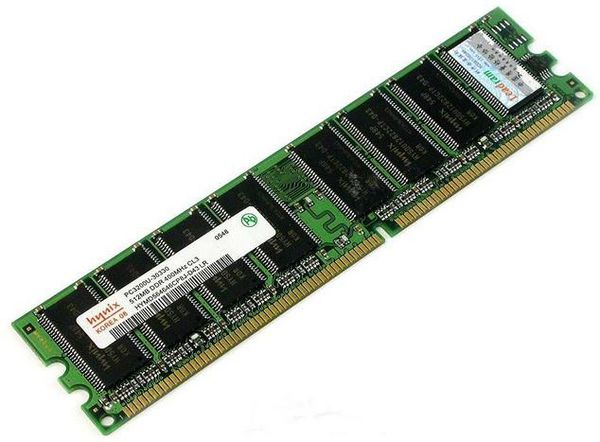
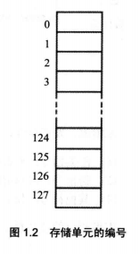
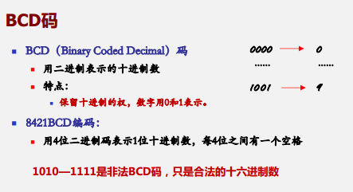
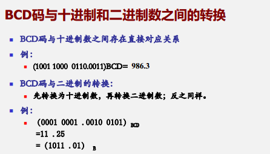
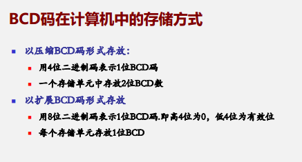

# 编码方式

[TOC]

---

## 数据存储方式

### 储存器物理形态

**128个地址码的内存图示**

数据在cpu中通常一字节的为单位进行储存，通过总线可以传输的数据大小来形成不同的数据类型。

比如：

​	在80386中我们的 数据总线是32位的，可以编码$${}2^{32}$$ 个地址，也就是可以控制8g的内存单元，但内存还是以8bit来储存，这样我们就需要将高位地址往下存.

​		比如数N：10001000 11111111 10001000 11111111，假设存放在 m 号地址空间，那么 m+3号地址都是N，且称该双字地址为m

## 数制

各种进制表示的数，在书写上面，由其数值加上它进制的标志

如：

- 2进制：Binary，1000 0011B
- 16进制：Hex，56AH
- 10进制：Decimal，10D
- 8进制：Octal，777O

### 常用进制

我们常用的数制有：二进制，十进制，十二进制，八进制，十六进制

由于电流分为低高频两种，则采用二进制

一星期7天，采用的是8进制

### 表示方法

一个数的表示方法取决于：

- **大小**
- **位置(权)**

### 各个进制转化

$$
N = a_{n-1} X^{(n-1)} \ \  + \ \  a_{n-2}X^{(n-2)} 
	\ \  +  ... + \ \
	a_0 X^0 \ \  + \ \ a_{-1} X^{-1}
	\ \  +  ...   + \ \ 
	a_{-m-1}X^{-(m-1)} \ \  + \ \ a_{-m}X^{-m}
$$

其中 

- a 代表着各位上的数值
- n 代表着位数，以及权重
- x 进制数
- N 代表着 x 进制数

进制的转换，就是获取： a  x n

- 对 N 除以 X 余数则为  a 

- 再对商 除以 X , 得到下一个 权位 的数值

- 每进行一次除法运算，n 就增大 一次

- 最后，商为 1的时候，将 余数倒序排列，得到X进制下的 N

### 单位转换

- bit ：翻译过来是 位 的意思
- byte：字节，因为一开始并没有ASCII 并没有设计英文的ASCII，只有英文，但原本8位内存，只能存下256个字母，所以我们编写中文，就要用16位，那么比英文多一倍，我们则以 8 位一字节，则中文是两字节。
- kb：kilobyte，kilo是千的意思
- mb：million byte，million百万的意思

- **1 MB = $${} 10 ^3 $$ KB = $${} 10^6 $$ byte = $${} 2^3 * 10^ 6$$ bit** 
- **1 个字 = 2 byte = 16 bit**

## 整数  及其二进制表示

由于CPU 的型号不同，可以控制的bit 大小也不同，

80x86 系列处理器，可以操作的整数有  8bit、16 bit

80386/80486 CPU 以及后面的微处理器，可以参加运算还可以有 32bit、64bit

对应java 数据类型：byte、short、int、long (这里举得都是有符号的例子 ，主要常用所以默认为有符号)

### 有符号数，无符号数

指的是就是有没有符号位

### 各种码

以 8位 来举例

符号说明：

- x：真值
- [x]：x 的原码
- 
- true code：原码
- Inverse code：反码
- Complement code：补码

#### 原码

$$
[X]_{true}=符号位+|绝对值|
$$

- 正数的原码是他本身

- 负数的原码是加上符号位 1 

  如：$${}[-3]_原 $$= 1000 0011B

- 特殊的 0

  -0 ：1000 0001B

  +0 ：0000 0000B

##### 优点

 	真值和其原码表示之间的对应关系简单， 容易理解；

##### 缺点

​	计算机中用原码进行加减运算比较困难
​	0的表示不唯一。 

#### 反码

分为三种情况来说： 

- $${}   X > 0  \quad [X]_{Inverse} = [X]_{true}$$
- $${}   X < 0  \quad [X]_{Inverse} $$ 符号位不变，其他位取反
- $${}   X = 0 \\  \quad [+0] = 0111 \ \ 1111B  \\ \quad [-0] = 1000 \ \ 0000B $$

发现0还是不一致，引出补码

#### 补码

上面两种表示方法，发现0表示不一致，引出补码

由同余定律
$$
X + NK = X \quad mod \ \ K
$$
犹如跑圈

- K：一圈或者多圈的长度
- X ：为距离 终点的距离
- N ：代表圈数

在一圈(k) 中， 我跑了 1/4 圈(x)， 和 我跑了 (1/4 + 1) 圈(X + NK) 是一样的

那么就有了补码这个概念。

- 由同余定律可以看出：

$$
[X]_{comlement} = X + K \\ 
0 \leq X \leq 2^{n-2} , [X]_{conlement} =  X \\
-2^{n-2} \leq X \leq 0 , [X]_{conlement} = 2^n + X
$$

​	其中 n 指的是 8、16、32、64，注意区分  |X| 与 X 的区别

- 我们也可以通过反码求
  - 正数：补码与反码、原码相同。
  - 负数：补码 = 反码 + 1

**补码中 -0 表示为 0，+0 也是0**

**-128 表示为：1000 0000B**

#### 移码

$$
[X]_{frame} = 2^{n-1} - 1 + X \quad \quad 2^{n-1} \geq X \geq -2^{n-2}
$$

- n：表示包括符号位与数值部分在内的二进制数位数
- 注意区分，|X|与X 的区别

例子：

- X = + 1 0010B

   则 $${} n = 6，[X]_{frame} = 2^5 - 1 + 10010B = 10\ 0000B + 1\  0010B - 1 = 11\ 0001B$$

- Y = - 1 00010B

  则 $${} n = 6，[X]_{frame} = 2^5 - 1 - 0 10010B = 10\ 0000B - 1 - 1\  0010B  = 00\ 1101B$$

## 数据运算

### 无符号与带符号

将无符号转化为带符号操作，用补码相加的方式求解

### 溢出判断

- $${}C_s$$ ：表征**最高位**（符号位）是否进位，进位为1
- $${} C_p $$：表征**数值部分最高位** 是否进位，进位为 1

| $${} C_s $$ | $${} C_p $$ |  溢出  | 结果 |
| :---------: | :---------: | :----: | :--: |
|      1      |      0      | 负溢出 | 错误 |
|      0      |      1      | 正溢出 | 错误 |
|      1      |      1      | 无溢出 | 正确 |
|      0      |      0      | 无溢出 | 正确 |

- $${} C_s \oplus C_p = 0 $$  ：没有溢出

- $${} C_s \oplus C_p = 1 $$  
  - $${} C_s  = 1 , C_p = 0$$ ：负溢出，比如：10000 0001 + 1000 0001
  - $${} C_s  = 0 , C_p = 1$$ ：正溢出，比如：0100 0000 + 0100 0000

## 数学协处理器(浮点数)

数字协处理器是集成在芯片内部，主要任务是支持浮点数的运算，支持7中类型

### 整形

分为三种：

- 字整形：16位
- 短整形：32bit
- 长整形：64bit

### 压缩BCD码

### 实型数

指以浮点数格式表示的带小数的数

