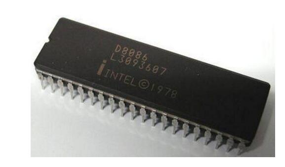
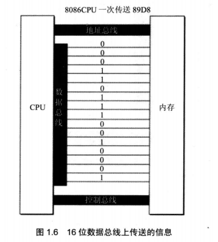
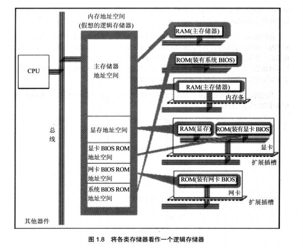
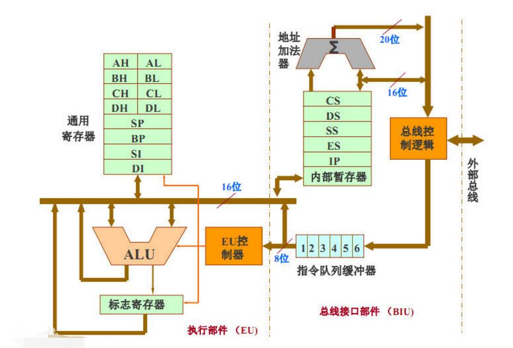

#  微机计算机组成及微机处理器功能结构

[TOC]

## 微型计算机介绍

计算机分为：巨型计算机（“[天河一号](https://baike.baidu.com/item/%E5%A4%A9%E6%B2%B3%E4%B8%80%E5%8F%B7)”为我国首台千万亿次超级计算机），大中型机，小型机，微型机，工作站

微型机分为：网络计算机、工业控制计算机，个人计算机、嵌入式计算机

## 8088 CPU 实体图

## cpu与总线的关系

8086一共16根数据总线

计算机中传输的都是电信号，总线都是导线。

分为三类总线

- 地址总线：用于CPU要访问的存储单元或I/O接口的地址总线。**8086地址总线20，可以控制的内存容量1MB**
- 数据总线：用来在CPU 与其他部件间传递信息，具有双向三态控制功能。**也就是说CPU用来接收其他部件的信息**。
- 控制总线：是CPU向其他部件传送控制信号，以及其他部件向CPU传递状态信号及请求信号的一组通信线，**如中断信息号**

## 8086 内部结构

### 通用寄存器

- AX：Accumulate high or low，累加器，用于乘法除法以及一些调整指令
- BX：Base high or low，基址寄存器，用来存放储存器操作数的基地址
- CX：count high or low，计数寄存器，用来存放许多指令的计数值，包括重复的串操作指令、位移、循环指令。
- DX：Data  high or low，数据寄存器，用来保存乘法形成的部分结果，或者除法指令执行之前，用于存放除法的一部分

