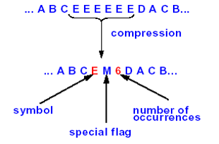
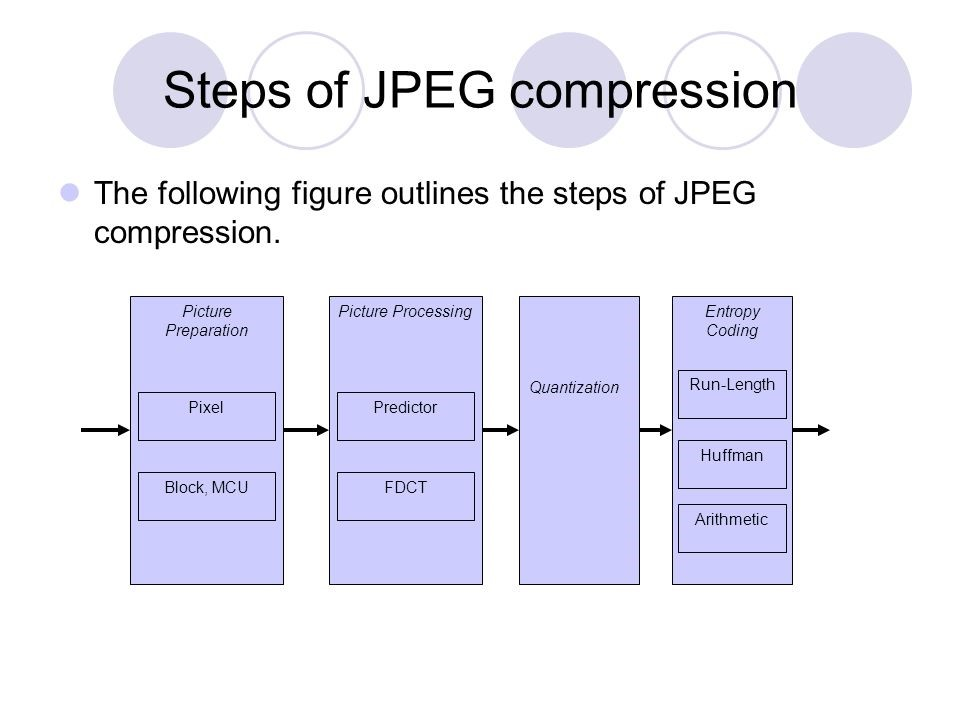

# Practice

1、Multimedia-definition（多媒体定义）

```
multimedia is a conbination of text , animation , graphic , sound and video that is delivered interactively to user by electronic and digitally manipulated means
```

2、Basic Elements of Multimedia（多媒体的基本要素）

```
static elements : text, graphic
dynamic elements : sound, video, animation
```

3、TYPES OF Multimedia（多媒体的类型）

```
linear multimdeia
non-linear multimedia
```

4、Differences between Linear and Nonlinear Multimedia（线性多媒体与非线性多媒体的区别）

```
Linear Mutimedia: A presentation moving in a straight line or path, move from one image to another image in consecutive order
Nonlinear Multimedia: A presentation moving not in a straight line or path , traintioning form one image to another image in perset order, but not necessarilly in staright path
```

5、Multimedia Applications（多媒体应用）


```
world wide web
games
virtual reality
mutimedia database systems
interactive TV
```

6、Multimedia products in use（使用中的多媒体产品）

```
brifing prodcution
reference prodcution
database prodcution
education and trianning production
kiosk
entertainment and game
```

7、What is Hyper Text? And Hyper media? （什么是超文本？还有超媒体？）

```
hyper text refers to textual items often indicated by underline blue types that click on it a new page in often .

```

8、Analog to Digital Conversion-Explain with a neat diagram（模拟到数字转换用简洁的图表解释）

```
analog singal ---> sampling ---> quantization ---> coding ---> digital singal 
```

9、Difference between Bitmaps and Vector images（位图和矢量图像的区别）

```
1. vector images cannot be used for photorealistic(真实感) images
2. vector images require a plug-in for web based display
3. bitmaps are not easily scalable and resizable
4. bitmaps can be converted to vector images using autotracing
5. vector images use les memory space and have a smaller file size as compared to bimaps
6. for the web, page that use vector graphics in plug-ins download faster, and when used for animation, draw faster than bitmaps
```

10、Write about Multimedia Authoring Tools and its functions（介绍多媒体创作工具及其功能）

```
tools:
	bitmaps, vector-draw
function：
	1. Use to merge multimedia elements 
	2. Designed to manage individual multimedia elements and provide user interaction 
```

11、Steps in MPEG Video Compression Process.（MPEG视频压缩过程中的步骤。）


12、Explain the DCT(Discrete Cosine Transform) in Image Processing.（解释图像处理中的DCT）

```
each block of 64 pixels goes through a transformation called the discrete cosine transform (DCT). 
```

13、What is meant by Dithering in images? Write a short note. （图像抖动是什么意思？写一个简短的笔记。）

```
Dithering is a process where the color value of each pixel is changed to the closest matching color value in the target palette(调色板), using a mathematical algorithm
```

14、Explain Run-Length Encoding - explain with a neat diagram（解释运行长度编码-用简洁的图表解释）

```
The general idea behind this method is to replace consecutive(连续) repeating occurrences of a symbol by one occurrence of the symbol followed by the number of occurrences.
```



15、List the Characteristics of Soundwaves.（列出声波的特性。）

```
frequency
amplitude(振幅)
```

16、Lossy and Lossless Compression – Differences（有损和无损压缩的差异）

```
lossless don't have any loss, but lossy not
lossless is that the decompressed fike and the original are indentical, but lossy not
```

17、JPEG Image Compression- Explain with a neat diagram.（jpeg图像压缩-用简洁的图表解释。）



18、Disadvantages of Audio Compression.（音频压缩的缺点。）

```
1. compression can only be used if both the transmitting and receiving modems support the same compression procedure
2. needs processing both for encoding and decoding
3. if a lossy compression method is used, the quality is reduced
4. lossless compression methods exist and they achieve about 50% reduction ini size
```

19、What is the function of VGA-Explain（VGA的功能是什么）

```
VGA ： Video Graphics Array
to provide interface betwween software and hardsware, basically this means that it plugs in to the monitor and shows what the computer is doing
```

20、Write down the hierarchy of Compression methods in Multimedia（写下多媒体压缩方法的层次结构）


21、Explain Image Compression Steps with a neat diagram（用简洁的图表解释图像压缩步骤）


22、MPEG-7 Standard:（MPEG-7标准）

1. Objective

   ```
   stills picture
   graphic 3d models
   audio
   speeh
   video
   composition information
   ```

2. Features

   ```
   1.Abstract MPEG-7 system architecture 
   2.Optimized binary format for metadata 
   3.Support for any transmission mode (push/pull) „ 
   4.Bi-directional mapping of metadata
   ```

3. Applications.Use diagram to Explain

   ```
   Broadcast media selection
   Remote sensing
   entertainment
   Educational applications.
   ...
   ```

23、the Block diagram of JPEG Encoder in Compression process（压缩过程中的JPEG编码器框图）


24、Linear and Nonlinear Multimedia Presentations with examples（线性和非线性多媒体演示及示例）

```
power point presentation
website
```

