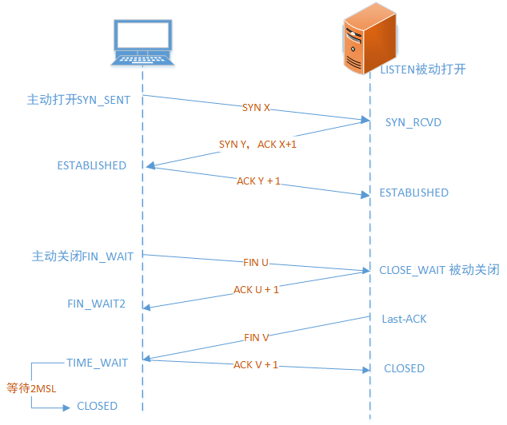
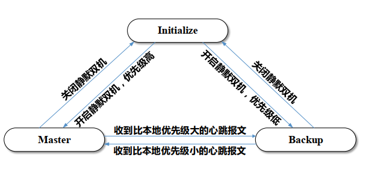
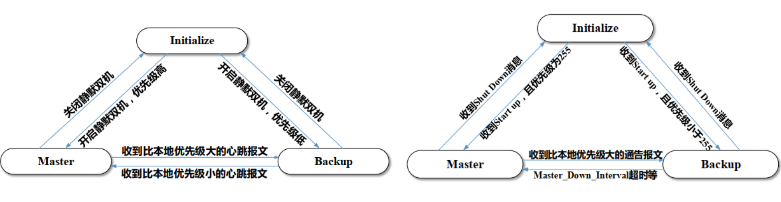
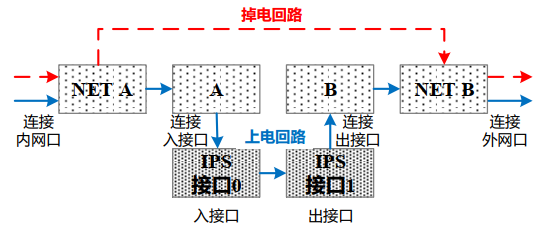
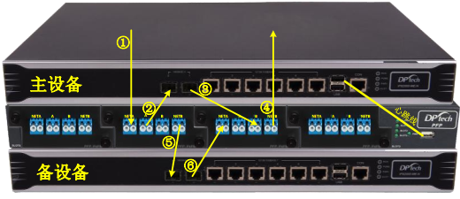

 DPNE学习理解
========

> 文章主要是组织知识点网络，同时补充自己对书中知识点的理解，标注注意点。

可以明确的几个点是：

<span style="background-color: #FFD39B; padding:0px 3px; margin:2px; border-radius:3px ">观念</span>：网络战，本质就是无论武器还是目标都是网络本身 

<span style="background-color: #C6E2FF; padding:0px 3px; margin:2px; border-radius:3px ">武器</span>：硬件设备

<span style="background-color: #98FF95; padding:0px 3px; margin:2px; border-radius:3px ">弹药</span>：漏洞

<span style="background-color: #F9F18B; padding:0px 3px; margin:2px; border-radius:3px ">指挥</span>：态势感知平台，情报

<span style="background-color: #F9B6E5; padding:0px 3px; margin:2px; border-radius:3px ">  人  </span>：安全服务，用户服务


DPNE书籍以及产品
----------------

根据迪普的培训教材和ppt来书写。

整本书就是介绍：

- FW1000，IPS2000，UAG3000这三个硬件如何使用，以及基础的配置案例
- UMC的使用。

三个硬件设施分为基础的配置以及业务：

### FW/IPS/UAG区别与通用

<span style="background-color:#EEAEEE; padding:0px 3px; margin:2px; border-radius:3px ">通用</span>

设备监控、基础配置、系统管理、对象管理、接口管理

路由管理、网络协议、高可靠性、日志管理、QoS管理

VLAN管理（FW）、认证管理 （FW，UAG)、ACL管理 （IPS，FW）

<span style="background-color:#EEAEEE; padding:0px 3px; margin:2px; border-radius:3px ">FW业务</span>

安全策略、NAT配置、ALG配置、VPN

攻击防护、应用安全、链路负载均衡、IPv6过渡技术

<span style="background-color:#EEAEEE; padding:0px 3px; margin:2px; border-radius:3px ">IPS业务</span>

入侵防御、防病毒、行为分析、行为控制

URL应用、安全中心、高级配置

<span style="background-color:#EEAEEE; padding:0px 3px; margin:2px; border-radius:3px ">UAG业务</span>

行为分析、行为控制、带宽管理、URL应用、安全中心


书中的思考
----------

看完书的感受，先说一下什么是网络安全，其实就在<span style="background-color: #E2F0FF; padding: 0px 3px; margin:2px; border-radius:3px ">组网</span >之后添加一些<span style="background-color: #E2F0FF; padding:0px 3px; margin:2px; border-radius:3px ">安全策略</span>，同时还要面临网络的<span style="background-color: #E2F0FF; padding:0px 3px; margin:2px; border-radius:3px ">可靠性</span>的问题。


网络中线是不是组网的需求，关键是每个硬件的位置，以及位置自身的配置，根据我自己的对组网的理解：

<span style="display: inline-block;border:1px solid #dbdcdc; background:#f5f5f5; padding-right: 3px ; padding-left:3px; margin:3px; border-radius: 3px " >安全组网 = 接口配置 + 路由配置 + 对象管理  </span> 

接口配置 涉及到

- 工作模式：二层或者三层
- 类型：access，truck，也就是虚拟局域网的设定
- IP：面临一个ip地址不够的问题，这里迪普做的是NAT的优化。

路由是三层做网络路由协议选择的配置，对象管理涉及到安全域，地址对象，服务对象，时间对象。

这是在基础的网络规划的时候做的，完成了这些安全组网的需求之后，才能往下去配置我们的安全策略。


安全的策略 在设定的时候，要考虑的问题是：

- 作用什么对象？
- 工作在什么层次？
- 采取何种处理方式？

在设定策略之后，进行维护：

- 是否命中？
- 统计优化


最后有一个需要完善的就是可靠性：

备份（静默双机）、冗余（vrrp)、断电保护（PTP)，负载均衡、BYPASS


### 安全组网

安全组网网络就是，在可以实现上网业务组网之后，加入了安全设备，同时做一个安全的规划。


#### 接口配置

接口配置涉及到

- 工作模式：二层或者三层
- 类型：access，truck，也就是虚拟局域网的设定，同时增加了一个管理口
- IP：面临一个ip地址不够的问题，这里迪普做的是NAT的优化。

工作模式根据业务需求，进行选择。

<span style="background-color: #FFAD86; padding:0px 3px; margin:2px; border-radius:3px ">需要注意的是</span>：

管理口不能通业务，<span style="background-color: #E0EEE0; padding:0px 3px; margin:2px; border-radius:3px ">迪普的设备通常 gige 0_0 接口为管理口，如果没有，默认最后一个为管理口</span>

具体说一下VLAN和NAT。


##### VLAN

VLAN：virtual local area network，虚拟局域网

出现原因：为了解决局域网内因为CSMD/CA带来的大量无效广播的影响。

实现原理：通过软件的手段通过在三层设备上添加TAG，通这个TAG的区别来实现广播域的隔离。

因为二层数据帧打了TAG，就需要不同的线路来指挥他们的通过，那么需要在设备的接口进行标识操作，也就是trunk和access

<span style="background-color: #FFAD86; padding:0px 3px; margin:2px; border-radius:3px ">需要注意的是</span>：

- trunk允许多个不同的TAG通过

- TAG默认是vlan1

- tag之类都是在设备内操作

- access类型的出接口，在出去的时候二层帧的TAG会被去掉；

  trunk类型的出接口，在出去的时候二层帧的TAG会携带到对端，除了默认的Vlan1


##### NAT

> 私网地址：
>
> 10.0.0.0		-    10.255.255.255：10.0.0.0/8
>
> 172.16.0.0    -    172.31.255.255：172.16.0.0.0/12
>
> 192.168.0.0  -    192.168.255.255：192.168.0.0/16

在迪普的设备中NAT是单独放在了FW中，进行管理，取名叫 "NAT管理"

产生原因：IP地址不够用，OSI定义私网地址，这就涉及到私网地址如何上网的问题

NAT原理：端口复用

实现方式：

这里描述一个场景是，客户端和服务端，我们处于客户端

- 源NAT：客户端进行NAT转换
- 目的NAT：服务端进行NAT转换
- 静态NAT：一对一或者多对多

<span style="background-color: #E0EEE0; padding:0px 3px; margin:2px; border-radius:3px ">源NAT出于解决IP地址不够用的原因，同时带来一个溯源性的问题，但也可以用于隐藏实际的server</span>

这里因为可以修改端口，指定流量的出口，其实还可以做到一个流量牵引的作用。

<span style="background-color: #FFAD86; padding:0px 3px; margin:2px; border-radius:3px ">需要注意的是</span>：

- 在配置公网地址池的时候，启用散列端口的功能：地址转换后的报文源端口将在1500-65535随机。

- 当配置了VRRP，需要设置"关联VRRP"，使得设备NAT地址池中的地址不发送ARP报文，从而避免了与主设备地址冲突。

- 设置NAT，无法访问内网服务器：源NAT和目的NAT的设置

- 设置NAT，无法使用DNS：DNS_ALG

- 设置NAT，由于回包不一致：启用会话转发

- 设置NAT，接口地址和设备内ip地址不一致的导致ARP风暴：域间设置丢包

  

#### 对象管理

分为四块：安全域，IP对象，服务对象，时间对象

实就是分类和分块管理，这样就是可以加快效率。

至于为什么要设定这一些对象参数，和安全策略的指定有关，什么决定安全策略就会有什么参数。

<span style="background-color: #FFAD86; padding:0px 3px; margin:2px; border-radius:3px ">需要注意的是</span>：

- 安全域的优先级：

  trust：85，DMZ：50，untrust：5.

  这里说一句：

  同优先级的不同区域，默认是阻断的，同一个区域，默认是通的。

  这很好理解，抛开trust、DMZ、Untrust来说，其实这些都是一个命名，取了一个固定值罢了。

  他们代码的判断应该是根据优先级这个数字来进行判断。

- 时间对象的分别：

  始终有效，绝对时间(日期)，相对时间(工作日)


#### 操作与维护


##### 配置方式

三种方式：web，ssh，console，Telnet

web：80，192.168.0.1，默认开启

ssh：22

console：波特率，9600，默认开启

telnet：23


### 会话

所有的网络安全策略，都是基于一次会话，所以首先要把会话的流程捋清楚

<span style="background-color: #FFAD86; padding:0px 3px; margin:2px; border-radius:3px ">需要注意的是</span>：

- 全状态检测，如果开启，则新建会话中TCP中的SYN ACK 会被拦截和丢弃，常用于非对称链路场景
- 报文经过设备建立会话：
  1. 设备接收到报文，先做路由前的安全检测（基本攻击检测，黑名单等）
  2. 建立会话结构
  3. 是否匹配 <span style="background-color: #E0EEE0; padding:0px 3px; margin:2px; border-radius:3px ">目的NAT规则</span> ，如果是则做目的的NAT预处理，记录会话信息
  4. 是否匹配会话，按照会话信息来做会话转发
  5. 查找路由，做 <span style="background-color: #E0EEE0; padding:0px 3px; margin:2px; border-radius:3px ">安全策略</span> ，记录会话信息
  6. 是否匹配 <span style="background-color: #E0EEE0; padding:0px 3px; margin:2px; border-radius:3px ">源NAT规则</span> ，如果做NAT预处理，记录会话信息
  7. 将会话挂到全局会话表中
  8. 进行会话转发

#### tcp建立




  一开始是TCP的连接，服务器被动打开端口进行监听，用户发起tcp请求，服务器收到消息并回复ack，而客户端收到ack回复服务器，建立正常的会话。

  在面对客户端主动断开TCP连接，客户端发送FIN U给服务端，告诉服务器自己要关闭了，客户端收到服务器的ack之后进入半关闭状态，等待服务器进行后续的数据传输，过一段时间后想客户端发送一个FIIN，然后客户端恢复一个ack，在一段时间内没有收到服务器其他的消息，客户端关闭，在服务器收到客户端的ack时候就正式关闭

### 包过滤ACL

ACL：access control list，访问控制列表

有两个动作：通过、丢包

这个主要是针对于ip地址的限制，比如知道了那个是经常发生攻击的ip，这样我们就会封堵这个ip，发生丢包行为。


<span style="background-color: #FFAD86; padding:0px 3px; margin:2px; border-radius:3px ">需要注意的是</span>：

- 包过滤策略根据序号大小<span style="background-color: #E0EEE0; padding:0px 3px; margin:2px; border-radius:3px ">由上至下</span>依次匹配，如果某条策略包含下面策略内容，则数据<span style="background-color: #E0EEE0; padding:0px 3px; margin:2px; border-radius:3px ">优先匹配范围大</span>的策略，导致范围小的策略失效，需调整策略顺序解决此问题。 
- 信任的数据：
  - 已建立的会话
  - 走ALG的数据
  - 发送给自己的数据


### 高级业务

普通的包过滤就是ACL：access control list，是网络层对数据包的过滤。

高级业务是应用层的过滤，对数据进行深度的检测和管理，对于会话的处理动作变多变细了。

这里介绍两台设备：IPS，UAG

IPS：Intrusion Prevention System，入侵防御系统

UAG：Unified audit gateway，用户认证网关

他们都属于"<span style="background-color:#EEAEEE; padding:0px 3px; margin:2px; border-radius:3px ">透明设备</span>"，透明设备有几种搭建的方式：

- 在线模式：串在处于转发的线路，不改变拓扑，可以进行访问控制

  

- 旁路模式：分支处一条线路，通过"镜像流量"对流量进行分析，不能做到访问控制

  

- 透明桥接模式：透明设备有两种接口，带内和带外，带内和带外可以配置ip地址。叫做"桥接口配置"

  

透明设备存在<span style="background-color: #E0EEE0; padding:0px 3px; margin:2px; border-radius:3px ">接口对</span>：gige 0_0，gige 0_1 一对，gige 0_2 和 gige 0_3


#### 入侵防御系统


这是入侵防御系统的一些可以配置的项目，下简单挑着介绍。

##### 入侵防御

主要面对着如下的一些攻击：

```
SQL攻击，XSS攻击，溢出攻击;
恶意代码分析(蠕虫，木马，钓鱼，防范攻击);
DDOS，扫描，监控;
入侵防御技术属于IPS的功能;
```

在”IPS规则“，可以配置相关的特征动作，也就是说高级业务采取的是包过滤的方式，如果命中采取的是动作是高级业务的动作，其实就是进一步的匹配IPS致命特征动作。

这个动作有：告警，阻断，阻断+源RST，阻断+目的RST，阻断双向+RST。

给一张图示意：


##### 攻击病毒防护

传统的检测病毒的方法，可以分为四种：特征代码法，校验和法，行为检测和软件模拟法。

在网络设备上实现防病毒功能，最后的办法就是特征代码法。

<span style="background-color: #FFAD86; padding:0px 3px; margin:2px; border-radius:3px ">需要注意的是</span>：

镜像流量成环，可以用VLAN进行隔离或者利用接口对的隔离来隔离。


##### 综合防御

land、死亡之ping、IP分片

- 基础的攻击

  - land：TCP不断请求却不回复ack
  - 死亡之ping：不断的使用ping发包占用宽带
  - IP分片：IP分片但不完整发送，导致缓冲区大量的开启

- 协议行为管理

  例如：禁止利用tracert进行网络结构的探测

- 密码防护：通过限制在多少间隔内发送登入请求，通过时间缓解来防御程序密码破解攻击

- 弱口令：对密码进行检测其能被破解的程度，来提高安全性


##### DDOS攻击

DDOS：distribute dennial  of server attack，分布式攻

DDOS 攻击分为两种：

- 带宽攻击：发送大量的数据包占用带宽，例：<span style="background-color: #E0EEE0; padding:0px 3px; margin:2px; border-radius:3px ">SYN Flood 攻击，DNS Query Flood，UDP Flood</span>
- 资源攻击：发送频繁的发送大量的好资源的求情，例：<span style="background-color: #E0EEE0; padding:0px 3px; margin:2px; border-radius:3px ">CC（challage Collapsar）</span>

面对各种攻击，这里提出了一个概念<span style="background-color:#EEAEEE; padding:0px 3px; margin:2px; border-radius:3px ">指纹防护</span> ：

就是通过大量的攻击报文分析提取出能够定义这个攻击的参数叫做指纹。

面对泛洪攻击一般用：<span style="background-color:#EEAEEE; padding:0px 3px; margin:2px; border-radius:3px ">cookie</span>，通过携带cookie来重复拦截。

SYN Floodl利用三次握手时中间拦截，生成cookie再放行；

CC ，是利用 302 重定向，同时根据URL生成cookie。

<span style="background-color: #FFAD86; padding:0px 3px; margin:2px; border-radius:3px ">需要注意的是</span>：

- SYN Flood，防护配置，通过设置半连接阈值，超出就被阻断
- 防护动作包括：观察，限速，阻断，以防护阈值100pps，为例：
  - 观察，对符合协议特征的报文，只检测不阻断并生成分析图，通常为后期配置防护数值提供有效参考；
  - 限速，对符合协议特征的报文，允许速率小于100pps的报文通过，大于100pps的部分被阻断，及被限速。
  - 阻断，对符合协议特征的报文，允许速率小于100pps的报文通过，当达到100pps的报文通过，当达到100pps时，将阻断所有符合协议特征的报文。


#### 行为管理与流控

<span style="background-color:#EEAEEE; padding:0px 3px; margin:2px; border-radius:3px ">协议识别技术</span>（IP+PORT、DPI、DFI 和 CAAR）是 <span style="background-color: #E0EEE0; padding:0px 3px; margin:2px; border-radius:3px ">上网行为管理</span> 和 <span style="background-color: #E0EEE0; padding:0px 3px; margin:2px; border-radius:3px ">应用流量控制</span> 的基础

设备通过协议识别实现流量分析、行为审计，或进一步的过滤、限速或控制功能

- 流量分析 可以分为 <span style="background-color: #E0EEE0; padding:0px 3px; margin:2px; border-radius:3px ">接口流量</span> 和 <span style="background-color: #E0EEE0; padding:0px 3px; margin:2px; border-radius:3px ">用户流量/连接数统计</span>。
- 审计 可以从 <span style="background-color: #E0EEE0; padding:0px 3px; margin:2px; border-radius:3px ">行为审计</span> 与 <span style="background-color: #E0EEE0; padding:0px 3px; margin:2px; border-radius:3px ">内容审计</span> 两个维度，对内网用户网络行为进行监控并审计

这里区别一下协议识别技术：

- IP+PORT：数据特征不明显，目的端口比较固定，例如：游戏类
- DPI：在分析报头的基础上，结合不同的应用的协议特征综合判断所属应用，例如：BT
- DFI：一种基于流量行为的协议识别技术。可以进行模糊识别，常见的识别项包括：数据包的包长，数据包的发包频率，例如：P2P，FTP，RSTSP等协商协议
- CAAR：采用AC多模匹配算法，支持流匹配，是协议的识别更加明确。

迪普利用 APP-x 高性能硬件平台实现了多个AC多模匹配算法。


##### 上网行为审计

常见的网页浏览、页面搜索、文件传输、即时通信、论坛发帖、邮件收发等


##### 关键字过滤

就是对敏感和危险词的过滤。


##### 应用流量控制

###### 带宽

主要是带宽保证和带宽限速。

带宽保证是为了：保证正常的业务流量，以及VIP流量的带宽使用。

这里区别一下令通算法：

- CAR：commited access rate，约定访问速率，是监管流控技术之一
- GTS：general traffic shap，通用整形流量
- LR：limit rate，端口限速

GTS 和 LR 是应用在出口上面的，GTS 和 CAR是作用在IP层，对于不仅过IP层的报文不起作用。


这里要带宽的算法：

- 对于用户组的限制，单用户的限制级高

- 对于普通用户带宽，VIP用户的限制级高

<span style="background-color: #FFAD86; padding:0px 3px; margin:2px; border-radius:3px ">需要注意的是</span>：

- 为确保宽带限速效果，需要及时更新APP特征协议库

- 限速参数设置为0，表示不限速。

- 带宽保证的意思：

  

  预留了5m，总带宽是10m，那么其他用户就只能用0-5m，占用总带宽的量是5-10m


###### URL过滤

主要就是防止访问不符合公司需求的网站，可以利用这个搞。


##### 安全接入技术

###### MAC/IP

<span style="background-color: #FFAD86; padding:0px 3px; margin:2px; border-radius:3px ">需要注意的是</span>：

- 带来的效果是：
  - 可以防止”ARP"欺骗
  - 防止内部网络的非法接入
- 遇到中间绑定有三层设备，可以开启 “自动学习” 或者 “手动配置” ，通过这样的手段获取中间设备的ARP表，进行绑定


###### Portat

Portat 认证又称web认证。

常见的认证方式包括：

- 本地认证

- 远程服务器集中认证（支持针对Raduis、AD和LDAP等第三方认证系统的对接）

- 实名认证（基于认证账号进行流量控制和行为审计）

- 注意一下认证过程：

  

### 可靠性

#### 双机

双机的作用就是冗余备份，通过两台机子来保障网络的可靠性。

有普通双热机，静默双热机，静默双热机相对于普通双热机多了一个流量切换的功能。

VRRP是一个容错协议，用来处理网络发生错误的时候，进行调度。

普通双热机只需要配置好心跳就可以了。

**静默双机**：

静默接口从活跃状态变为静默状态的时候，其实就是对业务的关闭，方式因为两个地方的ip配置一致的时候而导致ARP表发生紊乱。

这里描述一下状态机的各个状态的变化：



启动时：先都是Initialize，然后都是Master

运行时：进行心跳同步，优先级低的为Backup，且Backup为静默状态，如果优先级一样，则**MAC地址小的优先级大**

- Backup设备：此时静默状态的接口不接收、不发送报文，值处理链路层协商报文。
- Master设备：向上下设备发送[免费的ARP报文](https://blog.csdn.net/ethan0ly/article/details/53793078) 

故障时：

比如Master发生故障，比如业务接口断开，优先级 = 源优先级 - 端口优先级，心跳报文，转化为Backup并未静默状态，对端变为Master发送免费的ARP报文。


**VRRP**

切换的监视：

- 监视接口：可以直接监视连接上行链路的接口状态
- 监视IP：利用监视IP技术监视上行链路连接的远端主机或者网络状态
- 监视BFD：利用监视BFD技术监视上行链路连接的远端主机或者网络状态，列如backup 设备监视 master。


**静默双机和VRRP的状态机比较**：



<span style="background-color: #FFAD86; padding:0px 3px; margin:2px; border-radius:3px ">需要注意的是</span>：

- VRRP：接口发生故障，也就是说收到shut down的报文，那么接口就会从其他状态转换为Initialize.
- VRRP 有虚拟ip，对于主备的分别是：先比较优先级，大的为master，再比较IP地址
- 静默双机：先比较优先级，再比较MAC地址，MAC地址小的优先
- VRRP 有三种认证方式：无认证、明文认证、MD5认证。


#### 负载均衡

负载均衡的产生是为了规避网络出口故障带来的网络可用性风险，和解决网络带宽不足带来的网络访问问题。

链路负载通过多种健康检测判断链路状况，通过设置链路的优先级、权重、阈值等参数

产生的背景：

- 高访问量导致服务资源不足
- 跨运营商访问的质量问题
- 未能合理高效利用服务器资源 

负载均衡说白了，就是通过探测进行选择路由，进行引流，而解决上面的问题

探测的手段：ICMP，TCP

<span style="background-color: #FFAD86; padding:0px 3px; margin:2px; border-radius:3px ">需要注意的是</span>：

- 在选择链路的时候，有优先级和权重之分，优先级越小越优先，权重越大越优先


#### 断电保护

PFP：power fault protector ，断电保护设备



电筒：有电的时候是，相同的联通，就是：NETA和A连通。

这里贴一张PFP双机热备的图片。



根据保护链路接口类型不同，PFP支持电口模块和光口模块，其中，光口模块分为多模和单模两种类型，接口模块中每4个接口可对一条链路提供断电保护，即一个光口模块可保护一条链路，一个电口模块可以保护两条链路。

注意看是 PFP 8，还是啥


#### BYPASS

##### 办公用户可能不属于重要的流量

这个分等级的贯通，普通用户先贯通

先说一下BYPASS的作用，功能基于设备的丢包检测技术，检测引擎对出、入接口的流量进行周期性检测 并统计丢包率，瞬时流量的超载会产生大量丢包并影响正常业务，检测引擎将自动开启应用BYPASS功能，将设备设置成一个透明交换设备，不再匹配任何安全策略。

书上是作用于IPS和UAG，fw是没有这个功能的，其实通俗点说BYPASS就是，就是对丢包率的探测，超载就转化为透明的交换设备，而IPS和UAG是透明的路由设备。

A：用户流量不再进行安全策略的检测，但丢包率还是在选择

B：的确可以查询，通过系统日志，可查看应用 BYPASS 功能的启用和关闭记录 

C：IPS和UAG都是透明设备


