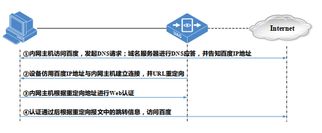
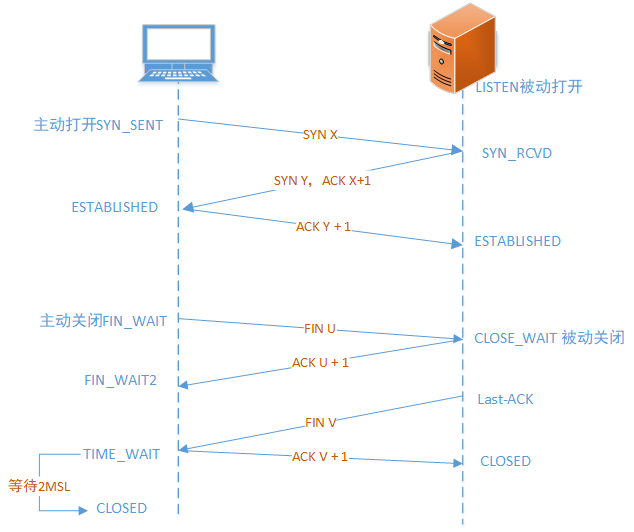
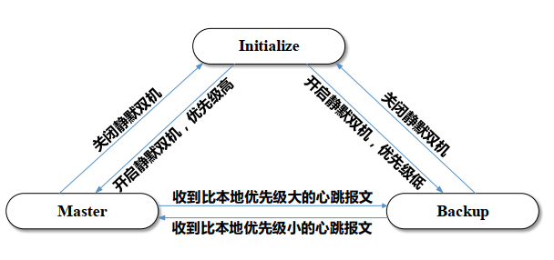
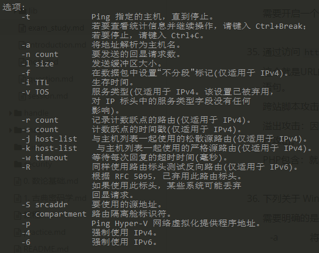
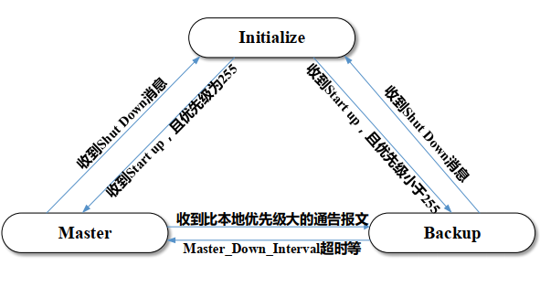
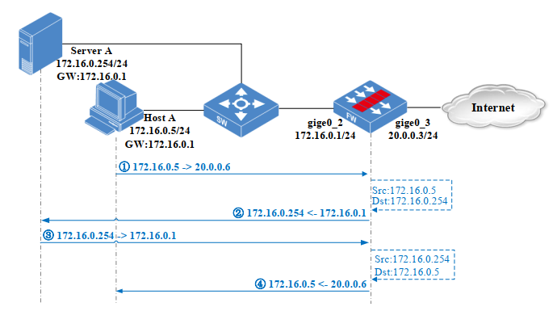
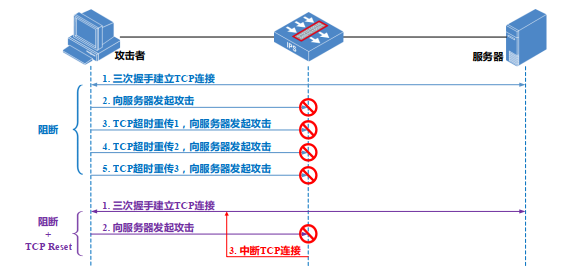
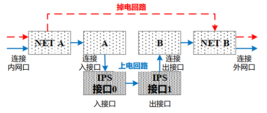
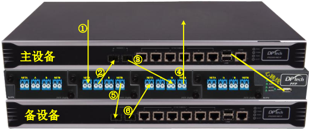

DPNE 
===============

[TOC]

如何准备？
----------

[报名网址](https://www.pearsonvue.com.cn/dptech) 

如何分析？

- 正确答案是什么？
- 考点是什么？
- 还会如何考？


## 模拟题分析

### 卷一

1. 以下哪个选项不属于报文的五元组？

   ```
   报文五元组：
   两个ip，源ip和目的ip
   两个端口，源端口和目的端口
   一个协议 
   可以用来区分一个会话。
   ```

2. 以下不属于私有地址的网段是？ <b style="color: red;"> 背 </b> 

   ```
   私有地址网段，首先三类ip都有
   10.0.0.0 	-- 	10.255.255.255，10.0.0.0/8
   172.16.0.0 	-- 	172.31.255.255，172.16.0.0/12
   192.168.0.0 -- 	192.168.255.255，192.168.0.0/16
   ```

   记忆三个网段就行了：

   - A：10.0.0.0/8
   - B：172.16.0.0/12
   - C：192.168.0.0/16

   

3. 以下属于 NAT 技术优势的是？ 

   > NAT：network area translation

   NAT 的出现就是为了解决公网ip紧张的问题，利用 `私有ip + 端口号 --> 公网ip + 端口号`

   同时达到隐匿ip地址的效果。

   

4. 包过滤策略的高级安全业务不包括？ <b style="color: red;"> 背 </b> 

   > 解析：
   >
   > VPN：virtual private network，虚拟局域网

   知识背景：

   包过滤策略的作用分为两种：网络层、应用层

   - 网络层：对于ip的包头进行检测，其实就是说对ip的拦截，比如护网行动，分析日志，对攻击ip进行封堵
   - 应用层：对应着设备IPS和UAG的防护功能，
     - IPS：防病毒，安全综合防御(协议行为、密码破解、弱口令)，DDOS
     - UAG：上网行为管理，应用流量控制，安全接入技术。

   

5. Untrust 域主机需要访问 Trust 域主机的 Windows“远程桌面”服务，包过滤策略中的自定
   义服务对象可配置成？   <b style="color: red;"> 背 </b> 

   解析：这里考的应该是，源端口的设置，源端口应该不设限。

   知识背景：windows 的服务端口与协议是： tcp，3389

   
   
6. 查看防火墙会话日志为，发起方： IP1->IP2，响应方： IP4->IP1。则该数据流可能匹配了哪
   个策略？ 

   解析：这里可以发现，IP1没有发生改变，说明是在出口的位置设置了NAT，也就是目的NAT

   

7. 以下哪些措施无法有效提高系统的防病毒能力？   <b style="color: red;"> 记</b> 

   解析：明显D不是，对于清理垃圾，并不能做到清理病毒 

   这里考的是：IPS功能的病毒防护攻击，P231

   

8. 下列密码安全性最高的是？

   在这里考的是IPS功能中的弱口令，P244

   长度长，数字、大小写字母和字符混合。 

   

9. 下列哪些是正确的 IPv6 地址？ 

    解析：

   很明显，A，C 是同样一个ip。B，冒分16进制大于8，D，省略的格式不对。

   知识背景：

   ipv6 是128位，采用的是冒分8位16进制，共8块

   - 全为零，简化为当个零

   - 全为零，且有多块，可以省略不写，采用`"::"`

   - 多处间隔全为零，只能省略一个。

     ```
     如：
     fe80:0000:0000:b567:0000:f082:766f:c2c5%3
     简写：
     fe80::b567:0:f082:766f:c2c5%3
     ```

   

10. Web 认证的工作流程为？  

    考的是安全接入，UAG的功能。

     

    很简单的理解，当你上网访问百度的时候，跳出一个要你输入密码和账号的页面，等你验证成功后，弹跳到百度页面。

    

11. URL 过滤通常是检测 HTTP GET 报文中的哪个字段？  

     考的是UAG中应用流量控制的URL过滤。

     URL就是Uniform Resource Locator，统一资源定位符，其实一帮是域名或者是ip加上web文件目录

     

12. IPS 设备与 IDS 设备的共同之处有？   <b style="color: red;"> 背 </b> 

     IPS：Intrusion prevention system，入侵防御系统

     IDS：Intrusion Detection Systems，入侵检测系统

     可以旁路部署，监视网络流量，提供安全报告

     

13. 关于 UAG 产品的即时通信应用审计，以下描述正确的是？<b style="color: red;"> 记</b> 

     - 可审计即时通信的应用类型

     - 可审计即时通信的用户ID

     - 可审计即时通信用户的登入状态

       

14. FWA 配置了 5 条 NAT 策略，为提高可靠性新采购了 FWB，并与 FWA 组成普通双机热备，
     在主设备 FWA 上新增 3 条 NAT 策略，则 FWB 同步了几条 NAT 策略？  <b style="color: red;"> 记</b> 

     解析：  

     考的是高可靠性技术，中的配置备份的问题。

     这里需要注意的是，普通的双机热备只同步新增的策略。

     与之对应的还有：静默双机，也是只备份在同步时期的配置，可以逆着想，比如说要这两台设备在不是同步的时期都是会被同步配置的话，那么这两台设备就是就无法保持有差异性。

     

15. 某企业总部和分部之间，为了保证数据在互联网传输的安全性，通常会部署哪一种类型的
     VPN？ <b style="color: red;"> 背 </b> 

     IPSec_VPN，就是互联网传输的协议，且用于总部与分部之间，IPSec_VPN 既可以固定接入，又可以移动接入，所以可以明显的判断出，应该选择C

     知识背景：

     按协议类型的不同可分为 IPSec、 SSL、L2TP 和 GRE 等 

     按接入方式的不同可分为固定接入和移动接入 

     ​	固定接入：IPSec_VPN 和 GRE_VPN 

     ​	移动接入：IPSec_VPN、 SSL_VPN 和 L2TP_VPN 

     其中各个协议的缩写解释：

     - IPSec_VPN：Internet Protocol Security，互联网协议安全
     - SSL_VPN：Secure Sockets Layer，安全套接层
     - PPTP_VPN：Piont to Piont Tuneling Protocol，点对点隧道协议
     - L2TP_VPN：layer 2 tunneling Protocol，第二层隧道协议
     - GRE_VPN：generic routing encapsulation，通用路由封装。
     - MPLS_VPN：multiprotocol label swicthing，多协议标记交换

     

16. 计算机病毒的主要来源不包括？  

     操作系统自动产生 的是漏洞，不是病毒。

     

17. 带宽保证策略中，对内网接口的内网用户保证基础带宽设置的上、下行分别为 5M 且不预
     留，保证参数的上行 2M 最大 2M，下行 4M 最大 4M。则内网用户访问互联网资源时匹配结果
     为？ 

     按照描述的来就行。

     
     
18. UMC 服务器接收流量分析日志的端口为？  

     这里非常需要注意的是：

     接收的是什么日志，不同的设备，接收的端口不一致，这里接收的是流量分析日志。

     只要是流量分析日志的端口都为UDP_9502

     设备源端口是：5000

     FW：UDP_9505

     IPS：UDP_9514

     UAG：UDP_9514

     

19. 关于 UMC 的 License 授权，以下描述错误的是？

     记住这几个正确的就行    <b style="color: red;"> 记</b> 

     - 不同的授权可激活不同的业务模块
     - 正式授权可在 DPtech 官网申请
     - 变更 UMC 硬件主机，需重新申请授权

     

20. 如何可以查询到设备的序列号？ （多选） <b style="color: red;"> 记</b> 

     - 可在 Web 页面的设备信息处查询

     - 可在串口输入 show version 命令查询

     - 可在设备外包装箱的产品标签处查询

     - 可在设备背面板查询 

       

21. 以下关于应用 BYPASS 的描述错误的是？<b style="color: red;"> 背 </b> 

      先说一下BYPASS的作用，功能基于设备的丢包检测技术，检测引擎对出、入接口的流量进行周期性检测 并统计丢包率，瞬时流量的超载会产生大量丢包并影响正常业务，检测引擎将自动开启应用BYPASS功能，将设备设置成一个透明交换设备，不再匹配任何安全策略。

     书上是作用于IPS和UAG，fw是没有这个功能的，其实通俗点说BYPASS就是，就是对丢包率的探测，超载就转化为透明的交换设备，而IPS和UAG是透明的路由设备。

     A：用户流量不再进行安全策略的检测，但丢包率还是在选择

     B：的确可以查询，通过系统日志，可查看应用 BYPASS 功能的启用和关闭记录 

     C：IPS和UAG都是透明设备

     

22. 以太网交换机一个接口在接收到数据帧时，如果在 MAC 地址表中可以查到目的 MAC 地
     址，通常如何处理？ 

     其实就是在ARP表中找到了可以转发的方向，肯定是单点传输

     ARP表的表头：编号、mac地址、接口

     

23. 当终端主机与 MAC/IP 绑定设备中间部署了三层设备，如何实现跨三层的地址绑定？ （单
     选） 

     考点是安全接入技术：

     加入了中间设备，也就是说MAC地址无法转发过去，那么就只需要获取到中间三层设备的arp表项就可以。

     

24. HTTP 工作在 OSI 参考模型的哪一层？

      HTTP：HyperText Transfer Protocol，超文本传输协议，明显是应用层的协议。

​     

25. 源 NAT 策略开启端口散列功能后，则？ 

     启用散列功能，则地址转换后的报文源端口将在1500-65535之间随机选择，特殊应用软件与外部通信是若要求报文源端口不能改变，则需要关闭端口散列端口。

     

26. 通过哪个安全策略可以禁止员工使用即时通讯软件？  <b style="color: red;"> 背 </b> 

     软件，肯定是应用层的防护，也就是高级防护，应用控制坑定是最好的

     - URL过滤：属于UAG中的应用流量控制这一块，主要是针对SQL、不符合企业规定的网站（娱乐视频）、违法网站（色情）、诈骗网站（CRSF）

     - 关键字过滤：属于UAG上网行为管理，主要针对于敏感信息的散发，比如公司的机密信息，政治敏感词

     - 应用访问控制：就是对应用层的数据进行访问的控制，比如ftp，http，web应用

     - 宽带限速：主要是为了满足主要流量的正常工作，对一些比如P2P和多媒体应用进行一个限速。

       

27. 以下关于 P2P 网络下载技术，描述正确的是？ 

     书P296。

     P2P：peer to peer，对等网络互联技术。可让用户直接连接到其他用户主机，进行文件共享与交换。

     其实就是两两进行路由信息交换，所交换的路由都是可以进行资源共享。

     比如A和B建立了连接，C又与B建立了连接，那么C可以从B中获取A的路由信息。

     

28. 关于 TCP 协议三次握手建立连接的顺序正确的是？

   

   

     一开始是TCP的连接，服务器被动打开端口进行监听，用户发起tcp请求，服务器收到消息并回复ack，而客户端收到ack回复服务器，建立正常的会话。

     在面对客户端主动断开TCP连接，客户端发送FIN U给服务端，告诉服务器自己要关闭了，客户端收到服务器的ack之后进入半关闭状态，等待服务器进行后续的数据传输，过一段时间后想客户端发送一个FIIN，然后客户端恢复一个ack，在一段时间内没有收到服务器其他的消息，客户端关闭，在服务器收到客户端的ack时候就正式关闭。

     

29. 通常哪些数据会匹配包过滤策略？  <b style="color: red;"> 背 </b> 

     P25，注明了有哪些是不进行包过滤的

     - 设备收到已有会话表项的数据

     - 设备收到ALG数据连接的数据

     - 设备收到目标地址为本机地址的数据

       

30. 以下属于 DDoS 攻击类型的是？   

     DOS：Denial of service 拒接服务攻击，利用各类服务请求耗尽被攻击网络系统资源，从而使得被攻击的网络无法无处理合法用户的请求。

     DDOS：Distributed denial of service attack，分布式网络服务攻击

     攻击一般分为两种：宽带型攻击(syn flood，DNS Query flood)、资源型攻击(大量请求好资源的连接CC)

     XSS 是Cross Site Scripting，跨站脚本攻击

     ARP是二层的协议，ARP欺骗是由有用户模拟网关，使得用户无法上网。

     

31. 某企业网络出口带宽 10M，对内网用户同时进行单用户限速 3M 和用户组限速 8M，当周
     末只有两台主机上网时，则可使用的总带宽最大为？

      10 -3 = 7，最大是7

32. 当静默接口从活跃状态变为静默状态时，执行的动作是？   <b style="color: red;"> 背 </b> 

     静默接口从活跃状态变为静默状态的时候，其实就是对业务的关闭，方式因为两个地方的ip配置一致的时候而导致ARP表发生紊乱。

     这里描述一下状态机的各个状态的变化：

     

     启动时：先都是Initialize，然后都是Master

     运行时：进行心跳同步，优先级低的为Backup，且Backup为静默状态，如果优先级一样，则**MAC地址小的优先级大**

     - Backup设备：此时静默状态的接口不接收、不发送报文，值处理链路层协商报文。
     - Master设备：向上下设备发送[免费的ARP报文](https://blog.csdn.net/ethan0ly/article/details/53793078) 

     故障时：

     比如Master发生故障，比如业务接口断开，优先级 = 源优先级 - 端口优先级，心跳报文，转化为Backup并未静默状态，对端变为Master发送免费的ARP报文。

     

33. 某企业不希望员工传播非法言论，在 DPtech 产品上开启哪个功能可以实现？

     言论肯定就是关键字

     - 宽带限速：应用层的防护，迪普的主要设备是UAG，这是为了对流量进行一个分类管理，让重要的业务保证有带宽，比如VIP用户和普通用户。

     - 入侵防御：应用层的防护，迪普的主要设备是IPS，一般是SQL、XSS、溢出攻击、蠕虫木马、钓鱼

     - MAC/IP：应用层的防护，迪普的主要设备是UAG，主要是为了防止Ip地址被盗用，通过MAC与IP地址绑定来完成监控。

     

34. 某企业出口防火墙启用目的 NAT 对外提供服务，但其内网用户无法通过域名方式访问该
     服务，最优的解决方案是？ 

     P69，当用户用域名发送请求的时候，DNS进行解析，回送一个公网ip给客户端，客户端拿到这个ip地址的时候进行一个访问，出去NAT发现访问不到服务，因为服务在内网，ip不一样，所以在DNS回送一个服务器ip地址的时候，要进行检查是不是内网的ip地址，进行一个内网的ip地址转换，这样客户端拿到的ip地址就是内网的ip地址，访问的时候，就可以直接的访问这个服务。

     需要开启一个DNS_ALG，域名解析应用层网关，同时还有FTP_ALG

     

35. 通过访问 `http://a.b.c.d/user.php?username=dptech'/*`，可验证哪个安全功能？ 

     这个就是URL的过滤，设置username传入了一个参数，后面的`'/*`，这里就是一个前闭合以及注释后面的sql语句。

     跨站脚本攻击：XSS，其实就是利用js进行攻击

     溢出攻击：因为程序中的缓存区有固定的大小限制，数据发生溢出，但还存储在计算机中，可以利用这信息进行攻击。

     PHP包含：就是上传shell

     

36. 下列关于 Windows 系统中 Ping 命令的常见参数，描述错误的是？  <b style="color: red;"> 记</b> 

     需要明确的是：-a 是将地址解析为主机名。

     

     

37. 在静默双机场景下，设备初始优先级为 255，监听接口 1 和 2 的优先级均为 10，当监听接
     口 1 发生故障后，则设备优先级为？ 

     255 - 10 = 245

     

38. 关于 Access、 Trunk 链路，以下描述错误的是？  <b style="color: red;"> 背 </b> 

     Access和Trunk 是根据接口的链路类型不同来区分的。

     Access只允许一个Vlan通过，所有链路默认是Vlan1，Trunk允许多个Vlan通过

     但不管是access和Trunk都是交换机在处理，进行打tag。

     access接口，当包进入接口的时候，对其进行当前端口的tag封装，在通过tag与端口表进行一个匹配，转发到通一个tag的接口处。如果存在trunk接口，默认的VLan不带tag，而其他的Vlan必须带tag。

     所以可以知道的是D是错误的。

     VLAN-ID 可以与VLan的标识不同。

     

39. 应用访问控制策略优先匹配哪个参数？ 

     优先匹配时间，时间过了，其他都是屁

     

40. 以下哪个不属于应用负载技术的产生背景？  <b style="color: red;"> 背 </b> 

     负载均衡的产生是为了规避网络出口故障带来的网络可用性风险，和解决网络带宽不足带来的网络访问问题。

     链路负载通过多种健康检测判断链路状况，通过设置链路的优先级、权重、阈值等参数

     产生的背景：

     - 高访问量导致服务资源不足

     - 跨运营商访问的质量问题

     - 未能合理高效利用服务器资源 

     负载均衡说白了，就是通过探测进行选择路由，进行引流，而解决上面的问题

     探测的手段：ICMP，TCP

     

41. Web 认证中的用户认证页面是通过哪个技术实现的？

     就是通过URL重定向到认证的页面，当用户输入账号和密码的时候，在进行URL的跳转。

     迪普UAG有这个安全接入技术，采用的是Poprtal。

     

42. VRRP 协议使用的组播地址是？   <b style="color: red;"> 背 </b> 

     224.0.0.18

     

43. 下列关于 VLAN 的描述错误的是？  

     VLAN：virtual local area network，虚拟局域网，就是用来隔离冲突域，不同的vlan是不可以之间访问的。

     

44. 一个 DPtech PFP 电口模块最多可保护几组链路？  

     根据保护链路接口类型不同，PFP支持电口模块和光口模块，其中，光口模块分为多模和单模两种类型，接口模块中每4个接口可对一条链路提供断电保护，即一个光口模块可保护一条链路，一个电口模块可以保护两条链路

     

45. VRRP 在初始选举时，如果组内成员的优先级相同，则选举结果为？ <b style="color: red;"> 背 </b> 

     静默双机：优先级 --- MAC，优先级越大为Master，MAC越小的为Master

     ARRP：优先级 --- IP，优先级越小的为Master，IP越大的为Master。

     

46. 关于 UMC 服务器的硬件选型，通常关注以下哪些内容？

     - 现网实际的吞吐量

     - 设备发送的业务日志类型

     - 服务器 CPU 和内存的处理性能

     - 服务器硬盘的存储空间和读写速度 

     

47. 数据链路层的传输数据单元是？  

     比特数据 ---> 数据帧 ---> 数据包 ---> 数据段

     

48. 关于 DPtech 设备的维护命令，以下描述错误的是？

       show cpu-usage ，cup的占用率

     

49. IPv4 地址由多少位二进制组成？  

     点分8位，也就是32位

     

50. VRRP 备份组中 FW1 和 FW2 的初始优先级分别为 110 和 100，且均为抢占，当 FW1 组内
     接口发生故障，则 FW1 发生故障期间和故障恢复后的状态分别是？   <b style="color: red;"> 背 </b> 

     

     接口发生故障，也就是说收到shut down的报文，那么接口就会从其他状态转换为Initialize.

     

51. 设备接口链路带宽为 10M，对保证用户指定业务的保证速率为 3M，最大保证速率为 5M。
     在带宽不预留情况下，非保证用户可用带宽范围是？ 

     保证速率，又不是限制速率，所以可以用最大带宽

     需要注意的发现这里很多可以考的。

     

52. Trust 域优先级 85，包含接口 1； DMZ1 域优先级 50，包含接口 2； DMZ2 域优先级 50，
     包含接口 3 和接口 4； Untrust 域优先级 5，包含接口 5。 关于安全域的默认策略，以下选项描
     述正确的是？  

     同优先级的不同区域，默认是阻断的，同一个区域，默认是通的。

     这很好理解，抛开trust、DMZ、Untrust来说，其实这些都是一个命名，取了一个固定值罢了。

     他们代码的判断应该是根据优先级这个数字来进行判断。

     

53. 在网页浏览审计中，记录文本类型“text/html”，而不记录“js、 css”等非 html 类型，且
     短时间内对同一域名的访问只记录一次的是？ 

     

     

54. 以下属于 P2P 下载技术优势的是？ 

     P297

     优点：大幅度的提升了数据传输速度

     缺点：占用宽带，病毒传播。

     

55. 当 NAT 会话日志的发送时机选择“会话新建”，则？

       <b style="color:BLUE;"> TODO </b> 

56. 跨站脚本攻击是指攻击者利用网站漏洞，恶意盗取用户信息，以下哪些场景可能会遭受跨
     站脚本攻击？  

     - 网上交易，交易页面与正常页面的 URL 相似且内容相同

     - 在聊天软件中，打开陌生人发来的链接

     - 论坛中浏览某些包含恶意脚本的帖子

     - Web 服务器存在跨站脚本漏洞 

     

57.  以下关于令牌桶算法 CAR、 GTS、 LR 描述错误的是？ 

     CAR：commited access rate，约定访问速率，流量监管技术。

     GTS：General traffic shaping，通用流量整形

     LR：limit rate，端口限速。

     

58. 公司员工访问 Web 网页，可能带来的风险有？

     - 容易被不安全的链接或者恶意下载威胁，终端被植入各种恶意的代码程序，使所在机构终端成为僵尸或者感染病毒

     - 容易被含有欺骗信息的钓鱼网站所欺骗，泄露个人银行帐号、密码等机密信息，造成重大经济损失

     - 会被娱乐性内容所吸引，不仅占用了企业的大量带宽，还降低了工作效率

     - 网页信息中可能带有一些与法律相抵触的内容，例如，色情和暴力等，将给企业带来一系列的法律风险

       

59. DPtech UAG 产品，在旁路模式下可以实现的功能是？ 

     UAG具有的功能，UAG是Unified audit gateway，统一审计网关。

     - 上网行为管控：流量分析、行为审计、关键字过滤

     - 应用流量控制：宽带保证、宽带限制、URL过滤
     - 安全接入技术：MAC/IP、Poral

     

60.  静默双机成员设备在什么情况下，状态会处于 Master？ 

     开启静默双机后，设备一开始是处于Initialize，然后改变为Master，只有在收到优先级比自己小的心跳包，自己才会处于Maste。


### 卷二

1.  包过滤策略的匹配规则是？  <b style="color: red;"> 背 </b> 

   - 查找是否存在包过滤规则
   - 按照规则序号自上而下匹配
   - 匹配包过滤规则后根据规则的动作决定通过还是丢弃
   - 若包过滤规则开启长连接，匹配策略的流量会话时间改为长连接时间。
   - 若包过滤规则动作为高级业务，匹配策略的流量上送DPI
   - 若数据未匹配所有包过滤规则，则根据域间默认策略，决定通过或丢弃

   

2.  从管理和控制上来区分，主流的带宽管理技术包括？

   - 基于时间的带宽管理，工作日生效

   - 基于用户的带宽管理，vip用户和普通用户

   - 基于应用的带宽管理，娱乐的应用禁止访问

     

3. 某企业出口防火墙启用目的 NAT 对外提供服务，但其内网用户无法通过公网映射地址访问
   该服务，应如何解决？ 

   其实就是，在内网启动了一个服务，而内网的主机无通过公网的ip访问到这个服务，

   其实就是在内网的ip进行访问的时候没有对目的ip进行nat。

   在服务器的数据回包的时候，要对发起请求的ip进行nat转化。

   

   

4. 当静默接口从静默状态变为活跃状态时，向上、 下行设备发送？  

   发送免费的arp报文，通过这个来获取自己的ip

   其实就是双机设备的ip是一样的，但是mac不一样，那么在其他的业务设备中会有arp表对之前的设备的mac和ip的绑定，但更换设备后，mac是一样的，所以要发送免费的arp报文去获取。

   

5.  IP 分片攻击是指？  <b style="color: red;"> 记</b> 

   属于安全综合防御这一块的知识点，

   - IP 分片攻击：

     是由攻击者构造分片报文，但不向接收方发送最后一个分片报文，导致接收方要为所有的分片分配内存空间，可由于最后一个分片报文永远不会达到，接收方的内存得不到释放，接收方会启动一个分片重组的定时器，在一定的时间内如果无法完成重组，将向发送方发送ICMP重组超时差错报文，只要这种攻击的分片报文发送的足够多、足够快，很容易占满内存。

   - land攻击：

     是攻击者构造一个特殊的SYN包，其中原地址和目的地址都被设置成摸个服务器地址，将导致服务器向它自己的地址发送SYN_ACK消息，结果这个地址又恢复ack，创建了大量的空连接，每一个空连接都保存至超时，严重时导致操作系统运行缓慢

   - smurf攻击

     是一而终在局域网中的攻击手段，他的作用原理是基于广播地址回应请求的。其实就是想广播地址发送一个包，比如ping命令，这样局域网内所有的客户都会收到信息，导致局域信道繁忙

   - Fragle攻击

     smurf攻击的修改，攻击方式由ICMP改为UDP

   - WinNuke攻击

     利用NetBIOS协议中的一个OOB的漏洞，也就是所谓的带外数据漏洞而进行的，他的原理是通过TCP/IP协议传递一个Urgent紧急数据包到计算机的137、138或139端口，当系统受到这个数据包后会瞬间死机或蓝屏，不重启计算进就无法继续使用TCP/IP来访问网络

   

6. 安全域的主要作用是？  <b style="color: red;"> 记</b> 

   - 便于管理不同网络间的安全访问需求

   - 增加业务系统的授权访问控制

   - 有效隔离不同的业务系统

   - 构建默认安全机制 

   

7.  网段地址为 192.168.1.0/24 的网络，最多可支持多少台主机？ 

   $ 2^8 - 2 = 254$ 

   

8. 识别加密 P2P 协议使用的是哪项技术？  <b style="color: red;"> 记</b> 

   P261，属于UAG，流量分析，协议识别技术这一块的知识

   - IP + PORT ：

     根据ip地址和TCP/UDP协议端口来是识别应用，检测效率高。

     Telnet协议可以通过捕捉TCP的固定端口23进行协议识别，当协议的数据特征不明显么人目的端口比较固定的情况下们可以采用此类方法定义协议。

   - DPI：deep Packet Inspection 深度包检测，对于存在明确的协议，采取DPI方式识别，需要对协议进行详细的分析，充分的识别，是提取和分析网络应用进程在进行交互过程中所携带的特有协议内容标识，进而识别网络协议。

   - DFI：deep flow Inspection，深度流检测，是一种基于流量行为的协议识别技术。对于经过加密但数据流形态不变的协议，可以通过DFI识别技术进行模糊识别

   - CAAR识别技术：采取优化的AC多模匹配算法，支持流匹配方式，使得协议的识别更切确

   DFI技术仅对流量行为及应用类型进行分析，DFI技术适用于识别加密且流量行为特征不变的应用协议

   

9. 用户的哪个操作可以触发 Web 认证功能？  

   就是上网功能

   

10. 关于上网行为审计的工作流程，以下描述正确的是？ 

   设备接收报文 > 应用协议识别 > 审计分析 > 日志保存 

   

11. 以下不会影响普通双机热备配置同步的是？  

    这里贴一下会影响的是：

    - 两台设备的普通双机参数配置错误

    - 两台设备的同步端口间网络不可达

    - 同步端口开启 HTTP 接口服务限制 

    

12. 在端口块 NAT 策略中，某企业有 3 个公网 IP，每个 IP 地址可用的端口数为 50000 个，如
    果给每个用户分 1000 个端口，则可进行源 NAT 转换的内网用户最多有多少个？

    3 * 500000 / 1000 = 150

    

13. 通过主机名方式过滤迪普科技官网首页，过滤参数应配置为？  

    首页过滤，只需要域名就可以。

    

14. 以下属于链路负载均衡健康监测的是？  

    就两种方式：TCP，ICMP

    

15. 以下关于 VIP 流量应用 BYPASS 描述正确的有？ 

    办公用户可能不属于重要的流量

    这个分等级的贯通，普通用户先贯通

    

16. 开启应用访问控制后，无法阻断指定应用的原因可能有？ 

    A. 策略参数配置错误

    B. 策略状态为禁用

    C. 未及时更新 APP 特征库

    

17. 设备接口链路带宽为 10M，对保证用户指定业务的保证速率为 4M，最大保证速率为 8M。
    在带宽预留情况下，非保证用户的流量不可能是？  

    10 - 4 = 6，普通用户最大不能超过6m

18. 组网模式中接口类型包括 LAN、 WAN 和管理口，以下描述错误的是？  

    LAN：local area network

    WALN：wide area network

    管理扣：只用于管理

    

19. 关于 VRRP 状态同步组，以下描述正确的是？ 

    肯定要有主从区别，不然无法容错

    主设备的变化会引起从设备的变化

    

20. 数据流经过 UAG 设备的策略匹配顺序依次为？ 

    这种匹配顺序，一般是先过滤大的，然后再过滤小的

    比如是一个web应用淘宝，首先是看是不是淘宝，是全都过滤

    或者说只屏蔽一些URL，近距离的屏蔽

    

21. 以下关于 UMC 服务端口描述错误的是？  

    流量分析日志是：UDP_9502

    包过滤日志是：UDP_9505

    

22. 路由表项中不包含的参数是？ 

    目标网段，对应接口，下一跳

    

23. 关于 VPN 技术，以下描述错误的是？  

    VPN（virtual private network，虚拟局域网）是一种在公用网络上建立专用网络的远程访问技术，结合安全协议可实现数据的加密传输，即利用加密技术在互联网上封装出一个数据通讯隧道 ，VPN 网关可通过硬件设备、服务器或应用软件等多种方式实现， 移动用户或分支机构通过互联网连接到 VPN 服务器， 建立隧道并访问内网资源 。

    - 相对于专线网络，企业运营成本更低

    - 一种在物理线路上复用出逻辑通道的技术

    - 出差人员访问企业内部资源更安全、便捷 

    

24. 为提升防病毒功能的病毒特征识别率，需定期更新哪个特征库？ 

    - APP特征库：应用层软件协议

    - URL特征库：目前设备中均不自带，使用时需要手动升级
- AV病毒特征库：FW设备不自带
    - IPS漏洞特征库：FW 不自带

    

25. 在应用访问控制功能中，设备阻断 UDP 类型应用程序的处理方式是？

    UDP没有三次握手，所以不用发送RST

     

    - 阻断：已经建立了tcp连接，保持当前会话，如何向服务器发起攻击则阻断

    - 阻断+TCP RST：在建立tcp连接之后，如果客户端发起攻击，则阻断tcp会话。

      

26. DPtech PFP 断电保护主机在不供电情况下，接口模块中的哪对接口互通？ 

    PFP：power fault protector ，断电保护设备

    

    电筒：有电的时候是，相同的联通，就是：NETA和A连通。

    这里贴一张PFP双机热备的图片。

    

    

27. 在 FTP 下载大文件的过程中（已限速），关闭带宽限速功能，则该会话？ 

      已经建立的会话，是不会进行修改。

​    

28. 木马病毒可以通过以下哪些途径传播？ 

    - 即时通讯软件 

    - 网页浏览 

    - 电子邮件 

    - 移动存储设备 

    

29. 包过滤策略对匹配报文可执行的动作不包括？ 

    通过、丢包 、高级安全业务 

    镜像：用于旁挂流量的时候，复制流量，进行分析。

    

30. 下列关于 ALG 应用层网关技术，描述错误的是？    

      - ALG 是为了解决某些协议无法成功穿越 NAT 所产生的技术

      - ALG 可以对某些多通道协议的载荷信息进行解析

      - ALG 可以解决包过滤防火墙无法理解数据报文上下文的问题 

      

31. 在 Windows 操作系统中，哪个命令可以查询主机的路由表？  

    route print

    

32. 源 NAT 的工作流程为？ 

    源NAT的原理就是，通过端口复用，将发起方内网的地址转换为公网的地址，在接收端回包的时候将目的地址的公网地址进行转换为内网。

    所以首先是：向公网地址发起请求，在NAT网关处进行NAT转换，创建对应的表项，在接收端回复包的时候进行再查询修改。

    

33. 关于静默双机热备功能，以下描述正确的是？ 

    静默双机热备的功能是：通过两台设备中的心跳线进行同步，来达到配置的同步。

    - 部署简单，易于维护 

    - 支持两个设备间的配置同步

    - 有效避免了网络中的单点故障

    流量的切换只是为了引流，从而保证业务不中断，不能达到一个负载均衡，因为还是一条路，静默双机是当另外一条发生故障的时候才会进行切换。

    

34. IPS 设备最优的部署方案是？  

    在设置策略的时候按等级来分。

    将致命和严重级别设置为阻断，一般和警告级别设置为警告，运行一段时间后，根据日志调整 IPS 策略

     

35. 下列不属于关键字过滤对象的是？ 

    邮件主题 、论坛发帖 、网页浏览 

    

36. 关于 FTP 协议描述错误的是？  

       <b style="color:BLUE;"> TODO </b> 

37. DNS 的作用是什么？ 

    DNS：Domain Network System

    

38. 在静默双机环境下，防火墙（FW1 主 FW2 备）版本升级的最优方案是？ 

    这里要注意的就是，因为要进行升级，肯定不能一起升级，而且不能在线升级，必须是离线升级

    那么就是如何进行离线的问题，

    转化为是先断业务线还是心跳线，肯定是业务线，这样就可以终止业务，发生优先级变化，进行备切换。

    在恢复的时候先连心跳线，再接上业务线，立即进行备切换，同时进行业务。

    

39. 以下关于 DPtech 设备管理员描述错误的是？    <b style="color: red;"> 记</b> 

    - 登录设备多次密码输入错误，将导致管理员账号被锁定
    - 管理员三权分立包括系统管理员、安全管理员和审计管理员
    - 当管理员登入个数达到上限的时候，可通过串口命令进行剔除

    第三个选项有个必须，所以他是错的。

    

40. MAC/IP 绑定列表中不包含的参数是？ 

    列表参数：port、mac、ip。在路由器上进行绑定，和协议无关

    MAC/IP，技术是为了防止网络ip的冒充，同时可以防止arp欺骗。

    

41. 防火墙出接口的 TCP_80 端口，既是设备的 HTTP 管理端口，又是目的 NAT 的服务映射
    端口，当开启该接口的 HTTP 服务限制后，用户访问该端口的结果是？  

    这里可以知道TCP_80n与 接口的HTTP服务相撞两个都用不了，NAT只是端口的标识而已，并不需要占用。

    
    
42. FTP 数据连接的端口号是？  

     20

     

43. 下列哪个操作可以有效防护缓冲区溢出攻击？ 

    溢出攻击和病毒没有关系

    - 程序设计时对程序进行缓冲区边界检查和溢出检测

    - 系统及时打补丁

    - 网络出口部署入侵防御设备 

      

44. 在 OSI 定义的七层参考模型中，以下对数据链路层的描述正确的是？ 

    A.  完成数据传输所需要的机械，接口，电气等属性：物理层

    B.  进行流量监控，错误检测，链路管理，物理寻址：数据链路层

    C.  检查网络拓扑结构，进行路由查找和报文转发：网络层

    D.  提供应用软件的接口 ：传输层

    

45. DPtech IPS 产品的 DDoS 攻击防护功能，防护动作包括观察、限速和阻断，以防护阈值为
    100pps 为例，以下描述正确的是？  

    这就是逻辑题，A和B对比，C和D对比，可以发现B,D更优

    观察动作值检测不阻断并生成分析结果，通常为后期配置预防法制提供有效参考
    
    阻断动作允许速率小于100pps的报文通过，当达到100pps时，将阻断所有符合特征的报文
    
    
    
46. 下列属于 VRRP 组内成员状态的是？ 

    就三个状态：initialize，master，backup

    

    

47. 开启 MAC/IP 绑定功能，可实现？  

      防止ip被盗用，防止非法主机被接入，防止网关ARP欺骗

​    

48. UMC 页面无法显示业务日志的原因可能有？ 

    -  未成功将设备添加到UMC的设备列表

    - 未配置或错误配置设备的业务日志输出

    - 设备与UMC之间的网络不可达

    - UMC的本地防火墙为放行业务日志端口

    

49. DPtech IPS 产品中，以下属于同一接口组的是？  

      透明设备有接口对的概念：gige 0_0 和 gige 0_1 是一组，gige 0_2 和 gige 0_3 是一组

​    

50. 以下哪个场景最适合使用带宽保证策略？ 

      企业关键性业务数据的可靠性传输

​    

51. 关于目的 NAT 功能，以下描述正确的是？ 

    - 一个公网地址可以映射成一个内网地址

    - 一个公网地址可以映射多个内网地址

    - 公网映射端口与内网真实端口可以相同

    - 内网映射端口与内网真实端口可以不同

    

52. 某企业为了提高员工的工作效率，在上班时间禁止观看网络电视，则此安全策略的时间对
    象选择？  

    绝对时间是：2018-08-08-8:08 到 2018-08-09-8:08

    相对时间是：比如工作日，就是相对与星期来说的周一至周五

    

53. 以下关于 URL 过滤功能描述错误的是？ 

       <b style="color:BLUE;"> TODO </b> 

    

54. DPtech 设备解除管理员账号锁定状态的命令是？  

    clear：澄清，解除

    reset：重置

    kick：剔除

    delete：解除

    

55. 互联网规模发展迅猛，网民规模持续增长，网络应用也更加多样化，在当前形势下网络安
    全状况的特点包括？  

    - 安全漏洞层出不穷

    - 木马与僵尸网络不断增长

    - 篡改、仿冒网站和恶意代码成为主要的安全威胁

    - 安全防护越发复杂

      

56. 如何排查包过滤策略不生效？ 

    首先看的就是配置是否正确，再看是否命中，如果命中说明配置没有问题，可能是显示的问题，如果不是查看是否在生效期，在看是否被前面的包过滤策略是否被挡住了

    

57. 防火墙下行链路开启 VRRP 功能后，如果上行链路中断将无法切换至备链路，通常的解决
    方案是？  

    监视接口

    
    
58. 以下应用无法通过 IP+端口进行识别的是？ 

       <b style="color:BLUE;"> TODO </b> 

59. 上网行为审计的两种审计维度分别为？ 

    上网行为审计是UAG的功能：流量分析（协议识别），行为审计（应用功能识别），关键字过滤

    审计可以从行为审计和内容审计两个维度对内网用户行为进行监控并审计

    攻击方式和病毒类型是IPS中的攻击病毒防护功能。

    

60. 关于 Web 认证的保活机制，以下描述正确的是？ 

    web认证就是UAG的安全接入功能，Poral认证。

    有两种保活机制：心跳保活，流量保活

    心跳保活是会弹出一个状态栏，当用户下线的时候可以点击注销，就会关闭当前页面

    流量保活是如果在老化时间内，没有流量通过，那么老化后姐结束。

    


### 网上题库

[迪普初级认证考题](https://www.docin.com/p-932565697.html)  

[迪普安全产品技术培训测试题](https://wenku.baidu.com/view/e8a8837f1711cc7931b716c1.html) 


