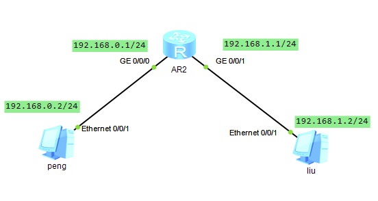
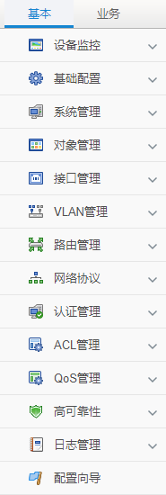
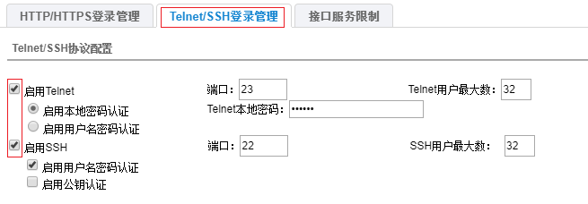

迪普设备登入
============

[TOC]

Topology
--------




这里利用的路由器代替**FW1000-GA-N**，这是一台

admin_default


设备版本升级
------------

### 步骤

版本升级分为的步骤

- 利用SecureCRT，会话日志，进行备份，有的需要图形化界面进行备份。
- 清除以前配置，重启
- 进入启动菜单，格式化cf，版本升级，格式化cf，等待启动
- 进行配置恢复，并且保存
- 测试网络连通性


### 实例

选择的设备是：**FW1000-GA-N**，防火墙。

抓取配置，`show  run`  并且保存。

清除配置，configuration clear-all，reboot。

--> console口连接串口

-->`Ctrl+B`，进入启动菜单

```python
onfiguring gmac0 in byte mode @ 125MHz (1000Mbps): full duplex mode

B1_XLS416 @ ATX_I $ 
Press Ctrl+B to enter extend boot menu...     #输入“Ctrl+B”进入启动菜单#

conplat will boot in  3
please enter the password:     #密码为空，输入“回车”即可#
```

--> 按4，进入文件控制目录 

--> 按4，进入FP格式化 

--> 按0，返回上一层目录 

--> 按3，进入以太网接口配置菜单

--> 按2，修改以太网参数

```python
Load File Name: FW1000-S111C008D016P06.bin     #软件版本名称#
Server IP Address:192.168.0.99     #TFTP服务器地址#
Local IP Address:192.168.0.1     #设备管理口地址#
Gateway IP Address:192.168.0.1     #设备网关地址#
Net Mask:255.255.255.0 Erasing 0xbf1c0000...     #设备管理口地址掩码#
```

--> 按3，通过TFTP上传版本

--> 按0，返回上一级目录，**4-->1查看是否上传成功**。

--> 按1，启动设备

-->按y，格式化CF，等待启动。

通过ping下一跳来检测是否通路，如果不同，则测试网关，如果网关不通，则需要检测链路问题，查看原来配置是否配好。

write file，成功。


### 注意

- 配置备份，当面对多台机器的时候，命名保存需要有规则，因为一般的流程都是先到处配置，再统一到现场配置。
- dp的产品，有些是命令行不可显示的，需要备份图形化界面的设置。
- 一定注意要保存设置：write file


## 界面认识

分为两个方面，第一个是基本的配置，因为迪普的设备是具有网路安全管控的，

对于防火墙其实就是：路由器+防火墙形成的，所以我基础的ip的配置。




配置基础命令
------------

基础的网络配置命令，和思科的设备很像。

- conf-mode:进入配置命令
- show ip int brief：查询当前的ip与接口信息。
- show ip route：查询路由信息


登入方式
--------

### web登入界面

本身当fw开启的时候，默认gige 0_0接口的ip是192.168.0.1

如果电脑用双绞线接入此端口，需要给电脑配一个同一个网段的ip，在浏览器中打开：http://192.168.0.1

使用用户：admin，密码：admin_default，进行登入设置即可


### Telnet或者SHH

都需要基于console口和web的登入方式进行，对fw的修改设置可以使用两者协议进行登入。

系统管理 --> 登入管理 --> 管理协议




然后就是如何使用secureRCT，进行连接，如果被汉化的secureRCT中的用户名是设备端口的ip


UMC
---

下载链接：https://www.dptech.com/index.php?m=content&c=index&a=lists&catid=56

report是免费版

