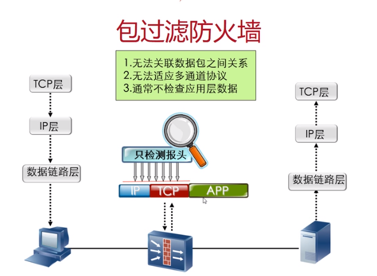
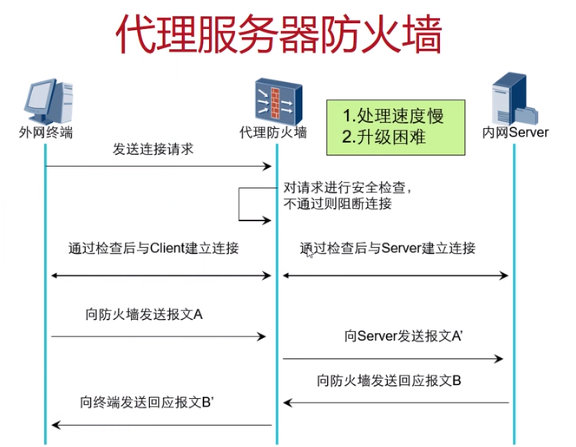
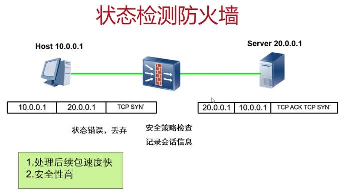
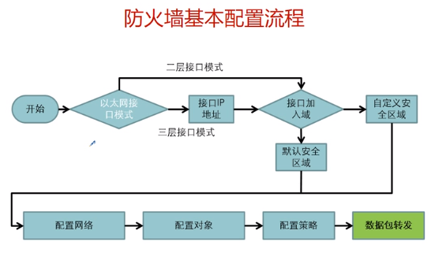
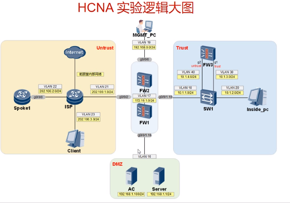

包过滤防火墙：网络层

代理防火墙：应用层

状态防火墙：网络层

当网络设备越来越多，ACL不适合进行使用，那么就会用转态检测。所有市面上的防火墙都是状态防火墙。

三层防火墙和二层防火墙

配置

实验

了解一个公司？

产品 --> 如何使用？--> 解决方案 ---> 岗位的了解。

官网是一个宣传的入口。

包过滤

- http 禁止访问

- ftp 禁止访问

高级业务

- P2P 流量限速

- URL 过滤

- 行为审计

- 防病毒

- 入侵防御

