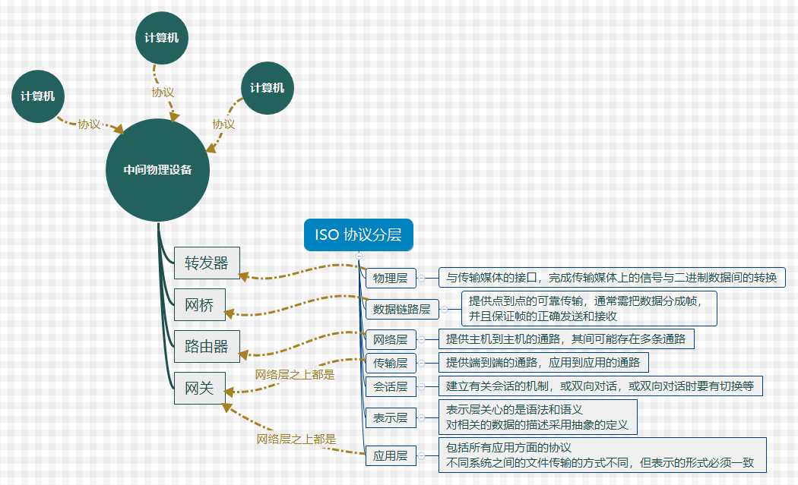

# 概述

[TOC]

## 为什么要有计算机网络，什么是计算机网络？？

计算机网络是  **计算机相互连接，形成可以通信的网络，至于网络是什么，就是类似于蜘蛛网**

为什么要有：**因为不同的计算机相互连接，可以实现资源共享与统一管理，缩短了人力距离**

> 比如为了使得我坐在教室可以访问北京大学的图书馆，但我不要坐火车过去，直接在网上了解就行了

## 形成计算机网络会遇到哪些问题，如何解决？？

对于这个问题，还需要先理清楚，我们用计算机网络来处理哪些问题?，对于他我们有哪些需求？？

针对需求进行一个设计，那么就会遇到设计的问题，并提出合理的解决方案。

所以有哪些需求？？

## 如何构建计算机网络？

这个问题还涉及到，怎么构建计算机网络，从硬件很软件两个方面。

首先肯定是由计算机的，再是中继设备，然后是传输媒介

最后解决如何传输的问题，及时计算机网络的协议了。

## 为什么要有计算机网络协议， 什么是计算机网络协议？？

协议：就是计算机间通信的标准，用同一种语言规范。

就像前后端有json传递数据，计算机可以根据json的格式解析获得信息。

就像人交流一样，如何表达客观存在的事物，我们协定了一套语言：汉语

## 协议如何构建？为什么要对协议分层？？

对于信息在计算机中传递这一过程，是很复杂的；

**因为人的记忆是短暂的，一般无法一路处理很长的逻辑，而且困难大，需要将事情分成块，一步一步处理。**

所以我们可以根据时间阶段，对于每一个时间段需要处理得我问题，进行一个函数封装。

同时这样也可以达到灵活性好，易于维护的特点。

## 如何学习？

有很多书，都是根据OSI七层协议，一层一层讲的，但我自己的理解感觉不对，应该是从实操来。

看他需要什么，在建立协议，有些东西他不是一下就建立协议的，需要一个过程。

当然如果从数据传输的一个初始阶段来演化的话。

先解决计算机连接以及传输媒介 --》 

​	数据帧传输的控制 ---》 

​		数据包转发以及网游  ---》

​			 数据段在计算机端口的传输 ---》

​				 应用级别的文本传输

总的来说，他是向上封装的一种协议类型，每一次打包都简化了我们对底层的思考与处理。

谢仁希的课本就是这么讲的，

而tcp/ip 优势另外一种讲法，就是将数据如何从对端传到对端的过程。

两种可以结合一起学。

OSI
---

[集线器、交换机、路由器有什么区别？](http://www.52im.net/forum.php?mod=viewthread&tid=1629#lastpost) 

### 设备

- 物理层---集线器、中继器 ：

  信号进行再生整形放大，以扩大网络的传输距离，共享介质有冲突域。

- 数据链路层---二层交换机与网桥

  继承物理层的功能，信号的方大，远距离传输，

  局域网MAC转发寻址，虚拟机局域网隔离冲突域。

- 网络层---路由器：信号放大，连接不同的网段区域，进行路由选择。

  

  

