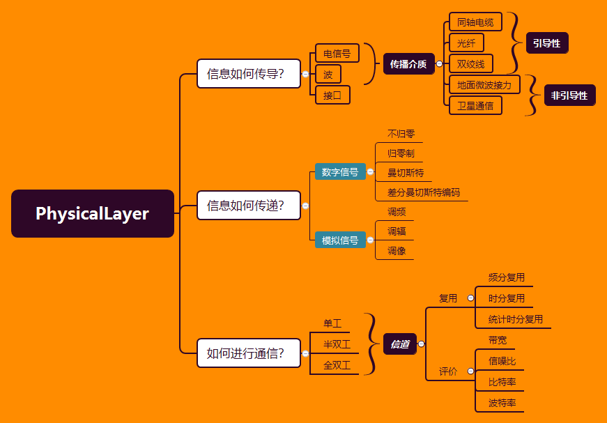

# 物理层

[TOC]

两台电脑连载一起，遇到的第一个问题就是：

信息应该以怎样传导？

信息应该应该怎样传递？

当应该如何进行传输？---信息如何进行转发。

再上升到如何进行通信？

 想象研究场景，**多台电脑连接了一个hub**，心中要有这么一个图

物理层的内容还是很容易串联的，两台电脑相连传输数据，

首先考虑到应该是传输介质的选择，到底用怎样的东西传递？

然后如果选择了有线传播，那他是如何传播？

电信号如何表示数据信息？模拟信息号，数字信息号

有了信息的转变，那么我们如何进行一个通信？

你说一句，我说一句，还是同时进行，如果同时进行如何分配信道？(是大喇叭、BB机、电话)

当我们链路增多，就需要考虑如何转发的问题，问题来源是对信道的占用问题

## 作用

与传输媒体的接口，完成传输媒体上的信号与二进制数据间的转换

## 目的

在保证传输媒体的数据能正确传播的情况下，**节省材料**，并**优化传输效率**。

### 信号表现

信号分两种，一种是离散型，一种是连续型的。也就是数字信息号，模拟信息号

- **模拟传输**：是指模拟数据的传输，不关心所传输信号的内容，而只关心尽量减少信号的衰减和噪声，长距离传输时，采用信号放大器放大被衰减的信号，但同时也放大了信号中的噪声
- **数字传输**：是指数字数据的传输，关心信号的内容，可以数字信号传输，也可以模拟信号传输，长距离传输时，采用转发器，可消除噪声的累积

### 传输的评价方式

#### 带宽

有效的频率范围，即构成信号的最高频和最低频之差

- 信道：信息的通道。通常一条物理媒体上可以有多个信道
- 数据：所要传输的信息，有数字数据和模拟数据
- 数据传输率：每秒能传输多少bit

#### 波特率

波特率：每秒内信号能改变的速率。显然，波特率越高，传输速率也越高

波特率不能无限提高，它受限于信号频率

Nyquist采样定理：最大的信号频率为H，则波特率为2H

#### 信噪比

在噪声信道中，当带宽为H Hz，信噪比为S/N，则：

  最大数据传输速率(b/s) = Hlog2(1+S/N) 

很多情况下信噪比用分贝（dB） 表示

  信噪比（dB）= 10log10 S/N 

如： 信噪比为30dB，则S/N=1000

## 信息转发

记忆点：电路转发独占信道，存储转发不忙转发，虚电路先建立链路

### 电路转发

- 在数据传输前，必须建立一条端到端的通路，称为连接，该连接可能穿越多个交换局，而每个交换局都必须为之提供连接

- 一旦建立连接，整个通路将被**独占**，除信号传播的延时之外，数据传输无额外延时，数据中毋需包含目的地址

- 线路的利用率较低

- 建立连接时间长，连接建立时冲突概率高  

### 存储转发

- 数据的传输毋需建立连接，数据的传输是一站一站往下送，无论数据传输过程要跨越多少个交换局（通常是路由器），只要      **下一站不忙，该数据即送至下一站**
- 数据中必须包含目的地址，并采用存储转发（store-forward*）机制
- 线路的利用率较高
- 由于采用store-forward机制，所以在数据传输过程中，除了信号传播的延时之外，还有存储和转发的延时，而且可能延时较大，且不可估计

两种记忆点：报文打包一份，分组先分组再组合。

#### 报文转发

- 将要发送的数据**打成一个包**，按存储转发的模式发送
- 缺点：包的长度变化很大，无法在内存预留空间，通常存储在外存储器上，影响了访问的速度

#### 分组转发

- 报文长度有个上限，每个报文称为一个分组
- 当发送的信息很长时，将被分为若干个**定长的分组**
- 每个分组中必须包含目的地址，并采用存储-转发机制
- 每个中间站点必须有缓存，但由于报文大小固定，所以缓存通常在内存中设置
- 接收分组和发送分组的顺序可能不一致 ，在目的站点需要将某一消息对应的所有分组重组起来恢复成发送的消息

### 虚电路

- 将电路交换和分组交换结合起来

- 传输前先建立连接，即**先找好通路**。信息还是以分组的形式传输。

优点

- 在分组传输时不需要找路径，提高传输速率

- 分组传输时，占用线路。传输结束后可以供其它连接传输分组。线路利用率高，

重点就在于如何建立虚电路，也就是后面路由表的建立。

## 数字信号与离散信号

这都是一种编码的格式，用来对现实中的数据转化为电信号的格式。

### 数字信号的几种方式

### 离散信号的几种方式

### 区别

