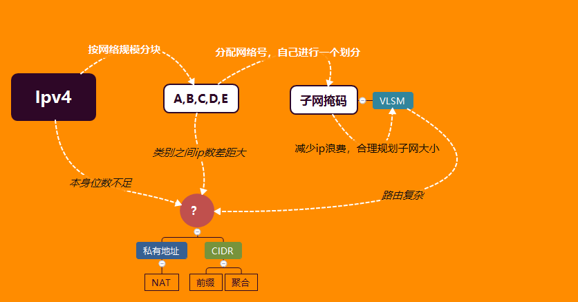
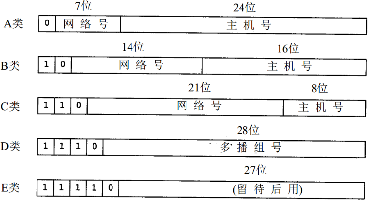

# IP地址的基本介绍

[TOC]

知识网络的构建

ipv4，指的是Internet Protocol version 4，用来第三层网络通信的报文标识。

是由64个10进制数字组成，通常用点分十进制标识。

在分配一个ip地址到不通过用户的时候，通常是一类一类的分，为：A，B，C，D，E，每一类的ip地址依次递减。

但一类一类的对于小企业，小网络来说太多ip地址，所以出现了子网掩码来进行类别间的继续划分。

还是不够精分，就出现了VLSM（可变长子网掩码）的技术，但同时带来了路由的问题应对计策是：CIDR

由于ip地址有限的原因，出现NAT（网络地址转换）+ 私网ip 的技术，通过端口复用的原理，来实现大规模的上网.

## IPV4设计原则

ipv4的协议设计，都围绕着：划分， 扩容，分配，三个问题展开

分块管理的设计思想。

### IP地址相关问答

#### 为什么要有IP地址和mac地址的不同？

IP地址指的网络中地址，mac地址是网卡中实际的地址

IP地址可能不唯一，因为在不同的局域网中IP地址可以重复，他的出现是为了方便网络上的寻址

从某种程度上减少了向mac地址寻址的麻烦，可以层级寻址，查询速度快。

MAC地址是唯一的，需要注意的是：一个计算机可以具有多个网卡，即可以具有多个mac地址

#### IP地址、名字、路由的区别？

IP地址是指明了你在网络上在哪，而名字指明了你是什么，路由指明了你应该怎么过去。

#### 如何申请IP地址？

发申请NIC --- APNIC --- CNNIC(中国互联网信息中心) ---  运营商

在哪获取的，在查询的时候，就会显示来自哪，比如说南昌大学的，就是来自运营商，而阿里来自自己，应该是独立申请。

一般我们去阿里云买一个云服务器都会有送一个公网ip

#### 怎么对IP地址做实验？

ifcongfig：用来查看当前电脑的ip

ping 连通性，同时可以获取摸个网站的ip

比如查看清华大学官网ip信息，查看清华大学的域名

这里看一下，发现ip地址是:166.111.4.100

这应该是B类地址，进行ip地址在线查询

是来自教育网的分配

在查一下江西南昌大学的，域名：www.ncu.edu.cn IP地址：218.64.56.38，这是一个C类地址

分配是电信。

也可以这样查：<http://whois.arin.net/rest/ip/218.87.136.6.txt>

要翻墙

#### 日常中的设备IP地址是什么类别？

看你连的什么网，城域网和局域网都是私有地址

可以手机的IP地址是运营商分配的，可以在设置中查到，再网上查询一下可以查出。

## IPV4设计的基本过程

- 首先根据计算机的特性，将ipv4设置为，**4个8位二进制标识**。

  > 通常逻辑上我们用点分十进制类记忆：、
  >
  > 1100 0000   1000 0000 0000 0001 0000 1010  记为  192.168.1.10

- 然后就是涉及到如何分配，根据不同地区的网民规模，划分一个**网络号**，也就是说`块状划分`，也称为一段。

  

  也很好记：

  A：0 

  B：256/2 

  C：256/2 + 256/2/2 

  D：256/2 + 256/2/2 + 256/2/2/2

- 这样就涉及到这个区域他自己如何划分，拿到这个网络号，首先这个区域庞大，不能说一个个ip划分，这样就显得不好为后面路由查找以及区分，沿用上面的思想，分块管理划分**子网**。

  > 这样每划分一个子网就会产生**两个无用的ip地址**：
  >
  > - 网络号(网段)：二进制中，网络位之后，全为0
  > - 全网地址(所有的主机)：二进制中，网络位之后，全为1

- 因为除去网络号后面的主机号有很多，我们不可能再这样命名abc来划分，所以提出一个**子网掩码**。

  > 子网掩码逻辑上是由4个8进制位组成，与ip地址相与得到**网段**。
  >
  > 192.168.1.10 255.255.255.0	可以记为	192.168.1.10/24

- 但如果说划分的子网也很大，而子网中也需要不同的划分，这怎么办？那就在这个子网中在进行子网划分，对于这个网络号来说，子网的划分通过了一个可以变长的**子网掩码VLSM**。

  假设说有A，B，C，D，E 五个部门，且上网人数分别为：100，50，30，10，5

  拥有192.168.1.0的c类网络号，则可以采用VLSM这样划分：

  

## IPV4面临的基本问题

那么问题就来了

- 随着网络人数规模增大，ip地址紧缺

- 由于ip类别的问题，粒度差别大，导致分配浪费

  > 如：主机数：2000，而c类地址容纳254台，B类地址容纳65534
  >
  > 导致分配c类地址不够，而B类地址太多。

- 由于可变长的子网掩码，导致路由管理赋复杂，每次查询话费时间大

## IPV4问题的解决

### 私有地址——NAT

IP地址紧缺 ---> ip地址重复使用 ---> 局域网、城域网私有化IP地址 ---> NAT协议进行公有与私有转化

#### 私有地址

#### NAT

Network Address Translation，网络地址转换。

实际上就是**端口号复用**的原理，ip地址不够端口来凑，但他也可以起到隐藏源ip的作用。

而进行端口复用的操作，一般都是在具有路由功能的设备上，通过修改传输层的段数据，来进行操作。

**例如**：

内部有一个电脑ip是：192.168.1.122，而在这个局域网的边界有一个路由器，出口ip为 12.1.1.9

那么当前的电脑进行网络通信，被标识为：192.168.1.122:6789，出去的ip端口是：12.1.1.9:5000

通过这样来建立一个端口表，进行复用。

但使用NAT的同时也产生很多问题：

就会遇到多种情况了，可以根据需求进行改变

- 配置ip的方式：静态，动态。

- 进行NAT转换的位置：出端口和入端口。

同时针对不同的业务场景会遇到不同的问题：

- 地址池和出接口不同一个网段
- 地址池带来的ARP风暴
- DNS的访问
- VRRP的备份

### CIDR

CIDR：**classless Inter-domain Routing**

#### 前缀

IP地址粒度大 ---> 打破粒度(类别)  ---> CIDR 前缀

其实就是打破了ABCDE类的一种分配方式：

以前是分配一个网络号，

如：主机数：2000，而c类地址容纳254台，B类地址容纳65534

本来是分配一个B类网络号：128.0.0.0 这样一个网络号，但现在可以这样分配：128.0.0.0/21

设置了这样的一个网段，可以容纳 256 * 8 = 2048 个主机，大大的缩减了ip地址的浪费。

#### 聚合

IP管理复杂 ---> 分块思想反向 ---> CIDR聚合

这个东西就是为了减少路由表的条目，之前我们都是将ip地址分块分下去，分的很细才能减少ip的浪费

而不可以避免的增加了路由表的条目。

那么聚合就是反分块，把ip地址相同的位数聚合一起查询，但并改变ip的分配，只是为了查询。

## 特殊IP地址

- 全网/缺省：0.0.0.0/32，但本机没有ip地址的时候，用全为0作为标识

- 本机回环：127.0.0.1，用来指代本机

