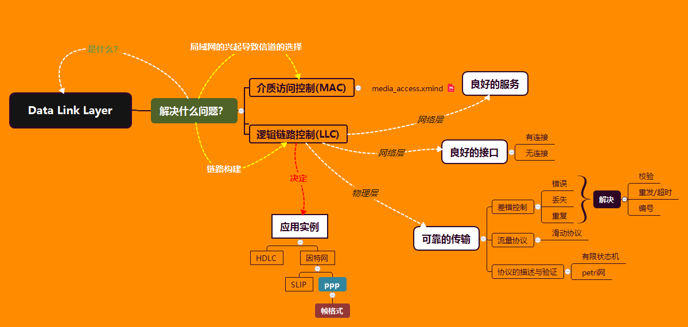
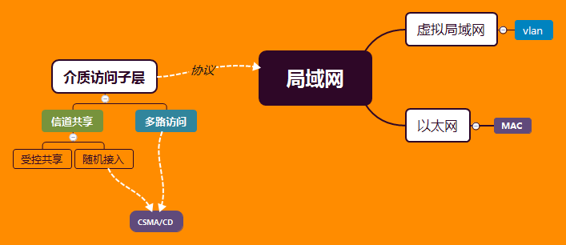
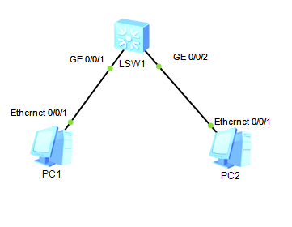
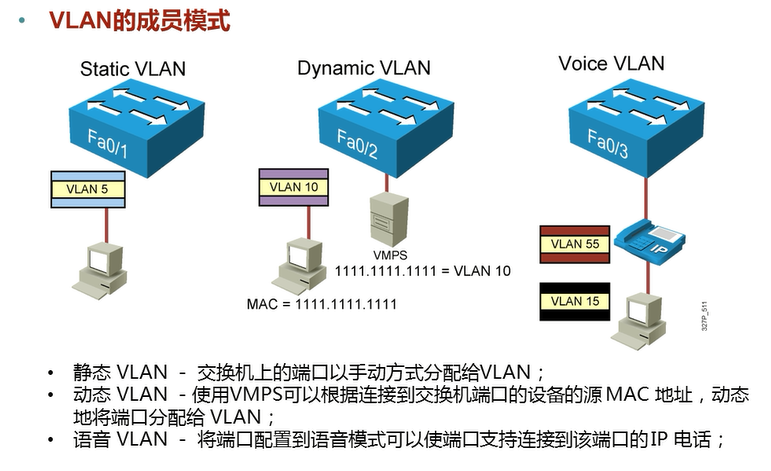

# 数据链路层

[TOC]




在网络的早期，只有公网的通信的时候，不用考虑数据的信道争端，只是路由器之间，路由器与电脑之间的之间通信，要完成通信使用的协议就是点对点通信。


在这两台电脑之间我们需要维护的就是：为**网络层提供接口和良好的服务**，同时保证物理连接两点的**可靠性传输**

而可靠性传输就要围绕下面的几点来说了：流量控制，差错检测，协议的描述与验证，

差错控制主要是为了解决如何问题：错误，帧丢失，帧重复。

然后我们根据这些要求，设计出数据链路层的协议，代表性的是ppp



后来由于局域网的出现（从整个网络看来，局域网属于数据链路层的范围），出现几台电脑通过hub互连的情况，一开始的物理层定义的信道复用问题，就无法满足要求，

需要我们重新对信道有所规划，涉及到共享信道的规划，这一块我么叫做**介质访问子层：MAC**（media access control），而上一层称为**逻辑链路控制：LLC**（logic link control）

也就是说，要先建立信道，在进行正常的网络通信。


**LLC已经成为历史**


ppp协议的文档：https://tools.ietf.org/html/rfc1334


ppp  是用于广域网的二层协议，对应的是点对点的信道，


广域网 --->局域网

载波监听对应

以太网是局域网协议，


ppoe、 拨号上网ADSL：学校就是利用用户名和密码来上网。

NAT，局域网地址转化为广域网地址，来进行上网


## 数据链路层的作用

- 为网络层提供一个较好的服务接口
- 为网络层提供可靠的传输服务，也就是保证物理连接的两点的可靠性传输。


### 数据链路层的定义？

数据链路层的上层是网络层，数据链路层将借助于物理层为网络层提供服务


## 数据在数据链路层的过程

**链路层** 获取 **网络层** 的数字信息 ---> 封装成**帧** ----> 转化为**物理层**可识别的一段连续的电信号 ---> 进行传递

另外一段获取并还原成帧 ---> 确认是否正确 ----> 送到数据链路层  


PPP 协议
--------

看一下标准文档给出的描述：[The Point-to-Point Protocol (PPP)](https://tools.ietf.org/html/rfc1661) 

这里给出一个视频的实验：[ppp实验视频](https://www.bilibili.com/video/av44996967?from=search&seid=1045187718963935840) 

参照的blog：[PPP中的CHAP认证实验](http://www.ming4.com/news/3548.html) 

华为官方配置ppp文档：[华为官网验证ppp](http://support.huawei.com/enterprise/docinforeader!loadDocument1.action?contentId=DOC0000646861&partNo=10072) 

### 实验

实验采用的华为ensp的模拟器，路由器是华为的AR2220，需要手动的给路由器添加广域网接口（2SA）

这里只进行一个单向的认证，类似于拨号上网，双向的只需要进行两次重复的配置操作。

抓包工具是wireshark

#### PAP验证

PAP 是Password Authentication Protocol 的缩写，采用的是明文的方式进行传输，不安全。

##### 拓扑

首先ppp是广义网的协议，Point to Point Protocol

所以是实验采用的是两个路由器通过，串口相连，且采用两个公网ip

两如路由器分别连接的是serial 4/0/0接口


##### 配置

- 首先是ip的配置

  ```c
  sys
  sysname RTA
  display int brief
  int serial 4/0/0
  ip add 12.1.1.1 24
  dis int serial 4/0/0 	// 只查看这个接口的信息
  
  sys						// 进入系统视图进行配置
  sysname RTB				// 修改路由器的名字
  display int brief		// 查看当前连接且拥有的广域网接口
  int serial 4/0/0		// 进入串口进行配置
  ip add 12.1.1.2 24		// 配置当前路由器的ip
  dis int serial 4/0/0 	// 只查看这个接口的信息
  ```

  可以查看到，这个接口已经up，且ip已经配好

  

  利用ping命令，发现两端是可以通信的。

- RTA服务端的配置

  ```c
  aaa											// 从系统视图进入AAA视图
  local-user rtb password cipher 123456
  local-user rtb service-type ppp
  q											// 退出AAA视图，进入系统视图
  int serial 4/0/0
  ppp authentication-mode pap					// 设置ppp认证模式为PAP
  restart										// 重启serial 4/0/0这个接口
  ```

  [AAA视图](http://support.huawei.com/enterprise/docinforeader!loadDocument1.action?contentId=DOC1000055518&partNo=10082#dc_ne_cfg_013336) 

  配置到这里会发现

  ```c
  // RTA报错
  On the interface Serial4/0/0, LCP negotiation failed because the result cannot be accepted.
  // RTB 报错
  The line protocol PPP on the interface Serial4/0/0 has entered the DOWN state. 
  ```

  尝试两端是否可以通信

  ```c
  // RTA使用ping，发现ping不通
  ping 12.1.1.2 
  ```

  说明配置成功

- RTB客户端的配置

  在RTB的serial 4/0/0 设置抓包

  

  发现当前的报文：

  

  然后开始配置信息：

  ```c
  int serial 4/0/0
  ppp pap local-user rtb password cipher 123456	// 配置服务器的验证信息
  restart	
  ```

  wireshark出现信息

  

  尝试着ping，发现可以通信，说明已经可以完成验证。

- 抓包信息分析

  参照文章：[PPP 抓包分析](https://blog.51cto.com/f1yinsky/1958527) 、[PPP链路建立过程抓包分析，PPP不要求同一网段!](https://forum.huawei.com/enterprise/zh/forum.php?mod=viewthread&tid=453293) 

  

#### CHAP验证

CHAP是三次握手，传输MD5值进行认证，相对于PAP来说更安全，企业一般采用的就是这种方式。

##### 拓扑


##### 配置

- ip信息配置

  ```c
  // RTA 的配置
  sys
  sysname RTA
  int Serial 4/0/0
  ip add 121.1.1.1 24
      
  // RTB 的配置
  sys
  sysname RTB
  int Serial 4/0/0
  ip add 122.1.1.1 24
  ```

  利用ping命令

  ```c
  // 在RTB中使用ping
  ping 121.1.1.1
  ```

  发现可以ping通，说明ip配置没有问题

- RTA的配置

  ```C
  sys
  local-user rtb password cipher 123456
  local-user rtb service-type ppp
  quit
  int serial 4/0/0
  ppp authentication-mode chap
  restart
  ```

- RTB的配置，同时开启抓包

  ```c
  sys
  int serial 4/0/0
  ppp chap user rtb
  ppp chap password cipher password 123456
  restart
  ```

  

  

### PPP分析

　NCP有很多种，如IPCP、BCP、IPv6CP，最为常用的是IPCP（Internet Protocol Control Protocol）协议。NCP的主要功能是协商PPP报文的网络层参数，如IP地址，DNS Server IP地址，WINS Server IP地址等。PPPoE用户主要通过IPCP来获取访问网络的IP地址或IP地址段


虚拟局域网
----------

虚拟局域网说白了就是，在交换机端口上进行区域划分，这个路由器中不同网段不能够直接通信的思想是一样的

都是为了满足具有共同点的客户进行统一的控制，对于不同点的客户进行隔离，就是分类管理二分算法快的思想。

具体表现为VLAN的配置

而vlan的配置，其实就是路由器，对数据帧的再封装，进行一个标识。

推荐阅读：[VLAN基础知识](https://blog.csdn.net/qq_38265137/article/details/80390759) 

华为虚拟局域网的配置

拓扑



```c
sys
vlan 10
quit
dis int brief
int GigabitEthernet 0/0/1
port link-type access
port default vlan 10
```

vlan的删除：undo port default vlan

trunk的配置

```
int Eth0/0/3
port link-type trunk
port trunk allow-pass vlan 10 20
```


vlan的类别

