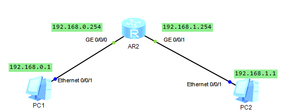
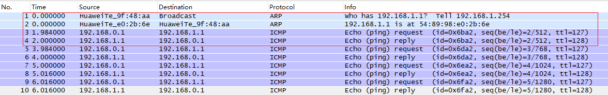
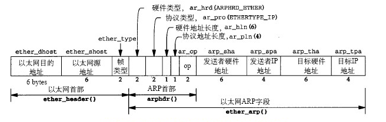

网络层
======

[TOC]

ARP、ICMP与IP分析
-------------

### 拓扑与配置

利用的华为的ensp设备做的实验，采用的三层的路由器。



- AR2

  ```c
  sys
  dis int brief
  int g0/0/0
  ip add 192.168.0.254
  int g0/0/1
  ip add 192.168.1.254
  ```

- PC1和PC2打开设置直接配上ip地址

  ```c
  PC1 
      ip:192.168.0.1
      子网掩码: 255.255.255.0
      网关: 192.168.0.254	// 跨网段，所以需要进行设置网关
  PC2
  	ip:192.168.1.1
      子网掩码: 255.255.255.0
      网关: 192.168.1.254
  ```


### 抓包分析

#### 流程分析

在PC1中使用ping命令(基于ip协议的协议，用来测试网络的连通性，发送的是ICMP报文进行相应，在这个过程中自然要进行arp寻址)，ping PC2的网关，并且在PC的以太网接口中进行抓包


PC1抓取到的arp协议

**使用ping命令**


可以看到的是，先发发送了一个ICMP报文，Time为0

看一下PC2的报文



可以发现，PC2首先收到的是路由器在 192.168.1.254 的g/0/0/1接口ARP报文

询问 我们在PC1ping的IP地址是谁？即是在这个网段进行广播，收到PC2的回应将自己的MAC地址传输给路由器

路由器再发送ICMP报文，同时回复ICMP

回到PC1中的截图，看一下报文


可以发现此时来自于路由器中192.168.0.254的g/0/0/1接口的ARP报文

这样可以看一下整个流程：

```c
--> PC1发送ICMP报文
--> 路由器直连 --> g/0/0/1接口发ARP报文询问PC2 --> 路由器发送ICMP 
--> PC2回复ICMP
--> 路由器直连 --> g/0/0/0接口发ARP报文询问PC1 --> 路由器回复ICMP
--> PC1发送ICMP报文
```


#### 报文分析

##### ARP

这里截取的是路由器向PC1发送的报文，可以发现ARP是在帧格式里面直接分装，而不是在IP协议中，说明ARP并不是基于IP协议进行工作的，这里需要说明的是又不同的书籍进行将ARP协议归纳为数据链路层的协议或者网际层的协议。


可以**发现这么几点**

- arp寻找目的设备，mac帧的目的地是：`ff:ff:ff:ff:ff:ff`，6组冒号分开的ff

- arp 报文格式，图片上的缩写可以对应上面的报文进行查看。

  

- [ARP协议工作流程](https://www.cnblogs.com/DarrenChan/p/6055130.html) 参考

  ```c
  --> 发起请求的设备查看arp缓存表 --> 无，发送以全1的MAC地址进行广播 
  --> 被请求的设备搜到ARP请求 --> 将请求ARP 的设备信息缓存到表中 ---> 回复ARP请求 
  --> 收到ARP回应， 设备缓存arp信息
  ```


##### ICMP与IP

这里截取的是PC1向PC2发送的ICMP报文。


可以发现，ICMP头部是IP协议，ICMP是基于IP协议以上的一种协议

> ICMP协议是IP协议的补充，用于IP层的差错报告、拥塞控制、路径控制以及路由器或主机信息的获取。


分析一下IP的报文


总结

- 数据包格式：

  

  type：常见的是request(8)，reply(0)，可分为两类一种是信息，一种是差错

  code：和type一样，共同标识ICMP的信息。

  checksum：校验和

- ICMP协议是IP协议的补充，用于IP层的差错报告、拥塞控制、路径控制以及路由器或主机信息的获取。


路由的配置
--------------

### 直连

### 静态

### 缺省路由

### 动态

#### 分类


### 

距离矢量、链路状态

