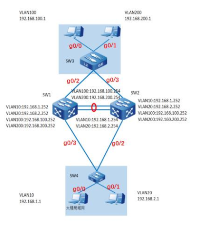

# 1Virtual Router Redundancy Protocol 

[TOC]

## 生成树

hostname sw3

con t

spanning-tree mst instance 0 priority 32768

spanning-tree enable


如果ip地址冲突

hostname sw2

con t

dis 表示阻塞

fwd  表示可以交换

show spanning-tree


控制接口不接受优先级设定

con t 

int g0/0

no spannning-tree enable 


## VRRP

默认优先级是100


sw3

con t

g0/2-0/2

switchport trunk 


## 第一天实训

### topology



### sw1操作代码


#### 生成树配置

```shell
spanning-tree mst instance 0 priority 4096
spanning-tree enable
```

#### 协议汇聚

```shell
config terminal

vlan 10,20,100,200
int vlan 10
ip add 192.168.1.252 24
int vlan 20
ip add 192.168.2.252 24
int vlan 100
ip add 192.168.100.252 24
int vlan 200
ip add 192.168.200.252 24

link-aggregation 1 mode lacp
int g0/0-0/1
link-aggregation 1 active
exit


link-aggregation 1
switchport mode trunk
switchport trunk allowed vlan add 10,20,100,200
```

#### VRRP配置

```
int vlan 10
vrrp 1 ip 192.168.1.254
vrrp 1 priority 150
exit

int vlan 20
vrrp 2 ip 192.168.2.254
exit


int vlan 10
vrrp 1 ip 192.168.1.254
exit

int vlan 20
vrrp 2 ip 192.168.2.254
vrrp 2 priority 150
exit
```


#### 指定接口的vlan

```
int g0/2
switchport mode trunk
switchport trunk allowed vlan add 100,200

int g0/3
switchport mode trunk
switchport trunk allowed vlan add 10,20
```


#### 查看vlan


### sw4配置

#### 生成树控制

```
con t
spanning-tree mst instance 0 priority 32768
```

#### vlan 与接口开通

```
vlan 10,20
int g0/0
switchport mode access
switchport access vlan  10

int g0/1
switchport mode access
switchport trunk allowed vlan add 20

int g0/2-0/3
switchport mode trunk
switchport trunk allowed vlan add 10
switchport trunk allowed vlan add 20
```


### sw2

#### 生成树配置

```shell
spanning-tree mst instance 0 priority 8192
spanning-tree enable
```

#### 协议汇聚

```shell
config terminal

vlan 10,20,100,200
int vlan 10
ip add 192.168.1.252 24
int vlan 20
ip add 192.168.2.252 24
int vlan 10
ip add 192.168.100.252 24
int vlan 20
ip add 192.168.200.252 24

link-aggregation 1 mode lacp
int g0/0-0/1
link-aggregation 1 active
exit

link-aggregation 1
switchport mode trunk
switchport trunk allowed vlan add 10,20,100,200
```

#### VRRP配置

```
int vlan 10
vrrp 1 192.168.1.254
vrrp 1 priority 150
exit

int vlan 10
vrrp 1 192.168.2.254
exit


int vlan 20
vrrp 1 192.168.2.254
vrrp 1 priority 150
exit

int vlan 10
vrrp 1 192.168.1.254
exit
```


#### 指定接口的vlan

```
int g0/2
switchport mode trunk
switchport trunk allowed vlan add 100,200

int g0/3
switchport mode trunk
switchport trunk allowed vlan add 10,20
```


### sw3配置

#### 生成树控制

```
con t
spanning-tree mst instance 0 priority 32768
```

#### vlan 与接口开通

```
vlan 10,20
int g0/0
switchport mode access
switchport access vlan  10

int g0/1
switchport mode access
switchport trunk allowed vlan add 20

int g0/2-0/3
switchport mode trunk
switchport trunk allowed vlan add 10
switchport trunk allowed vlan add 20
```


### 

### 四台电脑配置

sw4-->vlan10


