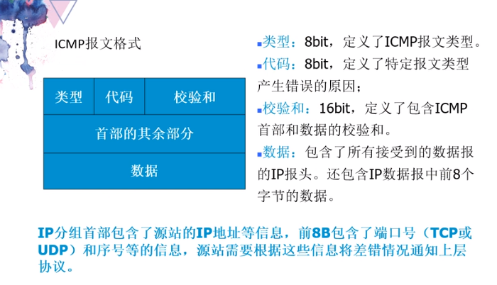
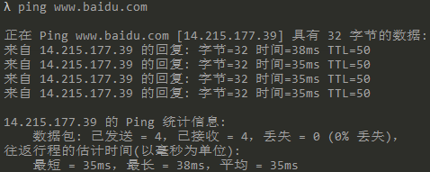
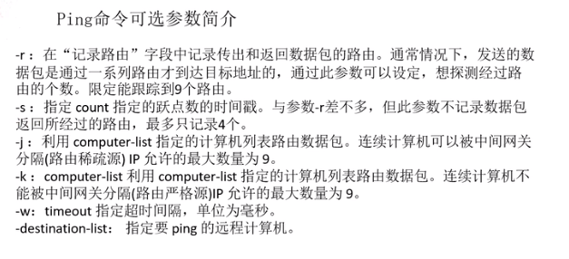

# ICMP

[TOC]

参考文章：[ping原理介绍](<https://blog.csdn.net/genius_lg/article/details/15420491>) 、[ping获取源码](<https://blog.csdn.net/tekenuo/article/details/84340873>) 

[ping命令整个过程详解](<https://blog.csdn.net/guoweimelon/article/details/50859658>)、[ping源码分析](<https://blog.csdn.net/rosetta/article/details/7343533>) 、[路由追踪程序Traceroute分析与科普](<https://www.freebuf.com/articles/network/118221.html>)

参考视频：[ICMP](<https://www.bilibili.com/video/av37717264?from=search&seid=7045843334416560662>)

## 用途

用来测试网络是否通畅，在操作系统通常结合ping来用。

需要知道的是ICMP是网络路层的协议，是基于物理层进行一个工作的。

## 报文格式

## 使用分析

## tracert

与传输层的UDP协议想结合，用来跟踪测试网络的节点。

原理是利用TTL每次加一，每次只能登入一个路由器，不能被转发，只获取当前路由器的报文。