计算机网络
==========

[](https://www.github.com/kevin-leak)  [](http://www.crabglory.club)  


> 文章写作的方式：
>
> 看书和做实验后，自己脑子里形成的一个知识网络
>
> 首先是一个整体的对网络的思考和理解，
>
> 后面是每一层的**思维构建**（将TCP/IP中的物理接口分为物理层和数据链路层来)
>
> 每层都会有具体的思维导图，然后细说。


概述
----

可以先看问题，再看问题中具体的解释，而更直观的放在了OSI这个分节的图片。

### 问题思考

首先要明白计算机网络的构建是为了什么，其实就是**资源共享**

而要构建**网络通道**面对的是：

1. 如何将任意两台电脑相互连接？

   相连首要考虑的是采用什么传导介质，要达到任意的相连，就是要有一套接口标准以及适配器，以及信息在电流中的表示方式。

   连接设备是：集线器

2. 如何建立稳定的通信链路？

   链路就是两台电脑有中继设备，主要涉及到两台或者多台电脑之间，介质共享和逻辑链路控制。

   连接设备是：交换机，网桥

3. 多个网络区域如何通信？

   和同一个区域的不一样是，同一个区域可以用广播的方式进行通信即可，而多个网络区域，就涉及到点对点的寻址，以及发送消息时选路。

   连接设备是：路由器

当通信通道构建起来了，我们从操作系统这一层以上来说，就是涉及到如何具体的实现通信。

1. 进程之间隔离通信？

   端到端的通信

2. 资源用户的通信？

   建立会话

3. 资源的适配转化？

   不同的资源用户会有不同的传输方式，需要一个规定来标识

4. 接下来就是应用的阶段。


### OSI

有那么个组织ISO：International Organization for Standardization，为了更好的制定规标准和管理，对网络进行了分层。也就是OSI：Open System Interconnection，开放式网络互联。

分层及具体如下：


### OSI与TCP/IP区别

OSI是国际制定的一个标准，而TCP/IP是早期发展起来的网络协议产品。

TCP/IP 协议只有四层：网络接口、网际互联、传输层、应用层。

需要注意的是：

- 网络接口层对应：OSI的物理和数据链路层
- TCP/IP应用层：OSI中的会话、表示、应用。


物理层 --> physical_layer
-------------------------

### 思维网络

物理层要解决的及时显示中的信息，如何转化为电信号，进行传输，同时满足所有类型的接口。


在物理层中，首先想到的场景是两台电脑相连，需要面对的就是：

```c
传导 ---> 传递  --> 通信
```

首先遇到的就是如何相连，传导问题，

**信息如何传导？**

生活中可以了解到就是，有线和无线，专业一点说就是引导性和非引导性。

引导性的就是：同轴电缆、双绞线、光纤。速度和制造价格一次递增。

非引导性的就是：卫星和基站。

有了先自然要有接口，平常可以接触到的就是以太网接口

有了连通传导设备，接下来需要做的就是，将信息以电信号传递。

**信息如何传递？**

首先从操作系统中可以了解到，信息都是以二进制传输的，而二进制在物理层的表现方式其实就是电流的状态。

在一个时钟内的状态变化，来形成一个信息点，简称码元

解决信息编码的问题，两台电脑就可以接收物理层的数据信息了，哪么应该建立什么样的通信和信道？

**如何进行通信？**

是大喇叭、BB机、电话？其实专业一点就是代表着，单工、半双工、双工这三种通信。方式。

物理层就是解决这三个问题的。


### 信号编码的区别

将生活中的实际信息转化为电信号，可以采用的编码方式有两种：数字信号、模拟信号。

数字信号也叫离散信号，模拟信号也叫连续信号

**数字信号**


黑色的部分为一个时钟，也就是获取一个0,1信息的时候，

- 不归零：正电平为1，低电平为0
- 归零制：正脉冲代表1，负脉冲代表0
- 曼切斯特：在一个时间周期的中间，发生向上的突变为0，发生向下的突变为1；
- 差分曼切斯特：在一个时间周期的的中间都会发生跳变，在时间周期边界，如果发生突变为代表为0，否则代表为1

信道本身容易受到干扰，所以要采用不归零制和归零制都是不容易的。

以太网一般采用的是：曼切斯特编码

**模拟信号**


稍微了解一下就行。


### 信道复用

信道 = 物理介质+逻辑通道


面对多台电脑连接在一个hub里面，如果说这几台设备同时发送消息，则会出现碰撞，就像打电话一样同时说话，就容易发生冲突

而信道复用技术，是一种静态的共享介质，可以减少一些冲突

采用的就是：

- 频分复用，时分复用，统计时分复用
- 波分复用
- 码分复用


### 信道质量的衡量标准

为什么会出现信道的质量问题？

因为会有线道老化，如果是波传播，还有可能出现其他波的干扰

有几个从不同角度来衡量信道的名词

<table>
    <tr>
        <td> 带宽 </td>
        <td> 就是形容一条传输设备的承载能力，这个和传输介质的材质有关 </td>
	</tr>
    <tr>
        <td> 信噪比 </td>
        <td> 信号的平均功率和噪声的平均功率之比</br>
    		 香农公式：
    	</td>
    </tr>
    <tr>
        <td> 波特率 </td>
        <td> // todo </td>
    </tr>
    <tr>
        <td> 比特率 </td>
        <td> 单位时间内传输了多少位 </td>
    </tr>
</table>

波特率与比特率

- 如果传输的信号是二值的，每次采样可以得到一个比特，那么波特率等与比特率

- 如果能将信号分成更多的等级，如4级，那么每个信号可以携带2个比特，每次采样就能得到2个比特，则比特率等于2倍的波特率


数据链路层——data_link_layer
---------------------------

### 思维网络


数据链路层，可以想象的是两种场景，第一种是两个路由器相连的信道的建立，第二种是多台电脑采用总线型的方式进行连接，会有一个共享信道的争夺问题，以及在同一局域网中如何获取对方的标识问题（也就是MAC地址）

这样就会很清晰的知道，数据链路层分为两层：**逻辑链路控制（LLC）**、**媒体访问控制（MAC）**

现在的以太网没有直接的逻辑链路控制包，都是包裹在MAC帧中，也就是说，在数据链路层中，逻辑链路控制层在媒体访问控制的上层。

对于逻辑链路来说，面对上层网络层：在数据链路层中需要满足的功能是给网络层提供良好的服务，以及有连接和无连接的接口（这现在已经遗弃，放在了传输层里面），而面对物理层，需要做到就是可靠性传输

这种需求在网络中具体落实的产品是HDLC，**PPP**

在发展的局域网中，通常拓扑结构是：总线型，总线型：

那么就会遇到共享介质的问题？

在物理层提出的解决方案是信道的复用，通过指定每个用户的复用和分用的格式，这种是静态的解决方案。

在数据链路层，提出的是动态的获取信道的方法：**CSMD/CD**

当解决完共享信道的问题，就是局域网中的寻址的问题了，这里用的不是ip地址，ip地址用于网络层通信的标识，对于同一个局域网中只有几台设备相互连接，没有必要取浪费一个公网的ip，我们需要找到的是**唯一不会改变的标识**，就是我们的物理地址**MAC地址**

这里给出介质子层的思维图

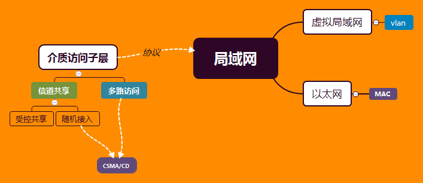

局域网是介质子层的产品；

面对介质访问这个问题，其实需要解决两个问题，一个信道共享，一个是多路访问，

信道共享实际上分为两种，一种是受控共享，代表的是令牌环，而随机接入代表的是CSMD/CD

在信道共享的实现中，同样会出现因为信道的共享而导致消息泛洪，这是一种新型的技术**VLAN**就出现了


### 可靠性传输

其实面对的就是三个基本问题：**封装成帧**、 **透明传输**、**差错检测** 

封装成帧，就是在物理的传输过程中，对于一段波形或者说编码，我们需要知道哪里是一段，

也就是说要有分割线，这里就遇到一个问题：

如何区分普通的数据和分割数据？

**解决办法**：利用不可打印的字符

透明传输的意思不是数据不可见，而是数据中不可见不可打印的字符，如果遇到这样的字符需要转义。

而差错检测是要面对三个问题：

如何判断数据被破坏？--> CRC 虚拟冗余码、海明威、校验和

如何面对数据被丢失？--> 时间计数器，重发

如何判断有重复帧？--> 帧有编号


流量控制，这个东西现在已经在数据链路层舍弃了，放在了传输层去做，其实采用的也是**滑动窗口协议**


### PPP与PPOE

看一下标准文档给出的描述：[The Point-to-Point Protocol (PPP)](https://tools.ietf.org/html/rfc1661) 

这里给出一个视频的实验：[ppp实验视频](https://www.bilibili.com/video/av44996967?from=search&seid=1045187718963935840) 

参照的blog：[PPP中的CHAP认证实验](http://www.ming4.com/news/3548.html) 

华为官方配置ppp文档：[华为官网验证ppp](http://support.huawei.com/enterprise/docinforeader!loadDocument1.action?contentId=DOC0000646861&partNo=10072) 

一位大神的源码分析：  [PPP/PPPOE源码阅读笔记](https://blog.csdn.net/kh815/article/details/81196235) 


**PPPOE 是 PPP协议在以太网的利用。**

具体的PPOE实验可以参考这篇博客：[PPPoE抓包分析](https://blog.csdn.net/u013688006/article/details/88913891) 


#### 实验

实验采用的华为ensp的模拟器，路由器是华为的AR2220，需要手动的给路由器添加广域网接口（2SA）

这里只进行一个单向的认证，类似于拨号上网，双向的只需要进行两次重复的配置操作。

抓包工具是wireshark

##### PAP验证

PAP 是Password Authentication Protocol 的缩写，采用的是明文的方式进行传输，不安全。

###### 拓扑

首先ppp是广义网的协议，Point to Point Protocol

所以是实验采用的是两个路由器通过，串口相连，且采用两个公网ip

两如路由器分别连接的是serial 4/0/0接口


###### 配置

- 首先是ip的配置

  ```c
  sys
  sysname RTA
  display int brief
  int serial 4/0/0
  ip add 12.1.1.1 24
  dis int serial 4/0/0 	// 只查看这个接口的信息
  
  sys						// 进入系统视图进行配置
  sysname RTB				// 修改路由器的名字
  display int brief		// 查看当前连接且拥有的广域网接口
  int serial 4/0/0		// 进入串口进行配置
  ip add 12.1.1.2 24		// 配置当前路由器的ip
  dis int serial 4/0/0 	// 只查看这个接口的信息
  ```

  可以查看到，这个接口已经up，且ip已经配好

  

  利用ping命令，发现两端是可以通信的。

- RTA服务端的配置

  ```c
  aaa											// 从系统视图进入AAA视图
  local-user rtb password cipher 123456
  local-user rtb service-type ppp
  q											// 退出AAA视图，进入系统视图
  int serial 4/0/0
  ppp authentication-mode pap					// 设置ppp认证模式为PAP
  restart										// 重启serial 4/0/0这个接口
  ```

  [AAA视图](http://support.huawei.com/enterprise/docinforeader!loadDocument1.action?contentId=DOC1000055518&partNo=10082#dc_ne_cfg_013336) 

  配置到这里会发现

  ```c
  // RTA报错
  On the interface Serial4/0/0, LCP negotiation failed because the result cannot be accepted.
  // RTB 报错
  The line protocol PPP on the interface Serial4/0/0 has entered the DOWN state. 
  ```

  尝试两端是否可以通信

  ```c
  // RTA使用ping，发现ping不通
  ping 12.1.1.2 
  ```

  说明配置成功

- RTB客户端的配置

  在RTB的serial 4/0/0 设置抓包

  

  发现当前的报文：

  

  然后开始配置信息：

  ```c
  int serial 4/0/0
  ppp pap local-user rtb password cipher 123456	// 配置服务器的验证信息
  restart	
  ```

  wireshark出现信息

  

  尝试着ping，发现可以通信，说明已经可以完成验证。

- 抓包信息分析

  参照文章：[PPP 抓包分析](https://blog.51cto.com/f1yinsky/1958527) 、[PPP链路建立过程抓包分析，PPP不要求同一网段!](https://forum.huawei.com/enterprise/zh/forum.php?mod=viewthread&tid=453293) 

  

##### CHAP验证

CHAP是三次握手，传输MD5值进行认证，相对于PAP来说更安全，企业一般采用的就是这种方式。

###### 拓扑


###### 配置

- ip信息配置

  ```c
  // RTA 的配置
  sys
  sysname RTA
  int Serial 4/0/0
  ip add 121.1.1.1 24
      
  // RTB 的配置
  sys
  sysname RTB
  int Serial 4/0/0
  ip add 122.1.1.1 24
  ```

  利用ping命令

  ```c
  // 在RTB中使用ping
  ping 121.1.1.1
  ```

  发现可以ping通，说明ip配置没有问题

- RTA的配置

  ```C
  aaa
  local-user rtb password cipher 123456
  local-user rtb service-type ppp
  quit
  int serial 4/0/0
  ppp authentication-mode chap
  restart
  ```

- RTB的配置，同时开启抓包

  ```c
  aaa
  int serial 4/0/0
  ppp chap user rtb
  ppp chap password cipher password 123456
  restart
  ```

  

  这里可以看到PPP协议在这里通过CHAP建立了数据的连接，同时通过IPCP进行IP信息的交换。
  
  

#### PPP分析

PPP 请求过程：LCP发送连接请求，收到ACK，进行CHAP或者PAP认证，IP信息管理利用NCP（network control Protocol），最后LCP建立稳定连接

NCP有很多种，如IPCP、BCP、IPv6CP，最为常用的是**IPCP（Internet Protocol Control Protocol）**协议。NCP的主要功能是协商PPP报文的网络层参数，如IP地址，DNS Server IP地址，WINS Server IP地址等。

PPPoE用户主要通过IPCP来获取访问网络的IP地址或IP地址段


### CSMA/CD

Carrier Sense Multiple Access / Collision Detection：载波监听多点接入/碰撞检测

参考文章：[CSMA/CD 协议](https://blog.csdn.net/violet_echo_0908/article/details/51897628) 

总结一个过程：

假设两台电脑向对端发送信息，A和B，

```
A先发送消息，走到一半与B发生的消息相撞，代表着有人要占用信道
A和B同时等待一段时间，A在发送消息。
```

关键在于等待时间是多长？如果两者同时等待相同的时间，还是发生冲突，如何处理？

以太网采用的是**二进制指数退避算法**

参考这篇文章：[CSMA/CD 及其二进制指数退避算法](https://blog.csdn.net/qq_32534441/article/details/88659857) 

当等待的时间是一个随机的且与信道的通信一次的时间有关的话，那么冲突的概率就降到最低了，具体的而看上这一片文章。


### MAC帧分析

简单的拓扑，利用电脑ping网关，获取ARP报文（MAC帧的一种)

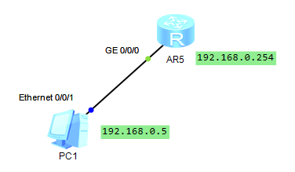

抓包获取的信息：

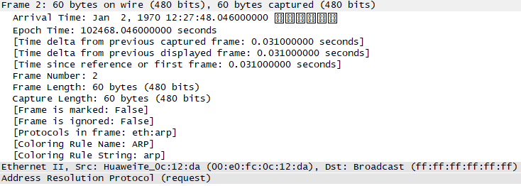

表格化可以看到这个：


具体参考：[mac层的主要功能介绍 - 全文](http://www.elecfans.com/news/wangluo/20180315647693_a.html) 

mac帧是一个数据链路的一个统称，帧投是大部分是一样的，知识具体的协议信息有变化，比如可能是ARP，也可能是包裹的PARP，或者IP

还有一点需要注意的是： **常用的以太网MAC帧格式有两种标准 ：**DIX Ethernet II标准，IEEE 的 802.3 标准。


### VLAN

vlan：virtual local area network，虚拟局域网

虚拟局域网的出现就是问了解决广播风暴，减少不必要的资源浪费

在具体的网络部署中，通常设置vlan标签来进行区域的划分，一个vlan通常使用一个信道被标识为access，

而在主干道要求所有vlan都可以通过，所以在可以用trunk这个来进行添加标识。


虚拟局域网说白了就是，在交换机端口上进行区域划分，这个路由器中不同网段不能够直接通信的思想是一样的

都是为了满足具有共同点的客户进行统一的控制，对于不同点的客户进行隔离，就是分类管理二分算法快的思想。

具体表现为VLAN的配置

而vlan的配置，其实就是路由器，对数据帧的再封装，进行一个标识。

推荐阅读：[VLAN基础知识](https://blog.csdn.net/qq_38265137/article/details/80390759) 

华为虚拟局域网的配置

拓扑

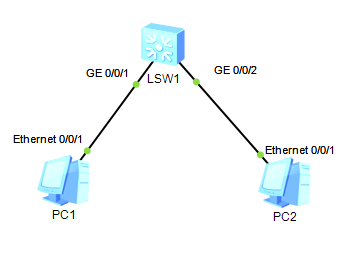

```c
sys
vlan 10
quit
dis int brief
int GigabitEthernet 0/0/1
port link-type access
port default vlan 10
```

vlan的删除：undo port default vlan

trunk的配置

```
int Eth0/0/3
port link-type trunk
port trunk allow-pass vlan 10 20
```


**vlan的类别**

其实就是根据不同的方式去设置vlan：

- 静态vlan：根据端口

- 动态vlan：根据mac地址

- 语音vlan：IP电话

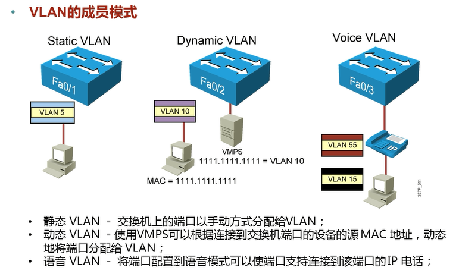


网络层——network_layer
---------------------

### 思维网络


### ICMP与IP、ARP

#### 拓扑与配置

利用的华为的ensp设备做的实验，采用的三层的路由器。


- AR2

  ```c
  sys
  dis int brief
  int g0/0/0
  ip add 192.168.0.254
  int g0/0/1
  ip add 192.168.1.254
  ```

- PC1和PC2打开设置直接配上ip地址

  ```c
  PC1 
      ip:192.168.0.1
      子网掩码: 255.255.255.0
      网关: 192.168.0.254	// 跨网段，所以需要进行设置网关
  PC2
  	ip:192.168.1.1
      子网掩码: 255.255.255.0
      网关: 192.168.1.254
  ```


#### 抓包分析

##### 流程分析

在PC1中使用ping命令(基于ip协议的协议，用来测试网络的连通性，发送的是ICMP报文进行相应，在这个过程中自然要进行arp寻址)，ping PC2的网关，并且在PC的以太网接口中进行抓包


PC1抓取到的arp协议

**使用ping命令**


可以看到的是，先发发送了一个ICMP报文，Time为0

看一下PC2的报文

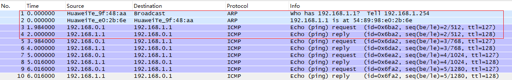

可以发现，PC2首先收到的是路由器在 192.168.1.254 的g/0/0/1接口ARP报文

询问 我们在PC1ping的IP地址是谁？即是在这个网段进行广播，收到PC2的回应将自己的MAC地址传输给路由器

路由器再发送ICMP报文，同时回复ICMP

回到PC1中的截图，看一下报文


可以发现此时来自于路由器中192.168.0.254的g/0/0/1接口的ARP报文

这样可以看一下整个流程：

```c
--> PC1发送ICMP报文
--> 路由器直连 --> g/0/0/1接口发ARP报文询问PC2 --> 路由器发送ICMP 
--> PC2回复ICMP
--> 路由器直连 --> g/0/0/0接口发ARP报文询问PC1 --> 路由器回复ICMP
--> PC1发送ICMP报文
```


##### 报文分析

###### ARP

这里截取的是路由器向PC1发送的报文，可以发现ARP是在帧格式里面直接分装，而不是在IP协议中，说明ARP并不是基于IP协议进行工作的，这里需要说明的是又不同的书籍进行将ARP协议归纳为数据链路层的协议或者网际层的协议。

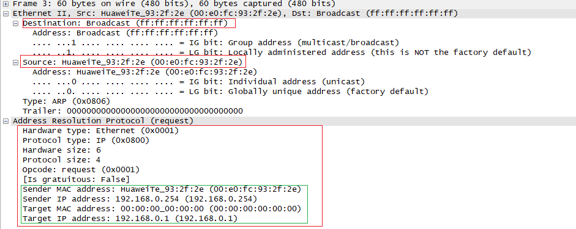

可以**发现这么几点**

- arp寻找目的设备，mac帧的目的地是：`ff:ff:ff:ff:ff:ff`，6组冒号分开的ff

- arp 报文格式，图片上的缩写可以对应上面的报文进行查看。

  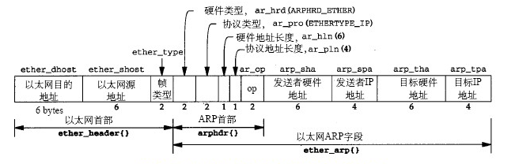

- [ARP协议工作流程](https://www.cnblogs.com/DarrenChan/p/6055130.html) 参考

  ```c
  --> 发起请求的设备查看arp缓存表 --> 无，发送以全1的MAC地址进行广播 
  --> 被请求的设备搜到ARP请求 --> 将请求ARP 的设备信息缓存到表中 ---> 回复ARP请求 
  --> 收到ARP回应， 设备缓存arp信息
  ```


###### ICMP与IP

这里截取的是PC1向PC2发送的ICMP报文。


可以发现，ICMP头部是IP协议，ICMP是基于IP协议以上的一种协议

> ICMP协议是IP协议的补充，用于IP层的差错报告、拥塞控制、路径控制以及路由器或主机信息的获取。


#### 总结

- 数据包格式：

  

  type：常见的是request(8)，reply(0)，可分为两类一种是信息，一种是差错

  code：和type一样，共同标识ICMP的信息。

  checksum：校验和

- ICMP协议是IP协议的补充，用于IP层的差错报告、拥塞控制、路径控制以及路由器或主机信息的获取。


### IP——掩码 / VLSM / NAT / CIDR

#### 思维网络


ip地址是用于网络寻址的标识，ipv4的协议设计，都围绕着：划分， 扩容，分配，三个问题展开。

ip地址都是划分为块，分给某个产商，自己进行内部管理。

不同的块给予了不同的分配类名，而为了产商更好的管理和标识就采用了子网掩码这种标识。


#### 为什么要有IP地址和mac地址的不同？

IP地址指的网络中地址，mac地址是网卡中实际的地址

IP地址可能不唯一，因为在不同的局域网中IP地址可以重复，他的出现是为了方便网络上的寻址

从某种程度上减少了向mac地址寻址的麻烦，可以层级寻址，查询速度快。

MAC地址是唯一的，需要注意的是：一个计算机可以具有多个网卡，即可以具有多个mac地址


#### IP地址、名字、路由的区别？

IP地址是指明了你在网络上在哪，而名字指明了你是什么，路由指明了你应该怎么过去。


#### 如何申请IP地址？

发申请NIC --- APNIC --- CNNIC(中国互联网信息中心) ---  运营商

在哪获取的，在查询的时候，就会显示来自哪，比如说南昌大学的，就是来自运营商，而阿里来自自己，应该是独立申请。

一般我们去阿里云买一个云服务器都会有送一个公网ip


#### 怎么对IP地址做实验？

ifcongfig：用来查看当前电脑的ip

ping 连通性，同时可以获取摸个网站的ip

比如查看清华大学官网ip信息，查看清华大学的域名

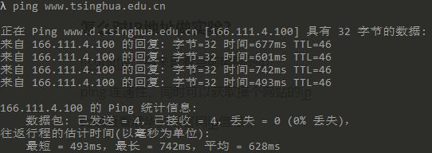

这里看一下，发现ip地址是:166.111.4.100

这应该是B类地址，进行ip地址在线查询

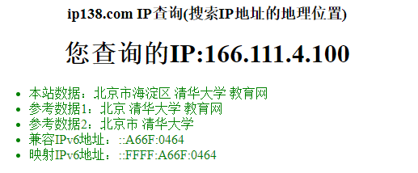

是来自教育网的分配


在查一下江西南昌大学的，域名：www.ncu.edu.cn IP地址：218.64.56.38，这是一个C类地址

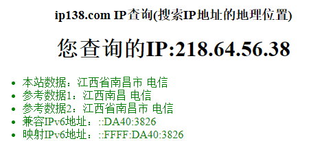

分配是电信。


也可以这样查：<http://whois.arin.net/rest/ip/218.87.136.6.txt>

要翻墙


#### 日常中的设备IP地址是什么类别？

看你连的什么网，城域网和局域网都是私有地址

可以手机的IP地址是运营商分配的，可以在设置中查到，再网上查询一下可以查出。


#### IPV4设计的基本过程

- 首先根据计算机的特性，将ipv4设置为，**4个8位二进制标识**。

  > 通常逻辑上我们用点分十进制类记忆：、
  >
  > 1100 0000   1000 0000 0000 0001 0000 1010  记为  192.168.1.10

- 然后就是涉及到如何分配，根据不同地区的网民规模，划分一个**网络号**，也就是说`块状划分`，也称为一段。

  

  也很好记：

  A：0 

  B：256/2 

  C：256/2 + 256/2/2 

  D：256/2 + 256/2/2 + 256/2/2/2

- 这样就涉及到这个区域他自己如何划分，拿到这个网络号，首先这个区域庞大，不能说一个个ip划分，这样就显得不好为后面路由查找以及区分，沿用上面的思想，分块管理划分**子网**。

  > 这样每划分一个子网就会产生**两个无用的ip地址**：
  >
  > - 网络号(网段)：二进制中，网络位之后，全为0
  > - 全网地址(所有的主机)：二进制中，网络位之后，全为1

- 因为除去网络号后面的主机号有很多，我们不可能再这样命名abc来划分，所以提出一个**子网掩码**。

  > 子网掩码逻辑上是由4个8进制位组成，与ip地址相与得到**网段**。
  >
  > 192.168.1.10 255.255.255.0	可以记为	192.168.1.10/24

- 但如果说划分的子网也很大，而子网中也需要不同的划分，这怎么办？那就在这个子网中在进行子网划分，对于这个网络号来说，子网的划分通过了一个可以变长的**子网掩码VLSM**。

  假设说有A，B，C，D，E 五个部门，且上网人数分别为：100，50，30，10，5

  拥有192.168.1.0的c类网络号，则可以采用VLSM这样划分：

  


#### IPV4面临的基本问题

那么问题就来了

- 随着网络人数规模增大，ip地址紧缺

- 由于ip类别的问题，粒度差别大，导致分配浪费

  > 如：主机数：2000，而c类地址容纳254台，B类地址容纳65534
  >
  > 导致分配c类地址不够，而B类地址太多。

- 由于可变长的子网掩码，导致路由管理赋复杂，每次查询话费时间大


#### IPV4问题的解决


##### 私有地址——NAT

IP地址紧缺 ---> ip地址重复使用 ---> 局域网、城域网私有化IP地址 ---> NAT协议进行公有与私有转化

##### 私有地址


##### NAT

Network Address Translation

实际上就是端口复用的原理，

比如说内部有一个电脑ip是：192.168.1.122，而在这个局域网的边界有一个路由器，出口ip为 12.1.1.9

那么当前的电脑进行网络通信，被标识为：192.168.1.122:6789，出去的ip端口是：12.1.1.9:5000

通过这样来建立一个端口表，进行复用。

nat也分几种：

- 源NAT
- 目的NAT
- 静态NAT


##### CIDR

CIDR：**classless Inter-domain Routing**

###### 前缀

IP地址粒度大 ---> 打破粒度(类别)  ---> CIDR 前缀

其实就是打破了ABCDE类的一种分配方式：

以前是分配一个网络号，

如：主机数：2000，而c类地址容纳254台，B类地址容纳65534

本来是分配一个B类网络号：128.0.0.0 这样一个网络号，但现在可以这样分配：128.0.0.0/21

设置了这样的一个网段，可以容纳 256 * 8 = 2048 个主机，大大的缩减了ip地址的浪费。


###### 聚合

IP管理复杂 ---> 分块思想反向 ---> CIDR聚合

这个东西就是为了减少路由表的条目，之前我们都是将ip地址分块分下去，分的很细才能减少ip的浪费

而不可以避免的增加了路由表的条目。

那么聚合就是反分块，把ip地址相同的位数聚合一起查询，但并改变ip的分配，只是为了查询。


#### IPv6

##### ipv6 的简写方法

ipv6 是128位，采用的是冒分8位16进制，共8块

- 全为零，简化为当个零

- 全为零，且有多块，可以省略不写，采用`"::"`

- 多处间隔全为零，只能省略一个。

  ```
  如：
  fe80:0000:0000:b567:0000:f082:766f:c2c5%3
  简写：
  fe80::b567:0:f082:766f:c2c5%3
  ```


在网络中ipv4和ipv6的转换。

政策与机构

包格式与区别

如何落实到网络中


### 路由选择算法

#### 分类

大概清楚一下类别，知道面对内部和外部的选择的时候，有一个清晰的思路，至于具体的内部网关协议的选择在下面的类比仔细说。

需要注意的是：[IGRP](http://zh.wikipedia.org/wiki/IGRP)（Cisco私有协议）、[EIGRP](http://zh.wikipedia.org/wiki/EIGRP)（Cisco私有协议）


#### 路由算法

**距离矢量**

参考文章：[距离矢量路由算法](https://blog.csdn.net/u013007900/article/details/45565389) 

**获取路由描述**：

根据到达一个节点的距离或者时间延迟，来作为访问一个节点的权值，

路由器维持两张表：到每一个相连节点的距离表，到每一个节点最短路径的向量表（记录经由节点）

在一个固定的时间节点，进行相连节点进行互相发包，进行比对，更新这两张表。

其实就是路由防洪，在进行最优选择。


会存在什么问题：**环路问题？**

**环路问题描述**：


当PC断开连接，A更新路由表去掉PC的路由，由于心跳更新时间到了，B先向A发送路由信息，表示 A-->PC，那么A更新路由表 B->A->PC，这样环路就出现了。

当路由继续更新出现：B路由表：A -> B -> A-> PC，，这样无限的环路。

具体的解决办法：

- 最大跳数16
- 水平分割：就是B不像A更新PC的路由信息
- 路由中毒：PC断开，则将PC的路由距离设为最大，不可达到。
- 触发更新：PC已断开，就每个节点都通知相连路由。


参考文章：

[距离矢量路由协议中路由环路问题的解决方法](https://www.cnblogs.com/qiaoyanlin/p/8037219.html)   [HCNA——距离矢量路由协议RIP的环路问题](https://www.2cto.com/net/201809/780518.html) 


**链路状态**

采用的是Dijkstra算法。

算法的思想是：源节点到当前节点是最短路径，那么当前节点到下一个节点是最短的，那么源节点到下一个节点就是最短的。


**两者的比较**

参考文章：[距离矢量与链路状态的区别](https://blog.csdn.net/wangquannetwork/article/details/45315233) 


#### 路由协议的区别

参考：[常见路由协议介绍](https://www.cnblogs.com/dapaitou2006/p/6638318.html) 、[路由协议 RIP、IGRP、OSPF和EIGRP 的对比](https://blog.csdn.net/immenselee/article/details/79633047) 

<table>
    <tr style="text-align: center">
        <td style="text-align: center" > 协议 </td>
        <td style="text-align: center"> 优点 </td>
        <td style="text-align: center"> 缺点 </td>
        <td style="text-align: center"> AD </td>
        <td style="text-align: center"> 更新协议 </td>
    </tr>
    <tr>
        <td style="text-align: center"> rip </td>
        <td style="text-align: center"> 适用中小型
        </td>
        <td style="text-align: center"> 
            最大条数16，收敛速度慢，版本2不支持VLSM<br/>
            每隔30秒广播一次路由表 
        </td>
        <td style="text-align: center"> 120 </td>
        <td style="text-align: center"> 
            UDP，V1是广播<br/>
            V2,组播224.0.0.9
        </td>
    </tr>
    <tr>
        <td style="text-align: center"> IGRP </td>
        <td style="text-align: center"> 极快的收敛速度 </td>
        <td style="text-align: center"> 
            思科私有协议，不支持CIDR<br/>
            每隔90秒发一次路由更新包 </td>
        <td style="text-align: center"> 100 </td>
        <td style="text-align: center"> UDP广播 </td>
    </tr>
    <tr>
        <td style="text-align: center"> OSPF </td>
        <td style="text-align: center"> 条数不受限制，收敛速度较快 </td>
        <td style="text-align: center"> 对cpu需求大，且容易发生抖动 </td>
        <td style="text-align: center"> 110 </td>
        <td style="text-align: center"> 
            IP,
           先把网路信息通过组播224.0.0.5传输给DR，<br/>
            再由DR用224.0.0.6组播给邻居更新路由
        </td>
    </tr>
    <tr>
        <td style="text-align: center"> IS-IS </td>
        <td style="text-align: center"> 收敛速度较快 </td>
        <td style="text-align: center">  </td>
        <td style="text-align: center"> 115 </td>
        <td style="text-align: center"> osi开发,集成在tcp/ip中 </td>
    </tr>
</table>


#### 路由备份协议——VRRP

vrrp：Virtual Router Redundancy Protocol 虚拟路由冗余协议


其实就是如果说sw1上的路线断开了，vlan20这边的电脑就可以走sw2这个备份路线。

需要注意的是：**vrrp优先级越大越优先**

具体配置：

- sw

  ```c
  interface vlan10
  ip address 192.168.1.253 255.255.255.0
  vrrp 1 ip 192.168.1.254		
  exit
  
  interface vlan20
  ip address 192.169.1.253 255.255.255.0
  vrrp 2 ip 192.169.1.254
  vrrp 2 priority 150		// vlan20 优先走sw1
  exit
  ```

- sw2

  ```c
  interface vlan10
  ip address 192.168.1.252 255.255.255.0
  vrrp 1 ip 192.168.1.254
  vrrp 1 priority 150			// 说明vlan10优先走sw2
  exit
  
  interface vlan20
  ip address 192.169.1.252 255.255.255.0
  vrrp 2 ip 192.169.1.254
  exit 
  ```

  

#### 路由协议的配置

使用的是迈普的设备，配置方式和思科很像

**rip 的基本配置**


| R1                                                           | R2                                                           | 描述                                                         |
| ------------------------------------------------------------ | ------------------------------------------------------------ | ------------------------------------------------------------ |
| router rip version 2 network 10.0.0.0 network 192.168.1.0 no auto-summary exit | router rip version 2 network 10.0.0.0 network 192.168.2.0 no auto-summary exit | 启动RIP路由协议 配置版本v2 宣告互联网段 宣告业务网段 关闭自动汇总 |

**ospf的基本配置**

接口的配置


ospf 路由算法配置

| R2                                                           | R3                                                           |
| ------------------------------------------------------------ | ------------------------------------------------------------ |
| router ospf 1 network 10.0.0.0 0.0.0.3 area 0 network 10.0.0.8 0.0.0.3 area 0 network 10.0.0.12 0.0.0.3 area 1 exit | router ospf 1 network 10.0.0.4 0.0.0.3 area 0 network 10.0.0.8 0.0.0.3 area 0 network 10.0.0.16 0.0.0.3 area 1 |

| R1OSPF配置                                                   | R4OSPF配置                                                   | 描述                                                         |
| ------------------------------------------------------------ | ------------------------------------------------------------ | ------------------------------------------------------------ |
| router ospf 1 network 10.0.0.0 0.0.0.3 area 0 network 10.0.0.4 0.0.0.3 area 0 network 192.168.1.0 0.0.0.255 area 0 exit | router ospf 1 network 10.0.0.12 0.0.0.3 area 1 network 10.0.0.16 0.0.0.3 area 1 network 192.168.2.0 0.0.0.255 area 1 exit | 启用OSPF进程，进程号1 指定相应OSPF接口和所属区域（注意使 用反掩码） |


其他重要配置
------------

### 链路汇聚

- 链路汇聚(Link Aggregation)， 把多个物理链路加入逻辑链路
- 扩展链路带宽，流量在多个链路负载均衡
- 提供更高的连接可靠性 

在物理层面上就是表现为，两根线相同配置，进行链路汇聚，不同的设备，有不同的命令。

### STP

stp：Spanning Tree Protocol 生成树协议。

STP协议主要是保证网络中不会出现环路,防止广播风暴产生

STP协议主要进行的运行过程是 

1. 选举根交换机(所有交换机而言) 
2. 选举根端口(非根交换机) 
3. 选举指定端口（不同网段交换机) 

需要注意的是：端口优先级+端口号，较小者优先 ，先比优先级，载比端口号或者说消耗值

就是通过计算链路到达根节点的优先级消耗，来确定走那条路。


具体的实验常考：[华为 配置STP预防环路](https://blog.csdn.net/tladagio/article/details/80731385) 


### ACL

访问控制链表，可以在路由其中配置过滤哪些ip。


### Loopback

本地回环，一般来说，在实际生产中不会使用，这个一般用来模拟一台pc。


传输层——transport_layer
-----------------------

### 思维网络


### TCP


### UDP与TCP的区别

TCP：transmission control Protocol

UDP：User Datagram Protocol

UDP是面向无连接，不可靠的。

TCP是面向连接的、可靠的字节流服务 

> TCP 为什么是可靠连接

- 通过 TCP 连接传输的数据无差错，不丢失，不重复，且按顺序到达。
- TCP 报文头里面的序号能使 TCP 的数据按序到达
- 报文头里面的确认序号能保证不丢包，累计确认及超时重传机制
- TCP 拥有流量控制及拥塞控制的机制


### 握手与挥手

**三次握手**

参考文章：[TCP的三次握手与四次挥手理解及面试题](https://blog.csdn.net/qq_38950316/article/details/81087809) 

客户端向服务器发送一个syn的同步包，等待服务器回应ack，客户端就是知晓自己可以连接上服务器，并且发送一个确认包告同步的服务器我收到了服务器的确认。


**挥手需要四次**

>T C P提供了连接的一端在结束它的发送后还能接收来自另一端数据的能力。这就是所谓的半关闭 

  一开始是TCP的连接，服务器被动打开端口进行监听，用户发起tcp请求，服务器收到消息并回复ack，而客户端收到ack回复服务器，建立正常的会话。

  在面对客户端主动断开TCP连接，客户端发送FIN U给服务端，告诉服务器自己要关闭了，客户端收到服务器的ack之后进入半关闭状态，等待服务器进行后续的数据传输，过一段时间后想客户端发送一个FIIN，然后客户端恢复一个ack，在一段时间内没有收到服务器其他的消息，客户端关闭，在服务器收到客户端的ack时候就正式关闭


### 流量控制

滑动窗口协议：通过设置窗口的大小来限定流量的大小，同时在面对重复的情况，采用n帧倒退重发机制。


应用层——application_layer
-------------------------

### DNS

DNS：Domain name resolution，域名解析。

域名解析的出现是为了解决ip地址难记的原因。

**pc如何打开网页？**

1. pc1打开网页(如www.baidu.com)首先需要解析域名，这时pc1要发个dns解析请求给dns服务器
2. 然后dns服务器解析域名，然后将域名对应的ip地址（192.168.200.1）打包发回给pc1.
3. pc1，获取到ip信息，开始打包IP数据包，将数据包进行发送
4. 然后pc1再通过交换机、路由器，到网站服务器（域名www.baidu.com IP地址为192.168.200.1）。
5. 服务器进行解析http数据包，并将服务器的资源打包发到本机流浪器端口
6. 浏览器获取到数据信息，对数据信息进行渲染

**域名具体解析的流程？**

1. 浏览器自身
2. 本机host文件
3. 本地域名服务器（LDNS）
4. Root Server 域名服务器
   - 返回给LDNS一个所查询域的主域名服务器（gTLD Server，国际顶尖域名服务器，如.com .cn .org等）地址
   - 去gTLD Server查，返回ip地址给LDNS并缓存
   - LDNS发送回复包给客户端，浏览器就行缓存


### HTTPS与HTTP

先来一篇w3.org的文档：[Hypertext Transfer Protocol -- HTTP/1.1](https://www.w3.org/Protocols/HTTP/1.1/rfc2616bis/draft-lafon-rfc2616bis-03.html) 

首先要知道http是应用层的协议，全称是：hypertext  transfer protocol ，就是超文本传输协议，也就是客户端与服务器之间交互的协议，至于下面是怎么运行的，不管。

#### 浏览器解包分析

先来看第一个问题：**服务器与客户端是如何进行信息交互的？**

只是做简单的记录，没有从他为什么要有这些字段来分析

直观的先从浏览器中解析的http包开始分析，先了解各大概。


报文分析参考：[An overview of HTTP](https://developer.mozilla.org/en-US/docs/Web/HTTP/Overview) 和  [HTTP请求行、请求头、请求体详解](https://blog.csdn.net/u010256388/article/details/68491509) 

可以看到，http报文分为两块：请求报文和应答报文

每一个报文的结构

```
行：请求行、相应行
头：请求头、响应头
体：请求体、响应体
```

##### 请求


[request](https://www.w3.org/Protocols/rfc2616/rfc2616-sec5.html) w3.org的文档

- 请求行：

  ```c
  // 请求方式 + url + 版本信息
  GET  /static/img/favicon32.7f3da72dcea1.png    HTTP/1.1
  ...
  ```

  请求方式有很多种，介绍两种，其他以后遇到再查：[method definition](https://www.w3.org/Protocols/rfc2616/rfc2616-sec9.html) 

  ```
   get: 数据拼接在url里面，url长度可以限制，相对不安全
   post: 数据被封装成包，相对安全。
  ```

- 请求头

  也有好多，挑几个常见的

  ```
  accept：值请求之后能接收什么多媒体类型
  Host：域名或者地址
  connection：
  User-Agent：发送请求的设备的系统与浏览器信息
  cookie：用来安全防护
  Referer: 从哪来
  ```

- 请求体

  用brup suite 拦截包：

  

  

##### 响应


这里给一下w3.org 的文档：[response](https://www.w3.org/Protocols/HTTP/1.1/rfc2616bis/draft-lafon-rfc2616bis-03.html#response) 

- 响应行

  讲 一下，状态码，状态码暂时是从100到505，后面的是扩展码，每一百一个类别：

  ```
  1xx：指示信息--表示请求已接收，继续处理
  2xx：成功--表示请求已被成功接收、理解、接受
  3xx：重定向--要完成请求必须进行更进一步的操作
  4xx：客户端错误--请求有语法错误或请求无法实现
  5xx：服务器端错误--服务器未能实现合法的请求
  ```

- 响应头

- 响应体

  

##### 工作过程

看一篇文章：[HTTP工作流程](https://www.cnblogs.com/quan-coder/p/9277837.html) 

浏览器发送一个请求：

地址解析 --> 封装HTTP 请求 --> tcp报文 --> 各大层 --> 服务http请求 --> 浏览器代码 --> 页面渲染


##### 扩展https

贴一篇文章：[HTTPS原理和CA证书申请](https://blog.51cto.com/11883699/2160032) 

HTTPS是 hypertext transition Protocol Secure；就是 http + ssl(secure  Sockets Layer)；

重点介绍一下ssl的原理，这篇文章就够了，[HTTPS整套加密机制是如何实现的？](https://www.wosign.com/news/httpsjiami_20180817.htm) 

这里写一下演变过程：

--> 没有加密，数据被中间人拦截任意修改

--> 对称加密，秘钥相同，用户可以冒充

--> 非对称加密，在申请公钥的时候可以进行劫持

--> 数字证书，数字证书 = 网站信息 + 数字签名，

​	其实就是本地拥有了第三方的机密公钥可以进行比对，这个公钥是攻击者无法获取的。


### DHCP

DHCP：Dynamic Host Configuration Protocol，动态主机配置协议

DHCP采用UDP封装， CLIENT使用知名端口号68，SERVER使用知名端口号67。

**三种分配方式**：

- 自动分配：对于ip的管控，没有时间限制
- 动态分配：需要定时更新租聘
- 静态分配：DHCP Server为Client分配已经绑定好的固定IP的地址，且地址不会过期

**三种场景**：

- 正常分配
- 拒绝与释放
- 租聘更新

**分配规则**：

- 对于ip地址不会喜新厌旧
- 顺序查找可分配，再查租赁过期

**中继分配**

建立连接后，还要定时发送租聘的报文，进行更新。


### ssh与FTP

FTP采用客户端/服务器架构，**基于TCP**，采用双TCP连接方式

- 控制连接使用TCP端口号21
- 数据连接使用TCP端口号20

连接图片


ssh是远程服务的协议，可以参考这篇文章：[图解SSH原理](https://www.jianshu.com/p/33461b619d53) 


参考资料
========

### 文档

[RFC](http://www.rfc-editor.org/search/rfc_search.php) 


### 书籍

TCP/IP 详解卷一

计算机网络第七版（谢仁希）

计算机网络—自顶向下

深入理解计算机网络（王达）


### 视频

[红茶三杯视频](http://ccietea.com/) 

[上海交大——计算机网络视频](https://www.bilibili.com/video/av52763991) 