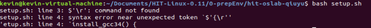

# Linux 内核环境的搭建

[TOC]


先给一篇博客：<https://blog.csdn.net/longintchar/article/details/78827886>

大多都是参照他看的，有些我自己遇到的问题，进行了添加


## 镜像的获取

<https://github.com/Wangzhike/HIT-Linux-0.11>

里面有环境的搭建步骤，非常详细，可以直接看文档


## 初始化建立环境

原来的文档，只需要进入

```
\HIT-Linux-0.11\0-prepEnv\hit-oslab-qiuyu
```

执行

```
./setup.sh
```

即可，但个人遇到一个错误



先给出[stackflow的回答](https://stackoverflow.com/questions/11616835/r-command-not-found-bashrc-bash-profile)，使用如下命令即可

```shell
sed -i 's/\r$//' filename
```

错误表示是，“\r”报错，那么我们就用正则，把\r 给删掉。


后来发现很多文件都是这样，是不是由于我再windows用github软件下载的，再导入到虚拟机中导致的问题。

在虚拟机中重新下载一个包，果然如此，发现这setup成功。

然后执行：

```shell
cd ~/oslab/linux-0.11
make
```

再启动这个Linux系统

```shell
cd ~/oslab
bash run
```

如果在这个流程卡主了，请再次执行 make 这一步操作。


## 必看博客

一个关于Linux 2.6 的网络协议栈的源码分析：<https://blog.csdn.net/zxorange321/article/details/75676063>

比较结构化的分析：<https://blog.csdn.net/geekcome/article/details/8333011>