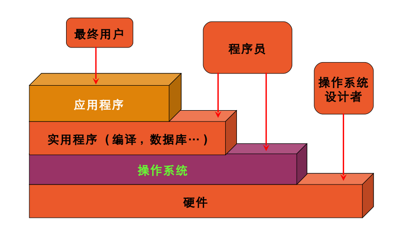

# operating system

[TOC]

操作系统也叫镜像

个人的理解是，将操作系统看做一个函数，那么我们的操作就是x，经过操作系统的映射，成像，所以讲操作系统叫做镜像。

操作系统内核功能有点像一个数据库，负责管理processer，memory，I/O的资源，但比数据库多了一点就是调度，也就是管理

## 什么是操作系统

用于 	**管理并加以优化** 	**memory，I/O，CPU ** 	的软件。

## 操作系统的主要任务

- 扩展机：隐藏硬件，呈现程序良好、清晰、优雅、一致的抽象。
- 资源管理：记录那个哪个程序正在用什么资源，对资源请求进行分配、评估使用代价、并且为不同的程序和用户调节互相冲突的资源请求。

资源管理及时实现资源：多路复用

- 时间：cpu的调度
- 空间：虚拟内存，磁盘调度，分页分段技术

## 操作系统的层次与结构

### 外部结构

### Linux 内部结构

## 存储结构

